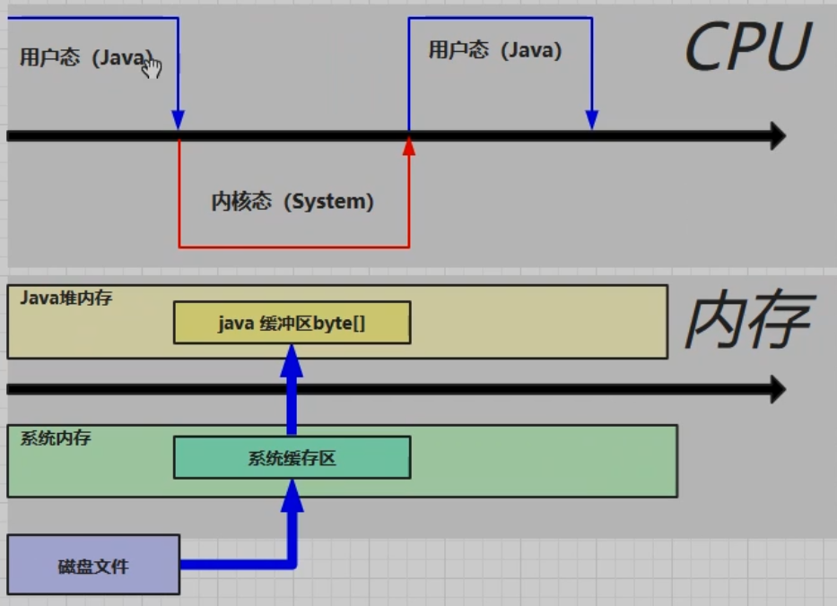

1. 程序计数器

    1. 定义

        Program Counter Register 程序计数器（寄存器）

    2. 作用

        记住下一条jvm指令的执行地址

        

    3. 特点

        * 线程私有
        * 不会存在内存溢出

2. 虚拟机栈

    1. 定义

        java virtual machine statcks （java虚拟机栈）

        * 每个线程运行时所需要的内存，称为虚拟机栈
        * 每个栈由多个栈帧（frame）组成，对应着每次方法调用时所占的内存
        * 每个线程只能有一个活动栈帧，对应着当前正在执行的那个方法

        问题辨析：

        1. 垃圾回收是否涉及栈内存？

            不涉及，栈帧只要调用后就会弹出

        2. 栈内存分配越大越好吗？

            不是，内存分配越大，可分配的线程就越少（-Xss1m）

        3. 方法内的局部变量是否线程安全的

            * 如果方法内局部变量没有逃离方法的作用范围，他就是线程安全的
            * 如果是局部变量引用了对象，并逃离方法的作用方法，需要考虑线程安全

    2. 栈内存溢出

        * 栈帧过多导致栈内存溢出
        * 栈帧过大导致栈内存溢出

    3. 线程运行诊断

        1. cpu占用过多

            定位：

            1. 用top定位哪个进程对cpu的占用过高
            2. ps H -eo pid, tid, %cpu | grep 进程id（用ps命令进一步定位是哪个线程引起的cpu占用过高）
            3. jstack 进程id
                * 可以根据线程id找到有问题的线程，进一步定位到问题代码的源码行号

        2. 程序运行很长时间没有结果

3. 本地方法栈

4. 堆 heap

    1. 定义
       
    * 通过new关键字，创建对象都会使用堆内存
      
    2. 特点： 

        * 他是线程共享的，堆中对象都需要考虑线程安全的问题

        * 有垃圾回收机制

    3. 堆内存溢出

        可以将堆内存设置的小一点，以便快速的发现问题

    4. 堆内存诊断

        1. jps

            查看当前系统中有哪些java进程

        2. jmap

            查看堆内存占用情况（jhsdb jmap --heap --pid 进程id）

        3. jconsole

            图形界面的，多功能的监测工具，可以连续监测 

5. 方法区

    1. 定义

        所有jvm线程共享的区域，存储了类的结构信息

    2. 组成

        

        

    3. 方法区内存溢出

        * 1.8以前会导致永久代内存溢出
            * java.lang.OutOfMemoryError : PermGen space
            * -XX:MaxPermSize=8m
        * 1.8之后会导致元空间内存溢出
            * java.lang.OutOfMemoryError: metaspace
            * -XX:MaxMetaspaceSize=8m

    4. 运行时常量池

        * 常量池就是一张表，虚拟机指令根据这种常量表找到要执行的类名、方法名、参数类型、字面量等信息
        * 运行时常量池，常量池是*.class文件中的，当该类被加载，它的常量池信息就会放入运行时常量池，并把里面的符号地址变为真实地址
        * javap -v StringDemo.class 反编译字节码文件
        
    5. StringTable

        ```java
        //StringTable["a", "b", "ab"]   是一个hashtable结构，不能扩容
        public class StringDemo {
            /**
             * 常量池中的信息，都会被加载到运行时常量池中，这时a，b，ab都是常量池中的符号，还没有变为java字符串对象
             * ldc #2会把a符号变为"a"字符串对象
             * ldc #3会把b符号变为"b"字符串对象
             * ldc #4会把ab符号变为"ab"字符串对象
             */
            public static void main(String[] args) {
                String s1 = "a";//懒加载
                String s2 = "b";
                String s3 = "ab";
        
                //new StringBuilder().append("a").append("b").toString
                //new String("ab")
                String s4 = s1 + s2;
        
                //javac 在编译期间的优化，结果已经在编译期确定为ab
                String s5 = "a" + "b";
        
                System.out.println(s3 == s4);
            }
        }
        ```

    6. StringTable特性

        * 常量池中的字符串仅是符号，第一次用到时才变为对象
        * 利用串池的机制，来避免重复创建字符串对象
        * 字符串变量拼接的原理是StringBuilder（1.8）
        * 字符串常量拼接的原理是编译期优化
        * 可以使用intern方法，主动将串池中还没有的字符串对象放入串池 
            * 1.8 将这个字符串对象尝试放入串池，如果有则并不会放入，如果没有，会把此对象复制一份，放入串池，会把串池中的对象返回

    7. StringTable的位置

        

    8. StringTable垃圾回收

    9. StringTable性能调优

        * 调整 -XX:StringTableSize=桶个数
        * 考虑字符串对象是否入池

6. 直接内存

    1. 定义

        * 常见于NIO操作时，用于数据缓冲区
        * 分配回成本较高，但读写性能高
        * 不受JVM内存回收管理

    2. 图示

        

    3. 分配和回收原理

        * 使用Unsafe对象完成直接内存的分配回收，并且回收需要主动调用freeMemory方法
        * ByteBuffer的实现类内部，使用了Cleaner（虚引用）来检测ByteBuffer对象，一旦ByteBuffer对象被垃圾回收，那么就会由ReferenceHandler线程通过Cleaner的clean方法调用freeMemory来释放直接内存