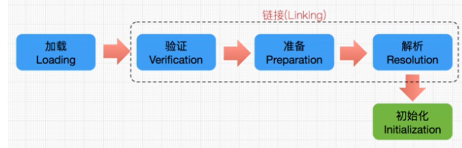
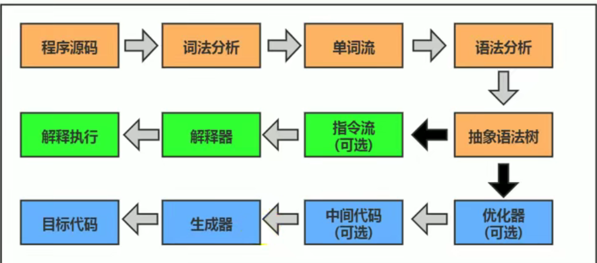
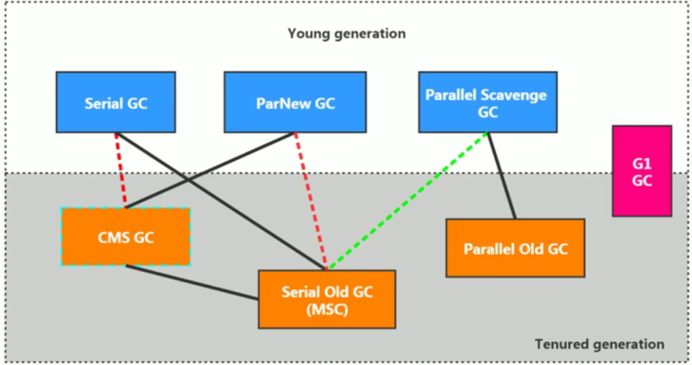
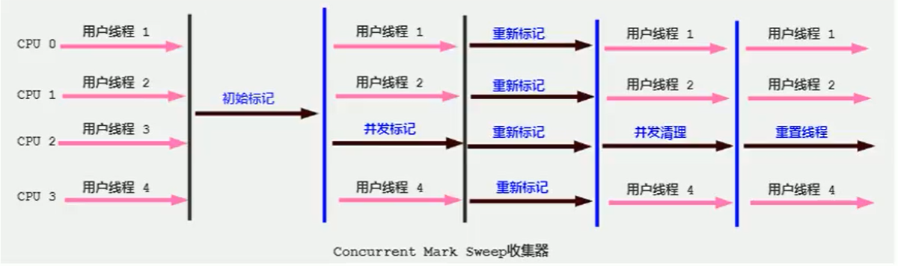
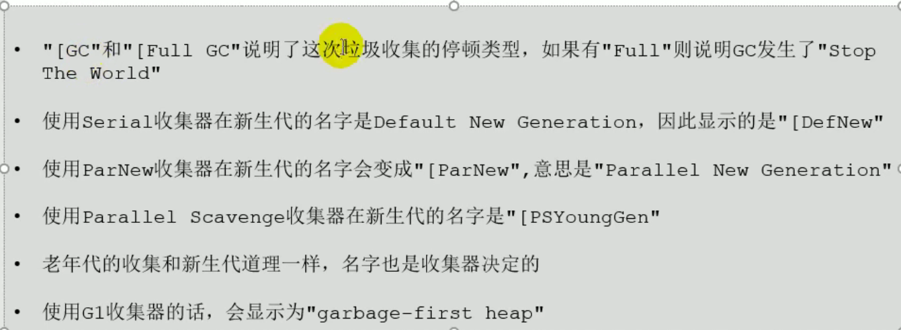

## JVM与java结构体系

JVM虚拟机也可以运行非java语言编写的程序，他只关心“**字节码**”文件

### 字节码

1. 我们平时说的java字节码，指的是用java语言编译成的字节码。准确的说，任何能在jvm上执行的字节码格式都是一样的，应该统一称为jvm字节码
2. 不同的编译器，可以编译出相同的字节码文件，字节码文件也可以在不同的jvm上运行
3. java虚拟机与java语言并没有必然的联系，它只与特定的二进制文件格式-class文件格式所关联，class文件中包含了java虚拟机指令集（或者称为字节码）和符号表，还有一些其他辅助信息

**jvm就是二进制字节码的运行环境**

### JVM整体结构

### JVM的架构模型

### JVM的生命周期

#### 虚拟机的启动

java虚拟机的启动是通过引导类加载器（bootstrap class loader）创建一个初始类（initial class）来完成的，这个类是由虚拟机的具体实现指定的

#### 虚拟机的执行

* 一个运行的java虚拟机有着一个清晰的任务：执行java程序
* 程序开始执行时他才运行，程序结束时他就停止
* 执行一个所谓的java程序的时候，真真正正在执行的是一个叫做java虚拟机的进程

#### 虚拟机的退出

* 程序正常执行结束
* 程序在执行过程中遇到了异常或错误而异常终止
* 由于操作系统出现错误而导致java虚拟机进程终止
* 某线程调用Runtime类或System类的exit方法，或Runtim类的halt方法，并且java安全管理器也允许这次exit或halt操作
* 除此之外，JNI（Java native interface）规范描述了用JNI Invacation API来加载和卸载java虚拟机时，java虚拟机的退出情况

## 类加载子系统

### 类加载器与类的加载过程

* 类加载器子系统负责从文件系统或者网络中加载class文件，class文件在文件开头有特定的文件标识
* ClassLoader只负责class文件的加载，至于它是否可以运行，则由ExecutionEngine决定
* **加载的类信息存放在一块称为方法区的内存空间**。除了类的信息外，方法区中还会存放运行时常量池信息，可能还包括字符串字面量和数字常量（这部分常量信息是class文件中常量池部分的内存映射）

#### 类的加载过程

1. 加载

    1. 通过一个类的全限定名获取定义此类的二进制字节流
    2. 将这个字节流所代表的静态存储结构转化为方法区的运行时数据结构
    3. 在内存中生成一个代表这个类的java.lang.Class对象，作为方法区这个类的各种数据的访问入口

2. 链接

    1. 验证

        * 目的在于确保class文件的字节流中包含信息符合当前虚拟机要求，保证被加载类的正确性，不会危害虚拟机自身安全

        * 主要包括四个验证：文件格式验证，元数据验证，字节码验证，符号引用验证

    2. 准备

        * 为类变量分配内存并且设置该类变量的默认初始值，即零值
        * **这里不包含用final修饰的static，因为final在编译的时候就会分配了，准备阶段会显式初始化**
        * **这里不会为实例变量分配初始化**，类变量会分配在方法区中，而实例变量是会随着对象一起分配到java堆中

    3. 解析

        * 将常量池内的符号引用转换为直接引用的过程
        * 事实上，解析操作往往会伴随着jvm在执行完初始化之后再执行
        * 符号引用就是一组符号用来描述所引用的目标。符号引用的字面量形式明确定义在《java虚拟机规范》的class文件格式中。直接引用就是直接指向目标的指针，相对偏移量或一个间接定位到目标的句柄
        * 解析动作主要针对类或接口、字段、类方法、接口方法、方法类型等。对应常量池中的CONSTANT_Class_info、CONSTANT_Fieldref_info、CONSTANT_Methodrf_info

3. 初始化

    * 初始化阶段就是执行类构造器方法\<clinit>()的过程
    * 此方法不需定义，是javac编译器自动收集类中的所有**类变量**的赋值动作和**静态代码块**中的语句合并而来
    * 构造器方法中指令按语句在源文件中出现的顺序执行
    * \<clinit>()不同于类的构造器（关联：构造器是虚拟机视角下的\<init>()）
    * 若该类具有父类，jvm会保证子类的\<clinit>()执行前，父类的\<clinit>()已经执行完毕
    * 虚拟机必须保证一个类的\<client>()方法在多线程下被同步加锁

#### 类加载器分类

* jvm支持两种类型的类加载器，分别为引导类加载器（Bootstrap ClassLoader）和自定义类加载器（User-Defined ClassLoader）
* 从概念上来讲，自定义类加载器一般指的是程序中由开发人员自定义的一类类加载器，但是java虚拟机规范却没有这么定义，而是将所有派生于抽象类ClassLoader的类加载器都划分为自定义类加载器
* 无论类加载器的类型如何划分，在程序中我们最常见到的类加载器始终只有3种

这里的四者之间的关系是包含关系，不是上下层关系，也不是子父类的继承关系

##### 启动类加载器

1. 这个类加载器使用c/c++语言实现，嵌套在jvm内部
2. 它用来加载java的核心库，用于提供jvm自身需要的类
3. 并不继承java.lang.ClassLoader，没有父类加载器
4. 扩展类和应用程序类加载器，并指定为他们的父类加载器
5. 处于安全考虑，bootstrap启动类加载器，只加载包名为java、javax、sun等开头的类

##### 扩展类加载器(PlatformClassLoader)

* java语言编写
* 派生于ClassLoader类
* 父类加载器为启动类加载器
* 从java.ext.dirs系统属性所指定的目录中加载类库，或从jdk的安装目录的jre/lib/ext子目录（扩展目录）下加载类库。如果用户创建的jar放在此目录下，也会自动由扩展类加载器加载

##### 应用程序类加载器

* java语言编写
* 派生于ClassLoader类
* 父类加载器为扩展类加载器
* 他负责加载环境变量classpath或系统属性java.class.path指定路径下的类库
* 该类加载是程序中默认的类加载器，一般来说，java应用的类都是由它来完成加载的
* 通过ClassLoader.getSystemClassLoader()方法可以获取到该类加载器

##### 用户自定义类加载器

* 在java的日常应用程序开发中，类的加载几乎是由上述三种类加载器相互配合执行的，在必要时，我们还可以自定义类加载器，来定制类的加载方式

为什么要自定义类加载器

* 隔离加载类
* 修改类的加载方式
* 扩展加载源
* 防止源码泄露

##### 双亲委派机制

java虚拟机对class文件采用的是按需加载的方式，也就是说当需要使用该类时才会将他的class文件加载到内存生成class对象。而且加载某个类的class文件时，java虚拟机采用的是双亲委派机制，即把请求交由父类处理，他是一种任务委派模式

**工作原理**

1. 如果一个类加载器收到了类加载请求，它并不会自己先去加载，而是把这个请求委托给父类的加载器去执行
2. 如果父类加载器还存在其父类加载器，则进一步向上委托，依次递归请求最终将到达顶层的启动类加载器
3. 如果父类加载器可以完成类加载任务，就成功返回，倘若父类加载器无法完成此加载任务，子加载器才会尝试自己去加载，这就是双亲委派模式

**优点**

* 避免类的重复加载
* 保护程序安全，防止核心API被随意篡改

**沙箱安全机制**

自定义String类，但是在加载自定义String类的时候会率先使用引导类加载器加载，而引导类加载器在加载的过程中会先加载jdk自带的文件（rt.jar 包中java.lang.String.class）。报错信息说没有main方法，就是因为加载的是rt.jar包中的String类。这样可以保证对java核心源代码的保护，这就是沙箱安全机制。

## 运行时数据区概述

每个JVM只有一个Runtime实例，即为运行时环境，相当于内存结构的中间的那个框框：运行时环境

**线程**

* 线程是一个程序里的运行单元。JVM允许一个应用有多个线程并行的执行
* 在Hotspot JVM里，每个线程都与操作系统的本地线程直接映射。当一个java线程准备好执行以后，此时一个操作系统的本地线程也同时创建。java线程执行终止后，本地线程也会回收
* 操作系统负责所有线程的安排调度到任何一个可用的CPU上。一旦本地线程初始化成功，他就会调用java线程中的run（）方法

### 程序计数器(PC寄存器)

pc寄存器用来存储指向下一条指令的地址，也即将要执行的指令代码。有执行引擎读取下一条指令

它是一块很小的内存空间，几乎可以忽略不计，也是运行速度最快的存储区域

在jvm规范中，每个线程都有他自己的程序计数器，是线程私有的，生命周期与线程的生命周期保持一致

任何时间一个线程都只有一个方法在执行，也就是所谓的当前方法。程序计数器会存储当前线程正在执行的java方法的jvm指令地址；或者，如果是在执行native方法，则是为指定值（undefined）

他是程序控制流的指示器，分支、循环、跳转、异常处理、线程恢复等基础功能都需要依赖这个计数器来完成

字节码解释器工作室就是通过改变这个计算器的值来选取下一条需要执行的字节码指令

它是唯一一个在java虚拟机规范中没有规定任何OutOfMemoryError情况的区域

1. **使用PC寄存器存储字节码指令地址有什么用呢？为什么使用PC寄存器记录当前线程的执行地址呢？**

    以为CPU需要不停的切换各个线程，这时候切换回来以后，就得知道接着从哪开始继续执行JVM的字节码解释器就需要通过改变PC寄存器的值来明确下一条应该执行什么样的字节码指令

2. **PC寄存器为什么会被设定为线程私有**

    我们都知道所谓的多线程在一个特定的时间段内只会执行其中一个线程的方法，CPU会不停的做任务切换，这样必然导致经常中断或恢复，如何保证分毫无差呢？**为了能够准确地记录各个线程正在执行的当前字节码指令地址，最好的办法自然是为每一个线程都分配一个PC寄存器**，这样一来各个线程之间可以进行独立计算，从而不会出现互相干扰的情况

    由于CPU时间片轮转机制，众多线程在并发执行过程中，任何一个确定的时刻，一个处理器或者多核处理器中的一个内核，只会执行某个线程的一条指令

    这样必然导致经常中断或恢复，如何保证分毫无差呢？每个线程在创建之后，都会长身自己的程序计数器和栈帧，程序计数器在各个线程之间互不影响

### 虚拟机栈

==栈是运行时的单位，而堆是存储的单位==

栈就解决程序的运行问题，即程序如何执行，或者说如何处理数据。堆解决的数据存储的问题，即数据怎么放，放在哪

* java虚拟机栈是什么？

    java虚拟机栈(Java Virtual Machine Stack)，早期也叫java栈。每个线程在创建时都会创建一个虚拟机栈，其内部保存一个个的栈帧（Stack Frame）对应着一次次的java方法调用

* 生命周期

    生命周期和线程一致

* 作用

    主管java程序的运行，它保存方法的局部变量（8种基本的数据类型、对象的引用地址）、部分结果，并参与方法的调用和返回

#### 栈的优点

* 栈是一种快速有效的分配存储方式，访问速度仅次于程序计数器
* JVM直接对Java栈的操作只有两个：
    * 每个方法执行，伴随着入栈
    * 执行结束后的出栈工作
* 对栈来说不存在垃圾回收问题

#### 栈中可能出现的异常

* java虚拟机规范允许==java栈的大小是动态的或者是固定不变的==
    * 如果采用固定大小的java虚拟机栈，那每一个线程的java虚拟机栈容量可以在线程创建的时候独立选定。如果线程请求分配的栈容量超过java虚拟机栈允许的最大容量，java虚拟机将会抛出一个StackOverflowError异常
    * 如果java虚拟机栈可以动态扩展，并且在尝试扩展的时候无法申请到足够的内存，或者在创建新的线程时没有足够的内存区创建对应的虚拟机栈，那java虚拟机将会抛出一个OutOfMemoryError异常

#### 栈的存储单位

* 每个线程都有自己的栈，栈中的数据都是以栈帧(Stack Frame)的格式存在
* 在这个线程上正在执行的每个方法都各自对应一个栈帧
* 栈帧是一个内存区块，是一个数据集，维系着方法执行过程中的各种数据信息

#### 栈的运行原理

* JVM直接对java栈的操作只有两个，就是对栈帧的压栈和出栈，遵循“先进后出”的原则
* 在一条活动线程中，一个时间点上，只会有一个活动的栈帧，即只有当前正在执行的方法的栈帧（栈顶栈帧）是有效的，这个栈帧被称为当前栈帧（Current Fram），与当前栈帧相对应的就是当前方法(Current Method)，定义这个方法的类就是当前类（Current Class）
* 执行引擎运行的所有字节码指令只针对当前栈帧进行操作
* 如果在该方法中调用了其他方法，对应的新的栈帧会被创建出来，放在栈的顶端，成为新的当前帧
* 不同的线程中包含的栈帧是不允许存在相互引用的，即不可能在一个栈帧之中引用另外一个线程的栈帧
* 如果当前方法调用了其他方法，方法返回之际，当前栈帧会传回此方法的执行结果给前一个栈帧，接着虚拟机会丢弃当前栈帧，使得前一个栈帧重新成为当前栈帧
* java方法有两种返回函数的方式，一种是正常的函数返回，使用return指令；另外一种是抛出异常，不管使用哪种放方式，都会导致栈帧被弹出

#### 栈帧的内部结构

* 局部变量表(Local Variables)

* 操作数栈(Operand Stack) / 表达式栈

* 动态链接(Dynamic Linking) / 指向运行时常量池的方法引用

* 方法返回地址(Return Address) / 方法正常退出或者异常退出的定义

* 一些附加信息

    

##### 局部变量表

* 局部变量表也被称之为局部变量数组或本地变量表
* **定义为一个数字数组，主要用于存储方法参数和定义在方法体内的局部变量**，这些数据类型包括各类基本数据类型、对象引用，以及returnAddress类型
* 由于局部变量表时建立在线程的栈上，是线程的私有数据，因此**不存在数据安全问题**
* **局部变量所需的容量大小是在编译期确定下来的**，并保存在方法的code属性的maximim local variables数据项中。在方法运行期间是不会改变局部
* 方法嵌套调用的次数由栈的大小决定。一般来说，栈越大，方法嵌套调用次数越多。对一个函数而言，他的参数和局部变量越多，使得局部变量表膨胀，他的栈帧就越大，以满足方法调用所需传递的信息增大的需求。进而函数调用就会占用更多的栈空间，导致其嵌套调用次数就会减少
* 局部变量表中的变量只在当前方法调用中有效。在方法执行时，虚拟机通过使用局部变量表完成参数值到参数变量列表的传递过程。当方法调用结束后，随着方法栈帧的销毁，局部变量表也会随之销毁

关于slot的理解

* 参数值的存放总是在局部变量数组index0开始，到数组长度-1的索引结束
* 局部变量表，**最基本的存储单元是solt（变量槽）**
* 局部变量表中存放编译器课知的各种基本数据类型（8种），引用类型（reference），returnAddress类型的变量
* 在局部变量表里，**32位以内的类型只占用一个slot（包括returnAddress类型），64位的类型（long和double）占用两个slot**
* JVM会为局部变量表中的每一个slot都分配一个访问索引，通过这个索引即可成功访问到局部变量表中指定的局部变量值
* 当一个实例方法被调用的时候，它的方法参数和方法体内部定义的局部变量将会按照顺序被复制到局部变量表中的每一个slot上
* 如果需要访问局部变量表中一个64bit的局部变量值时，只需要使用前一个索引即可
* 如果当前帧是由构造方法或者实例方法创建的，那么该对象引用this将会存放在index为0的slot处，其余的参数按照参数表顺序继续排列
* **栈帧中的局部变量中的槽位是可以重复利用的。**如果一个局部变量过了其作用域，那么在其作用域之后申明的新的局部变量就很有可能会复用过期局部变量的槽位，从而达到节省资源的目的
* 在栈帧中，与性能调优关系最为密切的部分就是前面提到的局部变量表。在方法执行时，虚拟机使用局部变量表完成方法的传递
* **局部变量表中的变量也是重要的垃圾回收根节点，只要被局部变量表中直接或间接引用的对象都不会被回收**

##### 操作数栈（operand stack）

* 操作数栈，主要用于保存计算过程的中间结果，同时作为计算过程中变量临时的存储空间
* 操作数栈就是JVM执行引擎的一个工作区，当一个方法刚开始执行的时候，一个新的栈帧也会随之被创建出来，这个方法的操作数栈是空的
* 每一个操作数栈都会拥有一个明确的栈深度用于存储数值，其所需的最大深度在编译期就定义好了，保存在方法的code属性中，为max_stack的值
* 栈中的任何一个元素都是可以任意的java数据类型
* 操作数栈并非采用访问索引的方式来进行数据访问的，而是只能通过标准的入栈和出栈操作来完成一次数据访问
* 如果被调用的方法带有返回值的话，其返回值将被压入当前栈帧的操作数栈中，并更新pc寄存器中下一条需要执行的字节码指令
* 操作数栈中元素的数据类型必须与字节码指令的序列严格匹配，这由编译器在编译器期间进行验证，同时在类加载过程中的类校验阶段的数据流分析阶段要再次验证
* 另外，我们说java虚拟机的解释引擎是基于栈的执行引擎，其中的栈指的就是操作数栈

**栈顶缓存技术**

将栈顶元素全部缓存在物理CPU的寄存器中，以此降低对内存的读写次数，提升执行引擎的执行效率

##### 动态链接技术（指向运行时常量池的方法引用）

* 每个栈帧内部都包含一个指向运行时常量池中该栈帧所属方法的引用。包含这个引用的目的就是为了支持当前方法的代码能够实现动态链接（synamic Linking）

* 在java源文件被编译到字节码文件中时，所有的变量和方法引用都作为符号引用（Symbolic Reference）保存在class文件的常量池里

    比如：描述一个方法调用了另外的其他方法时，就是通过常量池中指向方法的符号引用来表示的，那么**动态链接的作用就是为了将这些符号引用转换为调用方法的直接引用**

为什么要用常量池？

常量池的作用，就是为了提供一些符号和常量，便于指令的识别

##### 方法的调用

在JVM中，将符号引用转换为调用方法的直接引用与方法的绑定机制相关

* 静态连接

    当一个字节码文件被装载进JVM内部时，如果被调用的目标方法在编译期可知，且运行期保持不变时。这种情况下将调用方法的符号引用转换为直接引用的过程称之为静态链接

* 动态链接

    如果被调用的方法在编译期无法被确定下来，也就是说，只能够在程序运行期将调用的方法的符号引用转换为直接引用，由于这种引用转换过程具备动态性，因此也就被称之为动态链接

对应的方法的绑定机制为：早期绑定和晚期绑定，绑定是一个字段、方法或者类在符号引用被替换为直接引用的过程，这仅仅发生一次

* 早期绑定

    早期绑定就是指被调用的目标方法如果在编译期可知，且运行期保持不变时，即可将这个方法与所属的类型进行绑定，这样一来，由于明确了被调用的目标方法究竟是哪一个，因此也就可以使用静态链接的方式将符号引用转换为直接引用

* 晚期绑定

    如果被调用的方法在编译期无法被确定下来，只能够在程序运行期根据实际的类型绑定相关的方法，这种绑定方式也就被称之为晚期绑定

**虚方法与非虚方法**

* 如果方法在编译期就确定了具体的调用版本，这个版本在运行时是不可变的，这样的方法称为非虚方法
* 静态方法、私有方法、final方法、实例构造器、父类方法（super.xxx(..)）都是非虚方法
* 其他方法称为虚方法

虚拟机提供了一下几条方法调用指令：

* 普通调用指令
    1. invokestatic：调用静态方法，解析阶段确定唯一方法版本
    2. invokespecial：调用init方法、私有及父类方法，解析阶段确定唯一版本方法
    3. invokevirtual：调用所有虚方法
    4. invokeinterface：调用接口方法
* 动态调用指令
    1. invokedynamic：动态解析出需要调用的方法，然后执行

前四条指令固化在虚拟机内部，方法的调用执行不可认为干预，而invokedynamic指令则支持由用户确定方法版本。中inovkestatic指令和invokespecial指令调用的方法称为非虚方法，其余的（final修饰的除外）称为虚方法

**关于invokedynamic指令**

* JVM字节码指令集一直比较稳定，一直到java7才增加了一个invokedynamic指令，这是java为了实现[动态类型语言]支持而做的一种改进
* 但是在java7中并没有提供直接生成invokedynamic指令的方法，需要借助ASM这种底层字节码工具来产生invokedynamic指令的生成，在java中才有了直接的生成方式
* java7中增加的动态语言类型支持的本质是对java虚拟机规范的修改，而不是对java语言规则的修改，这一块相对来讲比较复杂，增加了虚拟机中的方法调用，最直接的受益者就是运行在java平台的动态语言的编译器

**动态类型语言和静态类型语言**

动态类型语言和静态类型语言两者的区别就在于对类型的检查是在编译期还是在运行期，满足前者就是静态类型语言，反之是动态类型语言

说的再直白一点就是，==静态类型语言是判断变量自身的类型信息 ，动态类型语言是判断变量值的类型信息，变量没有类型信息，变量值才有类型信息==，这是动态语言的一个重要特征

**方法重写的本质**

1. 找到操作数栈顶的第一个元素所执行的对象的实际类型，记作C
2. 如果在过程结束，如果类型C中找到与常量中的描述符合简单名称都相符的方法，则进行访问权限检验，如果通过则返回这个方法的直接引用，不通过，这返回java.lang.IllegalAccessError异常
3. 否则，按照继承关系从下往上一次对C的各个父类进行第2步的搜索和验证过程
4. 如果始终没有找到合适的方法，则抛出java.lang.AbstractMethodError异常

IllegalAccessError:

程序试图访问或修改一个属性或调用一个方法，这个属性或方法，你没有权限访问。一般的，这个会引起编译器异常。这个错误如果发生在运行时，就说明一个类发生了不兼容的改变

**虚方法表**

* 在面向对象的编程中，会很频繁的使用到动态分派，如果在每次动态分派的过程中都要重新在类的方法元数据中搜索合适的目标的话就可能影响到执行效率。因此，为了提高性能，JVM采用在类的方法区建立一个虚方法表（virtual method table）（非虚方法不会出现在表中）来实现。使用索引表来代替查找

* 每个类中都有一个虚方法表，表中存放着各个方法的实际入口

* 那么虚方法什么时候被创建？

    虚方法表会在类加载的链接阶段被创建并开始初始化，类的变量初始值准备完成之后，JVM会把该类的方法表也初始化完毕

##### 方法返回地址

存放调用该方法的PC寄存器的值

一个方法的结束，有两种方式

* 正常执行完成
* 出现未处理的异常，非正常退出

无论通过哪种方式退出，在方法退出后都返回该方法被调用的位置。方法正常退出时，调用者的pc计数器的值作为返回地址，即调用该方法的指令的下一条指令的地址。而通过异常退出的，返回地址是要通过异常表来确定，栈帧中一般不会保存这部分信息

本质上，方法的退出就是当前栈帧出栈的过程。此时，需要恢复上层方法的局部变量表、操作数栈、将返回值压入调用者栈帧的操作数栈、设置PC寄存器值等，让调用者方法继续执行下去

正常完成出口和异常完成出口的区别在于：通过异常完成出口退出的不会给他的上层调用者产生任何的返回值

返回指令：ireturn（boolean、byte、char、short、int），lreturn（long），freturn（float），dreturn（double），areturn（引用），return（void）

##### 一些附加信息

#### 相关面试题

1. 举例栈溢出的情况

    递归调用方法次数太多，栈空间过小

2. 调整栈的大小，就能保证不出现溢出吗

    不能

3. 分配的栈内存越大越好吗

    不是，因为内存越大，可以运行的线程就越少

4. 垃圾回收是否会涉及到虚拟机栈

    不会，垃圾回收只针对堆区

5. 方法中定义的局部变量是否线程安全

    线程安全，局部变量在每个线程的栈帧中

### 本地方法栈

* **java虚拟机栈用于管理java方法的调用，而本地方法栈用于管理本地方法的调用**

* 本地方法栈是线程私有的
* 允许被实现成固定或者是可动态扩展的内存大小（在内存溢出方面是相同的）
* 本地方法使用c语言实现的
* 他的具体做法是native method stack 中登记native方法，在execution engine执行时加载本地方法库

当某个线程调用一个本地方法时，他就进入了一个全新的并且不再受虚拟机限制的世界，他和虚拟机拥有同样的权限

* 本地方法可以通过本地方法接口来访问虚拟机内部的运行时数据区
* 他甚至可以直接使用本地处理器中的寄存器
* 直接从本地内存的堆中分配任意数量的内存

并不是所有的jvm都支持本地方法，因为java虚拟机规范并没有明确要求本地方法栈的使用语言、具体实现方式、数据结构等。如果jvm产品不打算支持native方法，也可以无需实现本地方法栈

在hotspot中，直接将本地方法栈和虚拟机栈合二为一

### 堆

#### 堆的核心概述

* 一个JVM实例只存在一个堆内存，堆也是java内存管理的核心区域
* java堆区在JVM启动的时候即被创建，其空间大小也就是确定了。是JVM管理的最大一块内存空间
    * 堆内存的大小是可以调节的
* 《java虚拟机规范》规定，堆可以处于物理上不连续的内存空间中，但在逻辑上它应该被视为连续的
* 所有的线程共享java堆，在这里还可以划分线程私有的缓冲区（Thread Local Allocation Buffer, TLAB）
* 《java虚拟机规范》中对java堆的描述是：所有的对象实例以及数组都应当在运行时分配在堆上。
    * 几乎所有的对象实例都在这里分配内存
* 数组和对象可能永远不会存储在栈上，因为栈帧中保存引用，这个引用指向对象或者数组在堆中的位置
* 在方法结束后，堆中的对象不会马上被移除，仅仅在垃圾收集的时候才会被移除
* 堆是GC(Garbage Collection)执行垃圾回收的重点区域

#### 堆空间分代思想

java7：新生区+养老区+永久区

java8：新生区+养老区+元空间

新生区又被划分为eden区和survivor区

#### 内存分配策略（对象提升规则）

* 优先分配到eden
* 大对象直接分配到老年代
    * 尽量避免程序中出现过多的大对象
* 长期存活的对象分配到老年代
* 动态对象年龄判断
    * 如果survivor区中相同年龄的所有对象大小的综合大于survivor空间的一半，年龄大于或等于该年龄的对象可以直接进入老年代，无须等到MaxTenuringThreshold中要求的年龄
* 空间分配担保
    * -XX:HandlePromotionFailure

1. 设置堆空间大小的参数

    -Xms 用来设置堆空间（新生代+老年代）的初始内存大小

    ​		-X 是jvm的运行参数

    ​		ms 是memory start

    -Xmx 用来设置堆空间（新生代+老年代）的最大内存大小

2. 默认堆空间的大小

    初始内存大小：物理电脑内存大小 / 64

    最大内存大小：物理电脑内存大小 / 4

3. 手动设置：-Xms600m -Xmx600m

    开发中建议将初始堆内存大小和最大的堆内存设置成相同的值（频繁GC，扩展压缩内存大小对系统性能影响较大）

4. 查看设置的参数

    1. jps / jstat -gc id
    2. -XX:+PrintGCDetails

#### 为对象分配内存：TLAB

为什么要有TLAB（Thread Local Allocation Buffer）

* 堆区是线程共享区域，任何线程都可以访问到堆区中的共享数据
* 由于对象实例的创建在jvm中非常频繁，因此在高并发环境下从堆区中划分内存空间是线程不安全的
* 为避免多个线程操作同一地址，需要使用加锁等机制，进而影响分配速度
* 从内存模型而不是垃圾收集的角度，对eden区域继续进行划分，JVM为每个线程分配了一个私有缓存区域，它包含在eden空间内
* 多线程同时分配内存时，使用TLAB可以避免一系列的非线程安全问题，同时还能够提升内存分配的吞吐量，因此我们可以将这个内存分配方式称之为**快速分配策略**
* 所有OpenJDK衍生出来的JVM都提供了TLAB的设计
* 尽管不是所有的对象实例都能够在TLAB中成功分配，但JVM确实是将TLAB作为内存分配的首选
* 在程序中，开发人员可以通过选项“-XX:UseTLAB”设置是否开启TLAB空间
* 默认情况下，TLAB空间的内存非常小，仅占有整个eden空间的1%，当然我们可以通过选项“-XX:TLABWasteTargetPercent”，设置TLAB空间所占用Eden空间的百分比大小
* 一旦对象在TLAB空间分配内存失败时，JVM就会尝试着通过使用加锁机制确保数据操作的原子性，从而直接在Eden空间中分配内存

#### 小结堆空间的参数配置

在发生minor gc之前，虚拟机会检查老年代最大可用的连续空间是否大于新生代所有对象的总空间

* 如果大于，则此次minor gc是安全的
* 如果小于，则虚拟机会查看-XX:HandlePromotionFailure设置值是否允许担保失败
    * 如果是true，那么会继续检查老年代最大可用连续空间是否大于历次晋升到老年代的对象的平均大小
        * 如果大于，则尝试一次minor gc，但是依然是有风险的
        * 如果小于，则进行一次full gc
    * 如果是false，则改为一次full gc

在jdk7之后，这个参数不会影响到虚拟机的空间分配担保策略了。

只要老年代的连续空间大于新生代对象总大小或者历次晋升的平均大小就会进行minor gc，否则进行full gc

#### 堆是分配对象的唯一选择吗

随着JIT编译期的发展与逃逸分析技术逐渐成熟，栈上分配、标量替换优化技术将会导致一些微妙的变化，所有的对象都分配到堆上也渐渐变得不那么绝对了

在java虚拟机中，对象是在java堆中分配内存的，这是一个普遍的尝试，但是，有一种特殊情况，那就是如果经过逃逸分析（escape analysis）后发现，一个对象并没有套移除方法的话，你们就可能被优化成栈上分配。这样就无需再堆上分配内存，也无需进行垃圾回收了。这也是最常见的堆外存储技术

逃逸分析的基本行为就是分析对象动态作用域

* 当一个对象在方法中被定义后，对象只在方法内部使用，则认为没有发生逃逸
* 当一个对象在方法中被定义后，他被外部方法调用，则认为发生逃逸

使用统计分析，编译器可以对代码做如下优化：

* 栈上分配。将堆分配转化为栈分配
* 同步省略。如果一个对象被发现只能从一个线程访问到，你们对于这个对象的操作可以不考虑同步
    * 线程同步的代价是相当高的，同步的后果是降低并发和性能
    * 在动态编译同步块的时候，JIT编译器可以借助逃逸分析来判断同步块所使用的锁对象呢是否只能够被一个线程访问而没有被发布到其他线程。如果没有，那么JIT编译器在编译这个同步块的时候就会取消这部分代码的同步。这样就能打打提高并发性和性能，这个取消同步的过程就叫同步省略，也叫锁消除
* 分离对象和标量替换。有的对象可能不需要作为一个连续的内存结构存在也可以被访问到，你们对象可以不存储在内存，而是存储在CPU寄存器
    * 标量：无法再分解成更小的数据的数据，java中的原始数据类型
    * 聚合量：java中的对象就是聚合量，因为他可以分解成其他聚合量的标量

**逃逸分析并不成熟**

无法保证逃逸分析的性能消耗一定能高于他的消耗。虽然经过逃逸分析可以做标量替换、栈上分配、和锁消除。但是逃逸分析自身也是需要进行一系列复杂的分析的，这其实是一个相对耗时的过程

#### 设置堆内存大小与OOM

#### 年轻代与老年代

* 存储在JVM中的java对象可以被划分为两类
    * 生命周期较短的对象，这类对象的创建和消亡都非常迅速
    * 生命周期比较长，在某些极端的情况下，和JVM生命周期保持一致
* java堆区可以划分为eden、survivor0、survivor1
* 配置新生代和老年代在堆结构的占比
    * -XX:NewRatio=2，表示新生代占1，老年代占2，新生代占整个堆的1/3
    * 可以修改-XX:NewRatio=4，表示新生代占1，老年代占4，新生代占整个堆的1/5
* 在hotspot中，eden和另外两个survivor缺省所占的比例是8:1:1
    * -XX:SurvivorRatio=8可以调整这个空间比例
* 几乎所有的java对象都是在eden区被new出来的
* 绝大部分java对象的销毁都在新生代进行了
    * IBM公司的研究表明：新生代中80%的对象都是“朝生夕死”
* -Xmn设置新生代最大内存大小
    * 这个参数一般使用默认值就可以了

#### 图解对象分配过程

为新对象分配内存是已经非常严谨和复杂的任务，JVM的设计者们不仅需要考虑内存如何分配、在哪里分配等问题，并且由于内存分配等问题，并且由于内存分配算法与内存回收算法密切相关，所以还需要考虑GC执行完内存回收后是否会在内存空间中产生内存碎片

1. new的对象先放伊甸园区，此区有大小限制
2. 当伊甸园的空间填满时，程序又需要创建对象，JVM的垃圾回收器将伊甸园区进行垃圾回收（Minor GC），将伊甸园区中的不再被其他对象所引用的对象进行销毁。再加载新的对象放到伊甸园区
3. 然后将伊甸园中的剩余对象移动到幸存者0区
4. 如果再次触发垃圾回收，此时上次幸存下来的放到幸存者0区的，如果没有回收，就会放到幸存者1区
5. 如果再次经历垃圾回收，此时会重新放回幸存者0区，接着再去幸存者1区
6. 啥时候能去养老区呢？可以设置次数，默认是15次
    1. -XX:MaxTenuringThreshold=\<N>进行设置
7. 在养老区相对悠闲，当养老区内存不足时，再次触发GC：Major GC，进行养老区的内存清理
8. 若养老区执行了Major GGC之后发现依然无法进行对象的保存，就会产生OOM异常

针对幸存者0,1区，复制之后又交换，谁空谁是to

关于垃圾回收，频繁在新生区收集，很少在养老区收集，几乎不在永久区/元空间收集

#### Minor GC、Major GC、Full GC

jvm在进行GC时，并非每次都对上面三内存区域一起回收的，大部分时候回收的都是指新生代

针对hostspot vm的实现，他里面的GC按照回收区域分为两大种类型：一种是部分收集(Patrial GC)，一种是整堆收集(Full GC)

* 部分收集：不是完整收集整个java堆的垃圾收集。其中又分为
    * 新生代收集（Minor GC）：只是新生代的垃圾收集
    * 老年代收集（Major GC）：只是老年代的垃圾收集
        * 目前，只有CMS GC会有单独收集老年代的行为
        * 很多时候，major gc 和full gc混淆使用，需要具体分辨是老年代回收还是整堆回收
    * 混合收集（Mixed GC）：收集整个新生代以及部分老年代的垃圾收集
        * 目前，只有G1 GC会有这种行为
* 整堆收集（Full GC）：收集整个java堆和方法区的垃圾收集

年轻代gc触发机制

* 当年轻代空间不足时（eden区满，survivor满不会触发gc）
* java对象大多都具备朝生夕灭的特性，所以minor gc非常频繁，一般回收速度也比较快
* minor gc会引发stw，暂停其他用户的线程，等垃圾回收结束，用户线程才恢复运行

老年代触发机制

* 指发生在老年代的gc，对象从老年代消失时
* 出现了major gc，经常会伴随着至少要一次的minor gc
    * 也就是在老年代空间不足时，会先尝试触发minor gc，如果之后空间还不足，则触发major gc
* major gc的速度一般会比minor gc满慢10倍以上，stw时间更长
* 如果major gc后，内存还不足，就报oom了

full gc触发机制

* 调用System.gc()时，系统建议执行full fc，但是不必然执行
* 老年代空间不足
* 方法区空间不足
* 通过minor gc后进入老年代的平均大小大于老年代的可用内存
* 由eden区，survivor s0向s1复制时，对象大小小于to的可用内存，则把该对象转存到老年代，且老年代的可用内存小于该对象大小
* ==full gc是开发或调优中尽量要避免的，这样暂时时间会短一些==

为什么要把java堆分代

* 不分代也完全可以，但是分代可以优化GC性能。

### 方法区

#### 栈、堆、方法区的交互关系

#### 方法区的理解

* 方法区（Method Area）与java堆一样，是各个线程共享的内存区域
* 方法区在JVM启动的时候被创建，并且它的实际的物理内存空间中和java堆区一样都是不连续的
* 方法区的大小跟堆空间一样，可以选择固定大小或者可扩展
* 方法区的大小决定了系统可以保存多少个类，如果系统定义了太多的类，导致方法区溢出，虚拟机同样会抛出内存溢出错误：java.lang.OutOfMemoryError: PermGen space 或者 xxx: Metaspace
* 关闭JVM就会释放这个区域的内存

#### 设置方法区大小与OOM

方法区的大小不必是固定的，jvm可以根据应用的需要动态调整

jdk7以前：

* 通过-XX:PermSize来设置永久代初始分配空间，默认值是20.75M
* -XX:MaxPermSize来设定有永久代最大可分配空间。32位机器默认是64M，64位默认是82M
* 当JVM加载的类信息容量超过了这个值，会报异常OutOfMemoryError:PermGen space

jdk8以后

* 元数据区大小可以使用参数-XX:MetaspaceSize和-XX:MaxMetaspaceSize指定
* 默认值依赖于平台，window下，-XX:MetaspaceSize是21M，-XX:MaxMetaspaceSize的值是-1，即没有限制
* 与永久代不同，如果不指定大小，默认情况下，虚拟机会耗尽所有的可用系统内存。如果元数据区发发生溢出，虚拟机一样会抛出异常OutOfMemoryError:Metaspace
* -XX:MetaspaceSize：设置初始的元空间大小，对于一个64位的服务器端JVM来说，其默认的-XX:MetaspaceSize值为21MB。这就是初始的高水位线，一旦触及这个水位线，Full GC将会被触发并卸载没用的类（即这些类对应的类加载器补在存活）然后这个高水位线将会重置。新的高水位线的值取决于GC后释放了多少元空间。如果释放的空间不足，那么在不超过MaxMetaspaceSize时，适当提高该值。如果释放空间过多，则适当降低该值
* 如果初始化的高水位线设置过低，上述高水位线调整情况会发狠很多次。通过垃圾回收器的日志可以观察到Full GC多次调用。为了避免频繁的GC，建议将-XX:MetasapceSize设置为一个相对较高的值

如何解决OOM

#### 方法区的内部结构

##### 方法区存什么

他用于存储已被虚拟机加载的类型信息、常量、静态变量、即时编译器编译后的代码缓存等

###### 类型信息

对每个加载的类型（类class、接口interface、枚举enum、注解annotation），JVM必须在方法区中存储以下类型信息

1. 这个类型的完整有效名称（全名 = 包名.类名）
2. 这个类型直接父类的完整有效名（对于interface或者java.lang.Object都没有父类）
3. 这个类型的修饰符（public、abstract、final的某个子集）
4. 这个类型直接接口的一个有序列表

###### 域（Field）信息

* JVM必须在方法区中保存类型的所有域的相关信息以及域的声明顺序
* 域的相关信息包括：域名称、域类型、域修饰符（public、private、pretected、static、final、volatile、transient的某个子集）

###### 方法（method）信息

* 方法名称
* 方法的返回类型（或void）
* 方法参数的数量和类型（按顺序）
* 方法的修饰符（public、private、protected、static、final、synchronized、native、abstract的一个子集）
* 方法的字节码（bytecodes）、操作数栈、局部变量表及大小（abstract和native方法除外）
* 异常表（abstract和native方法除外）
    * 每个异常处理的开始位置、结束位置、代码处理在程序计数器中的偏移地址、被捕获的异常类的常量池索引

一个有效的字节码文件中除了包含类的版本信息、字段、方法以及接口等描述信息外，还包含一项信息那就是常量池表（Constant Pool Table），包括各种字面量和对类型、域和方法的符号引用

##### 为什么需要常量池

一个java源文件中的类、接口，编译后产生一个字节码文件。而java中的字节码需要数据支持，通常这种数据会很大以至于不能直接存到字节码里，换另一种方式，可以存到常量池，这个字节码包含了指向常量池的引用，在动态链接的时候会用到运行时常量池

小结：常量池，可以看做是一张表，虚拟机指令根据这张常量表找到要执行的类名、方法名、参数类型、字面量等类型

#### 运行时常量池

* 运行时常量池（Runtime Constant Pool）是方法区的一部分
* 常量池表（Constant Pool Table）是Class文件的一部分，用于存放编译期生成的各种字面量与符号引用，这部分内容将在类加载后存放到方法区的运行时常量池中
* 运行时常量池，在加载类和接口到虚拟机后，就会创建对应的运行时常量池
* JVM为每个已加载的类型（类或接口）都维护一个常量池。池中的数据项就像数组项一样，是通过索引访问的
* 运行时常量池中包含多种不同的常量，包括编译器就已经明确的数值字面量，也包括到运行期解析后才能够获得的方法或者字段引用。此时不再是常量池中的符号地址了，这里换为真实地址
    * 运行时常量池，相对于Class文件常量池的另一重要特征是：具备动态性（String.intern()）
* 运行时常量池类似于传统编程语言中的符号表（symbol table）但是它所包含的数据却比符号表要更加丰富一点
* 当创建类或接口的运行时常量池时，如果构造运行时常量池所需的内存孔径超过了方法区所能提供的最大值，则JVM会OutOfMemoryError异常

#### 方法区的演进细节

只有HotSpot才有永久代

| jdk1.6之前 | 有永久代，静态变量存放在永久代上                             |
| :--------: | ------------------------------------------------------------ |
|   jdk1.7   | 有永久代，但是逐步取代，字符串常量池、静态变量移除，保存在堆中 |
| jdk1.8之后 | 无永久代，类型信息、字段、方法、常量保存在本地内存的元空间，但字符串常量池、静态变量仍在堆 |

#### 为什么永久代要被元空间替换

* 永久代中的数据被移到了一个与堆不相连的本地内存区域，这个区域叫做元空间（Metasapce）
* 由于类的元数据分配在本地内存中，元空间的最大可分配空间就是系统可用内存空间
* 为永久代设置空间大小是很难确定的
* 对永久代进行调优是很困难的

#### StringTale为什么要调整

jdk7之前，StringTable放在堆空间，但是永久代的回收效率很低，再full gc时才会触发，而fullgc是老年代空间不足、永久代不足时才会触发

这就导致StringTable回收效率不高。而且开发中会有大量的字符串被创建，回收效率低，导致永久代内存不足。放到堆里，能及时回收内存

#### 静态变量存放在哪

静态引用对应的对象实体始终都在堆空间

#### 方法区的垃圾收集

判定一个类型是否属于“不在被使用的类”的条件比较苛刻

* 该类所有的示例都已经被回收，也就是java堆中不存在该类及任何派生子类的实例
* 加载该类的类加载器已经被回收，这个条件除非是经过精心设计的可替换类加载器的场景，否则是很难达成的
* 该类对应的java.lang.Class对象没有在任何地方被引用，无法在任何地方通过反射访问该类的方法

满足了以上三个条件，则该类允许被回收，不是必然被回收

在大量使用反射、动态代理、CGLIB等字节码框架，动态生成JSP以及OSCI这类频繁自定义类加载器的场景中，通常都需要java虚拟机具备类型卸载能力，以保证不会对方法区造成过大的内存压力

### 对象的实例化内存布局与访问定位

#### 对象的实例化

创建对象的方式

* new
* Class的newInstance(已被弃用，只能调用空参构造器，权限必须是public)
* Constructor的newInstance()
* 使用clone()
* 使用反序列化
* 使用第三方库Objenesis

创建对象的步骤

1. 判断对象对应的类是否加载、链接、初始化

    虚拟机遇到一条new指令，首先去检查这个指令的参数能否在Metaspace的常量池中定位到一个类的符号引用，并且检查这个符号引用代表的类是否已经被加载、解析和初始化。（即判断类元信息是否存在）如果没有，那么在双亲委派模式下，使用当前类紧挨在你以ClassLoader+包名+类名为Key进行查找对应的.class文件。如果没有找到文件，则抛出ClassNotFoundException异常，如果找到啊，则进行类加载，并生成对应的Class类对象

2. 为对象分配内存

    首先计算对象占用空间的大小，接着在堆中划分一块内存给新对象，如果实例成员变量是引用变量，仅分配引用变量空间集合，即4字节大小

    1. 如果内存规整 ----指针碰撞

        所有用过的内存在一边，空闲的内存在另外一边，中间放着一个指针作为分界点的指示器，分配内存就仅仅是把指针指向空闲那边挪动一段与对象大小相等的距离罢了。如果垃圾收集器选择的时Serial、PasrNew这种基于压缩算法的，虚拟机采用这种分配方式。一般使用带有compact（整理）过程的收集器时，使用指针碰撞

    2. 如果不规整

        已使用的内存和未使用的内存相互交错，那么虚拟机将次用的是空闲列表法来为对象分配内存

        虚拟机中维护了一个列表，记录上哪些内存块是可用的，再分配的时候从列表中找到一块足够大的空间划分给对象实例，并更新列表上的内容。这种分配方式称为“空闲列表”（Free List）

        1. 虚拟机维护一个列表
        2. 空闲列表分配

    3. 选择哪种分配方式由java堆是否规整决定，而java堆是否规整又由所采用的垃圾收集器是否带有压缩整理功能决定

3. 处理并发安全问题

    1. 次用CAS配上失败重试保证更新的原子性
    2. 每个线程预先分配一块TLAB--通过-XX:+/-UseTLAB参数来设定

4. 初始化分配到的空间

    所有属性设置为默认值，保证对象实例字段在不赋值时可以直接使用

5. 设置对象的对象头

    将对象的所属类（即类的元数据信息）、对象的HashCode和对象的GC信息、锁信息等数据存储在对象的对象头中。这个过程的具体设置方式取决于JVM实现

6. 执行init方法进行初始化

    从java程序的视角看来，初始化才正式开始。初始化成员变量，执行实例化代码块，调用类的构造方法，并把堆内对象的首地址赋值给引用变量

    因此一般来说（由字节码中是否跟随有invokespecial指令所决定），new指令之后会接着就是执行方法，把对象按照程序员的意愿进行初始化，这样一个真正可用的对象才算完全创建出来

#### 对象的内存布局

#### 对象的访问定位

* 句柄访问

    

    reference中存储稳定句柄地址，对象被移动（垃圾收集时移动对象很普遍）时只会改变句柄中实例数据指针即可，reference本身不需要被修改

* 直接指针（Hotspot采用）

    

    节省空间，速度快

### 直接内存

* 不是虚拟机运行时数据区的一部分，也不是《java虚拟机规范》中定义的内存区域

* 直接内存是在java堆外的、直接向系统申请的内存区间

* 来源于NIO，通过存在堆中的DirectByteBuffer操作Native内存

* 通常，访问直接内存的速度会优先于java堆，即读写性能提高

    

    

    * 因此处于性能考虑，读写频繁的场合可能会考虑使用直接内存
    * java的NIO库允许java程序使用直接内存，用于数据缓冲区
    
* 也可能导致OutOfMemoryError异常

* 由于直接内存在java堆外，因此它的大小不会直接受限于-Xmx指定的最大堆大小，但是系统内存是有限的，java堆和直接内存的总和依然受限于操作系统能给出的最大内存

* 缺点

    * 分配回收成本较高
    * 不受JVM内存回收管理

* 直接内存大小可以通过MaxDirectMemorySize设置

* 如果不指定，默认与堆的最大值-Xmx参数值一致

### 执行引擎

#### 执行引擎概述

* 执行引擎是java虚拟机核心的组成部分之一
* 物理机的执行引擎是直接建立在处理器、缓存、指令集和操作系统层面上的，而虚拟机的执行引擎则是由软件自行实现的，因此可以不受物理条件制约的定制指令集与执行引擎的结构体系，能够执行那些不被硬件直接支持的指令集格式
* JVM的主要任务是负责装载字节码到其内部，但字节码并不能够直接运行在操作系统之上，因为字节码指令并非等价于本地机器指令，他内部包含的仅仅知识一些能够被JVM所识别的字节码指令、符号表，以及其他辅助信息
* 那么，如果想要让一个java程序运行起来，执行引擎（Execution Engine）的任务就是将字节码指令解释/编译为对应平台上的本地机器指令才可以。简单来说，JVM中的执行引擎充当了将高级语言翻译为机器语言的译者

执行引擎工作过程

1. 执行引擎在执行的过程中究竟需要执行什么样的字节码指令完全依赖于PC寄存器
2. 每当执行完一项指令操作后，PC寄存器就会更新下一条需要被执行的指令地址
3. 当然方法在执行的过程中，执行引擎有可能会通过存储在局部变量表中的对象引用准确定位到存储在java堆区中的对象实例信息，以及通过对象头中的元数据指针定位到目标对象的类型信息

从外观上看，所有的java虚拟机的执行引擎输入、输出都是一致的：输入的是字节码二进制流，处理过程是字节码解析执行的等效过程，输出的时执行结果

#### java代码编译和执行过程

大部分的程序代码转换成物理机的目标代码或虚拟机能执行的指令集之前，都需要经过上图中的各个步骤

java代码编译是由java源码编译器来完成，流程图如下

java字节码的执行是由JVM执行引擎来完成的，流程如下

解释器：当java虚拟机启动时，会根据预定义的规范对字节码采用逐行解释的方式执行，将每条字节码文件中的内容“翻译”为对应平台的本地机器执行执行

JIT(Just In Time Compiler)编译器：就是虚拟机将源代码直接编译成本地机器平台相关的机器语言

#### 机器码、指令、汇编语言

##### 机器码

* 各种用二进制编码方式表示的指令，叫做机器指令码。
* 机器语言虽然能够被计算机理解和接受，但和人们的语言差别太大，不易被人们理解和记忆，并且它编程容易出错
* 用它编写的程序一经输入计算机，CPU直接读取运行，因此和其他语言编写的程序相比，执行速度最快
* 机器指令与CPU紧密相关，所以不同类型的CPU所对应的机器指令也就不同

##### 指令

* 由于机器码是由0和1组成的二进制序列，可读性实在太差，于是人们发明了指令。
* 指令就是把机器码中特定的0和1序列，简化成对应的指令（一般为英文简写，若mov，inc等），可读性稍好
* 由于不同的硬件平台，执行同一个操作，对应的机器码可能不同，所以不同的硬件平台的同一种指令（比如mov），对应的机器码也可能不同

##### 指令集

不同的硬件平台，各自支持的指令，是有差别的。因此每个平台所支持的指令，称之为对应平台的指令集

##### 汇编语言

* 由于指令的可读性还是太差，于是人们又发明了汇编语言
* 在汇编语言总，用助记符（Mnemonics）代替机器指令的操作码，用地址符号（Symbol）或标号（Label）代替指令或操作数的地址
* 在不同的硬件平台，汇编语言对应着不同的机器语言指令集，通过汇编过程转换成机器指令
    * 由于计算机只认识指令码，所以用汇编语言编写的程序还必须翻译成机器指令码，计算机才能识别和执行

##### 高级语言

* 为了使计算机用户编程序更容易些，后来就出现了各种高级计算机语言，更接近人的语言
* 当计算机执行高级语言编写的程序时，仍然需要把程序解释和编译成机器的指令码。完成这个过程的程序就叫做解释程序或编译程序

##### 字节码

* 字节码是一种中间状态（中间码）的二进制代码（文件），他比机器码更抽象，需要直译器转译后才能成为机器码
* 字节码主要为了实现特定软件运行和软件环境、与硬件环境无关
* 字节码的实现方式是通过编译器和虚拟机器。编译器将源码编译成字节码，特定平台上的虚拟机器将字节码转译为可以直接执行的指令

#### 解释器

JVM的设计者们的初衷仅仅知识单纯的为了满足java程序实现跨平台特性，因此避免采用静态编译的方式直接生成本地机器指令，从而诞生了实现解释器在运行时采用逐行解释字节码执行程序的想法

##### 解释器工作机制

* 解释器真正意义上所承担的角色就是一个运行时“翻译者”，将字节码文件中的内容“翻译”为对应平台的本地机器指令执行
* 当一条字节码指令被解释执行完成后，接着再根据PC寄存器中记录的下一条需要被执行的字节码指令执行解释操作

##### 解释器分类

* **字节码解释器**在执行时通过纯软件代码模拟字节码的执行，效率非常低下
* **模板解释器**将每一条字节码和一个模板函数相关联，模板函数中直接产生这条字节码执行时的机器码，从而很大程度上提高了解释器的性能

现在，基于解释器执行已经沦落为低效的代名词，为了解决这个问题，JVM平台支持一种叫做即时编译的技术。即时编译的目的是避免函数被解释执行，而是将整个函数编译成为机器码，每次函数执行时，只执行编译后的机器码即可

#### JIT编译器

##### java代码的执行分类

* 第一种是将源代码编译成字节码文件，然后在运行时通过解释器将字节码文件转为机器码执行
* 第二种是编译执行（直接翻译成机器码）现代虚拟机为了提高执行效率，会使用即使编译技术（JIT）将方法编译成机器码后再执行

##### 为什么HotSpot内置了JIT并一起，还要再使用解释器来“拖累”程序的执行性能？

当程序启动后，解释器可以马上发挥作用，省去编译的时间，立即执行

编译器要想发挥作用，把代码编译成本地代码，需要一定的执行时间。但编译为本地代码后，执行效率高

对于服务端应用来说，启动时间并非是关注的重点，但对于那些看中启动时间的应用场景而言，或许就需要采用解释器与即时编译器并存的架构来换取一个平衡点。在此模式下，当java虚拟机启动时，解释器可以首先发挥作用，而不必等待即时编译器全部编译完成后再执行，这样可以省去许多不必要的编译时间。随着时间的推移，编译器发挥作用，把越来越多的代码编译成本地代码，获得更高的执行效率

同时，解释执行在编译器进行激进优化不成立的时候，作为编译器的“逃生门”

##### 概念

* java语言的“编译期”其实是一段“不确定”的操作过程，因为他可能是指一个前端编译器（其实叫“编译器的前端”更准确一些）把.java文件转变成.class文件的过程
* 也可能是虚拟机的后端运行期编译器（JIT编译器）把字节码转变成机器码的过程
* 还可能是指使用静态提前编译器（AOT编译器，Ahead Of Time Compiler）直接把.java文件编译成本地机器代码的过程

##### 热点代码及探测方式

是否需要启动JIT编译器将字节码直接编译为对应平台的本地机器指令，则需要根据代码被调用执行的频率而定。关于那些需要被编译为本地代码的字节码也被称之为“热点代码”，JIT编译器在运行时会针对那些频繁被调用的“热点代码”做出深度优化，将其直接编译为对应平台的本地机器指令，以此提升java程序的执行性能

* 一个被多次调用的方法，或者是一个方法体内部循环次数较多的循环体都可以被称之为“热点代码”，因此都可以通过JIT编译器编译为本地机器指令。由于这种编译方式发生在方法的执行过程中，因此也被称之为栈上替换，或简称为OSR（On Stack Replacement）编译

* 一个方法究竟要被调用多少次，或者一个循环体究竟需要执行多少次循环才可以达到这个标准？必然需要要给明确的阈值，JIT编译器才会贾昂这些“热点代码”编译为本地机器指令执行，这里主要依赖热点探测功能

* 目前HotSpot VM所采用的热点探测方式是基于计数器的热点探测

* 采用基于计数器的热点探测，HotSpot VM将会为每一个方法都建立2个不同类型的计数器，分别为方法调用计数器（Invocation Counter）和回边计数器（Back Edge Counter）

    * 方法调用计数器用于统计方法的调用次数

        

        

        

    * 回边计数器则用于统计循环体执行的循环次数

        

##### HotSpot VM可以设置程序执行方式

##### JIT分类

总结

* 一般来说，JIT编译出来的机器码性能比解释器高
* C2编译器启动时长比C1编译器慢，系统稳定执行以后，C2编译器执行速度远远快与C1编译器

## 本地方法接口、本地方法库

### 什么是本地方法

一个native method就是一个java方法调用非java代码的接口

### 为什么要使用native method

java使用起来非常方便，然而有些层次的任务  用java实现起来不容易，或者我们对程序的效率很在意时

* 与java环境外交互

    有时java应用需要与java外面的环境交互，这是本地方法存在的主要原因

* 与操作系统交互

    通过使用本地方法，我们得以用java实现了jre的底层系统的交互，甚至JVM的一些部分就是用c写的

* sun的解释器是用c实现的，这使得她能像一些普通的c一样与外部交互 

## StringTable

### String的基本特性

* String在jdk8及以前，内部定义了final char[] value用于存储字符串数据，jdk9改为byte[]并配上了private final byte coder字符编码类型
* String代表不可变的字符串序列
    * 当对字符串重新赋值时，需要重新 指定内存区域赋值，不能使用原有的value进行赋值
    * 当对现有的字符串进行连接操作时，也需要重新执行内存区域赋值，不能使用原有的value进行赋值
    * 当调用String的replace方法修改指定字符或字符串时，也需要重新指定内存区域赋值，不能使用原有的value进行赋值
* 通过字面量的方式（区别于new）为字符串赋值，此时的字符串值声明在字符串常量池中
* 字符串常量池是不会存储相同内容的字符串的
    * String的String Pool是一个固定大小的HashTable，默认值大小长度是1009.如果放进String Pool的String非常多，就会造成Hash冲突严重，从而导致链表会很长，而链表长了后直接会造成的影响就是当掉一共String.intern时性能会大幅下降
    * 使用-XX：StringTableSize可以设置StringTable的程度
    * 在jdk6中的StringTable是固定的，就是1009，如果常量池中的字符串过多就会导致效率下降很快。StringTableSize设置没有要求
    * 在jdk7中，StringTable默认长度是60013
    * jdk8开始，1009是可以设置的最小值

### String的内存分配

* java中有8中基本数据类型和一种比较特殊的类型String。这些类型为了使他们在运行过程中速度更快、更节省内存，都提供了一种常量池的概念
* 常量池就类似于一个java系统级别提供的缓存。8中数据类型的常量池都是系统协调的，String类型的常量池比较特殊。它的主要使用方法有两种
    * 直接使用双引号声明出来的String对象会直接存储在常量池中（String hl = "hl"）；
    * 如果不是双引号声明的String对象，可以使用String提供的intern方法
* java 6及以前，字符串常量池放在永久代
* jdk7之后，字符串常量池的位置调整到java堆内
    * 所有字符串都保存在堆中，和其他普通对象一样，这样可以让你在进行调优应用时仅需要调整堆的大小就可以了
    * 字符串常量池概念原本使用的比较多，但是这个改动使得我们有足够的理由让我们重新考虑在java7中使用String.intern();

### String的基本操作

### 字符串拼接操作

* 常量与常量的拼接结果在常量池，原理是编译期优化

* 常量池中不会存在相同内容的常量

* 只要其中有一个是变量，结果就在堆中。变量拼接的原理的StringBuilder

* 如果拼接的结果调用intern方法，则主动将常量池中还没有的字符串对象放入池中，并返回此对象地址

* 

* 字符串拼接操作不一定使用的是StringBuilder

* 如果拼接符号左右两边都是字符串常量或常量引用（final），则仍然使用编译期优化，即非StringBuilder的方式

* 针对于final修饰类、方法、基本数据类型、引用数据类型的量的结构时，能使用上final的时候建议使用上

* 字符串拼接的时候，StringBuilder的append方法添加字符串的效率要远高于使用string的字符串拼接方式

    * StringBuilder的append：自始至终只创建过一个StringBuilder的对象，使用Stirng的字符串拼接方式，创建过多个StringBuilder的String对象

    * 使用string的字符串拼接方式，内存中由于创建了较多的StringBuilder和String对象，内存占用更大，如果进行GC，需要花费额外的时间

    * 在实际开发中，如果基本确定要前前后后添加的字符串长度不高于某个限定值highLevel的情况下，建议使用构造器实例化

        StringBuilder s = new StringBuilder(highLevel);//new char[highLevel]

### intern()使用

如果不是用双引号声明的String对象，可以使用String提供的intern方法，intern方法会从字符串常量池中查询当前字符串是否存在，若不存在就会将当前字符串放入常量池中

* Stirng myInfo = new String("hello").intern();

也就是说，如果在任意字符串上调用String.intern方法，那么其返回结果所指向的那个类实例，必须和直接以常量形式出现的字符串实例完全相同

* ("a" + "b" + "c").intern() == "abc"

通俗点讲，Interned String就是确保字符串在内存里只有一份拷贝，这样可以节约内存空间，加快字符串操作任务的执行速度。注意，这个值会被存放在字符串内部池（String Intern Pool）

String的Intern的使用

* 在jdk1.6中，将这个字符串对象尝试放入串池
    * 如果串池中有，并不会放入，放回已有的串池中的对象的地址
    * 如果没有，会把此==对象复制一份==，放入串池，并返回串池中的对象地址
* 在jdk1.7起，将这个字符串对象尝试放入串池
    * 如果串池中有，则并不会放入，返回已有的串池中的对象的地址
    * 如果没有，则会把==对象的引用地址复制一份==，放入串池，并返回串池中的引用地址

### StringTable的垃圾回收

### G1中的String去重操作

背景：对许多java应用，做的测试得出以下结果：

* 堆存活数据集合里面String对象占了25%
* 堆存活数据集合里面重复的String对象有13.5%
* String对象的平均长度是45

实现：

* 当垃圾收集器工作的时候，会访问堆上存活的对象。对每一个访问的对象都会检查是否是候选的要去重的String对象
* 如果是，把这个对象的一个引用插入到队列中等待后续的处理。一个去重的线程在后台运行，处理这个队列。处理队列的一个元素意味着从队列删除这个元素，然后尝试去重它引用的String对象
* 使用一个hashtable来记录所有的被String对象使用的不重复的char数组。当去重的时候，会查这个hashtable，来看堆上是否已经存在一个一模一样的char数组
* 如果存在，String对象会被调整引用那个数组，释放对原来的数组的引用，最终会被垃圾收集器回收掉
* 如果查找失败，char数组会被插入到hashtable，这样以后就可以共享这个数组了

## 垃圾回收概述

垃圾收集机制是java的招牌能力，极大地提高了开发效率。

### 什么是垃圾

垃圾是指在运行程序中没有任何指针指向的对象，这个对象就是需要被回收的垃圾

### 为什么需要GC

* 对于高级语言来说，一个基本认知是如果不进行垃圾回收，内存迟早都会被消耗完，因为不断的分配内存空间而不进行回收，就好像不停的生产生活来及而从来不打扫一样
* 除了释放没用的对象，垃圾回收也可以清除内存里的记录碎片。碎片整理将所占用的堆内存移到堆的一端，以便JVM将整理出的内存分配给新的对象
* 随着应用程序所应付的业务越来越庞大、复杂，用户越来越多，没有GC就不能保证应用程序的正常运行。而经常造成STW的GC又跟不上实际的需求，所以才会不断的尝试对GC进行优化 

### 早期垃圾回收

手动申请和释放内存，会给开发人员带来频繁申请和释放内存的管理负担。倘若有一处内存区间由于程序员编码的问题忘记被回收，那么就会产生内存泄露，垃圾对象永远无法被清除，随着系统运行时间的不断增长，垃圾对象所耗内存可能持续上升，直到内存溢出并造成应用程序崩溃

内存泄漏：有些对象不用了，但是当我们视图清理的时候，还有引用指向他

### java垃圾回收机制

* 自动内存管理，无需开发人员手动参与内存的分配与回收，这样降低内存泄漏和内存溢出的风险
* 自动内存管理机制，将程序员从繁重的内存管理中释放出来，可以更专心地专注于业务开发
* 可能会弱化java开发人员在程序出现内存溢出时定位问题和解决问题的能力

## 垃圾回收的相关算法

### 标记阶段

堆里存放着几乎所有的java对象实例，在GC执行垃圾回收之前，首先需要区分出内存中哪些是存活对象，哪些是已经死亡的对象，只有被标记为已经死亡的对象，GC才会在执行垃圾回收时，释放掉其所占用的内存空间，因此这个过程称为垃圾标记阶段

当一个对象已经不在被任何的存活对象继续引用时，就可以宣判为已经死亡

判断对象的存活一般有两种方式：引用计数算法和可达性分析算法

#### 引用计数算法

对每个对象保存一个整型的引用计数器属性。用于记录对象被引用的情况

优点：实现简单，垃圾对象便于辨识；判定效率高，回收没有延迟性

缺点：

* 他需要单独的字段存储计数器，这样的做法增加了存储空间的开销
* 每次复制都需要更新计数器，伴随着加法和减法操作，这增加了时间开销
* 引用计数器有一个严重的问题，即无法处理==循环引用==的情况。这是一条致命缺陷，导致在==java的垃圾回收器中没有使用这类算法==

#### 可达性分析算法

又名：根搜索算法，追踪性垃圾收集

相对于引用计算算法而言，可达性分析算法不仅同样具备实现简单和执行高效等特点，更重要的是该算法可以有效地解决在引用计数算法中循环引用的问题，防止内存泄漏的发生

这类垃圾收集通常也叫做追踪性垃圾收集

所谓GC Roots根集合就是一组必须活跃的引用

* 虚拟机栈中引用的对象
    * 各个线程被调用的方法中使用到的参数，局部变量表
* 本地方法栈内JNI引用的对象
* 方法区中类静态属性引用的对象
    * java类的引用类型静态变量
* 方法区中常量引用的对象
    * 字符串常量池里面的引用
* 所有被同步锁synchronized持有的对象
* java虚拟机内部的引用
    * 基本数据类型对应的Class对象，一些常驻的异常对象（OutOfMemoryError），系统类加载器
* 反映java虚拟机内部情况的JMXBean、JVM中注册的回调、本地代码缓存等

由于root采用栈方法存放变量和指针，所以如果一个指针，他保存了堆内存里面的对象，但是自己又不存放在堆内存里面，那他就是一个root

基本思路：

* 可达性分析算法是以根集合（GC Roots）为起始点，按照从上至下的方式搜索被根对象集合所连接的目标是否可达
* 使用可达性分析算法后，内存中的存活对象都会被根对象集合直接或间接连接着，搜索所走过的路径成为引用链
* 如果目标对象没有任何引用链相连，则是不可达的，就意味着该对象已经死亡，可以标记为垃圾对象
* 在可达性分析算法中，只有能够被根对象集合直接或者间接连接的对象才是存活对象

如果要使用可达性分析算法来判断内存是否可回收，那么分析工作必须在一个能保障一致性的快照中进行。这点不满足的话分析结果的准确性就无法保证

这点也是导致GC进行时必须stop the world的一个重要原因。

即使是号称几乎不会停顿的CMS收集器中，枚举根节点时也是必须要停顿的

### 对象的finalization机制

* java语言提供了对象终止（finalization）机制来允许开发人员提供对象被销毁之前的自定义处理逻辑
* 当垃圾回收器发现没有引用指向一个对象，即：垃圾回收此对象之前，总会先调用这个对象的finalize方法
* finalize方法允许在子类中被重写，用于在对象被回收时进行资源释放

finalizaiton机制

* 永远不要主动调用某个对象的finalize方法，应该交给垃圾回收机制调用。理由包括下面三点
    1. 调用finalize时可能会导致对象复活
    2. finalize方法的执行时间是没有保障的，他完全由gc线程决定，极端情况下，若不发生gc，则finalize方法将没有执行机会
    3. 一个糟糕的finalize会严重影响gc的性能

由于finalize方法的存在，虚拟机中的对象一般处于三种可能的状态

* 可触及的：从根节点开始，可以到达这个对象
* 可复活的：对象的所有引用都被释放，但是对象有可能在finalize中复活
* 不可触及的：对象的finalize调用，并且没有复活，那么就会进入不可触及状态。不可触及的对象不可能被复活，因为finalize只会被调用一次

判断一个对象object是否可回收，至少要经历两次标记过程

1. 如果object到GC Root没有引用链，则进行第一次标记
2. 进行筛选，判断此对象是否有必要执行finalize方法
    1. 如果对象object没有重写finalize方法或者finalize方法已经被虚拟机调用过，则虚拟机视为“没有必要还执行”，object被判定为不可触及
    2. 如果对象object重写了finalize方法，且还未执行过，那么object会被插入到F-Queue队列中，由一个虚拟机自动创建的、低优先级的Finalizer线程触发其finalize方法执行
    3. finalize方法是对象逃脱死亡的最后机会，稍后gc会对F-Queue队列中的对象进行第二次标记。如果object在finalize方法中与引用链上的任何一个对象建立了联系，那么在第二次标记时，object会被移出“即将回收”集合。之后，对象会再次出现没有引用存在的情况，在这个情况下，finalize方法不会被再次调用，对象会直接变成不可触及的状态，也就是说，一个对象的finalize方法只会被调用一次

### MAT与JProfiler的GC Roots溯源

### 清除阶段

当成功区分出内存中存活对象和死亡对象后，GC接下来的任务就是执行垃圾回收，释放掉无用对象所占用的内存空间，以便有足够的可用内存空间为新对象分配内存

#### 标记-清除算法

执行过程

* 当堆中的有效内存空间（available memory）被耗尽的时候，就会停止整个程序（也被称为stop the world），然后进行两项工作，第一项是标记，第二项是清除
    * 标记：Collector从引用根节点开始遍历，标记所有被引用的对象。一般是在对象的Header中记录为可达对象
    * 清除：Collector对堆内存从头到尾进行线性遍历，如果发现某个对象在其header中没有标记为可达对象，则将其回收

缺点：

* 效率不算高
* 在进行GC的时候，需要停止整个应用程序，导致用户体验差
* 这种方式清理出来的空闲内存是不连续的，产生内存碎片。需要维护一个空闲列表

何为清除

这里所谓的清除并不是真的置空，而是把需要清除的对象地址保存在空闲的地址列表里。下次有新对象需要加载时，判断垃圾的位置空间是否够，如果够，就存放

#### 复制算法

核心思想：将活着的内存空间分为两块，每次只使用其中一块，在垃圾回收时将正在使用的内存中的存活对象复制到未被使用的内存块中，之后清除正在使用的内存块中的所有对象，交换两个内存的角色，最后完成垃圾回收

优点

* 没有标记和清除过程，是实现简单，运行高效
* 复制过去以后保证空间的连续性，不会出现碎片问题

缺点

* 需要两倍的内存空间
* 对于G1这种分拆成为大量region的GC，复制而不是移动，意味着GC需要维护region之间对象引用关系，不管是内存占用或者时间开销也不小

特别的

* 如果系统中的垃圾对象很多，复制算法就不会很理想。因为复制算法需要复制的存活数量并不会太大，或者说非常低才行

#### 标记-压缩算法

又叫标记-整理，Mark-Compact

执行过程

* 从根节点开始标记所有被引用对象
* 将所有的存活对象压缩到内存的一端，按顺序排放
* 清理边界外的所有空间

优点

* 消除了标记清除算法中，内存区域分散的缺点，我们需要给新对象分配内存时，JVM只需要持有一个内存的起始地址即可
* 消除了复制算法当中，内存减半的高额代价

缺点

* 从效率上来说，标记-整理算法要低于复制算法
* 移动对象的同时，如果对象被其他对象引用，则还需要调整引用的地址
* 移动过程中，需要全程暂停用户应用程序

### 小结

|          | Mark-Sweep         | Mark-compact     | Copying                                |
| -------- | ------------------ | ---------------- | -------------------------------------- |
| 速度     | 中等               | 最慢             | 最快                                   |
| 空间开销 | 少（但会堆积碎片） | 少（不堆积碎片） | 通常需要活对象的两倍大小（不堆积碎片） |
| 移动对象 | 否                 | 是               | 是                                     |

效率上来说，复制算法是当之无愧的老大，却浪费了太多内存

而为了尽量兼顾上面提到的三个指标，标记-整理算法相对来说更平滑一些，但是效率不高，他比复制算法多了一个标记阶段，比标记-清除多了个整理内存阶段

### 分代收集算法

前面的所有算法中，没有一种算法可以完全替代其他算法，他们都具有自己独特的优势和特点。分代收集算法应运而生

分代手机算法是基于这样一个事实：不同的对象的生命周期是不一样的。因此，不同生命周期的对象可以采用不同的收集方式，以便提高回收效率。一般是把java堆分为新生代和老年代，这样就可以根据各个年代的特点使用不同的回收算法，以提高垃圾回收的效率

在java程序运行的过程中，会产生大量的对象，其中有些对象是与业务信息相关，比如Http请求中的session对象、线程、socket连接，这类对象跟业务直接挂钩，因此生命周期比较长。当时还有一些对象，主要是程序运行过程中生成的临时变量，这些对象生命周期会比较短，比如String对象，由于其不可变类的特性，系统会产生大量的这种对象，有些对象生孩子只用一次即可回收

目前几乎所有的GC都是采用分代收集（Generational Collecting）算法执行垃圾回收的

在HotSpot中，基于分代的概念，GC所使用的内存回收算法必须结合新生代和老年代各自的特点

* young gen

    区域相对老年代较小，对象生命周期短、存活效率高，回收频繁

    这种情况复制算法的回收整理，速度是最快的。复制算法的效率只和当前存活对象大小有关，因此很适用于年轻代的回收。而复制算法内存利用率不高的问题，通过hotspot中的两个survivor的设计得到缓解

* tenured gen

    区域较大，对象生命周期长、存活率高，回收不及年轻代频繁

    这种情况存在大量存活率较高的对象，复制算法明显变得不合适。一般是由标记-清除与标记-整理的混合实现

    * Mark阶段的开销与存活对象的数量成正比
    * Sweep阶段的开销与所管理区域的大小成正相关
    * Compact阶段的开销与存活对象的数据成正比

### 增量收集算法

#### 基本思想

如果一次性将所有的垃圾进行处理，需要造成系统长时间的停顿，那么就可以让垃圾收集线程和应用程序线程交替执行。每次，垃圾收集线程只收集一小片区域的内存空间，接着切换到应用程序线程。依次反复，直到垃圾收集完成

总的来说，增量收集算法的基础仍是传统的标记-清除和复制算法。增量收集算法通过对线程间冲突的妥善处理，允许垃圾收集线程分阶段的方式完成标记、清理或复制工作。

#### 缺点

使用这种方式，由于在垃圾回收过程中，间断性得还执行了应用程序代码，所以能减少系统的停顿时间。但是，因为线程切换和上下文转换的消耗，会使得垃圾回收的总体成本上升，造成系统吞吐量的下降

### 分区算法

一般来说，在相同条件下，堆空间越大，一次GC时所需要的时间就越长，有关GC产生的停顿也越长。为了更好得控制GC产生的停顿时间，将一块大的内存区域分割成多个小块，根据目标的停顿时间，每次合理地回收若干个小区间，而不是整个堆空间，从而减少一次GC所产生的停顿

分代算法将按照对象的生命周期长短划分成两个部分，分区算法将整个堆空间划分成连续的不同小区间

每一个小区间都独立使用，独立回收。这种算法的好处是可以控制一次回收多少个小区间

## 垃圾回收相关概念

### System.gc的理解

* 在默认情况下，通过System.gc()或者Runtime.getRuntime().gc()的调用，会显式触发Full GC，同时对老年代和新生代进行回收，尝试释放被丢弃对象占用的内存
* 然而Syste.gc调用附带一个免责声明，无法保证对垃圾收集器的调用
* JVM实现者可以通过System.gc()调用来决定JVM的GC行为。而一般情况下，垃圾回收应该是自动进行的，无需手动触发，否则就太过麻烦了。

### 内存溢出

* 内存溢出相对于内存泄露来说，尽管更容易被理解，但是同样的，内存溢出也是引发程序崩溃的罪魁祸首之一

* 由于GC一直在发展，所以一般情况下，除非应用程序占用的内存增长速度非常快，造成垃圾回收已经跟不上内存消耗的速度，否则不太容易出现OOM的情况

* 大多数情况下，GC会进行各个年龄段的垃圾回收，实在不行了，就放大招，来一次独占式的Full GC操作，这时候会回收大量内存，供程序继续使用

* javadoc中对OutOfMemoryError的解释是，没有空闲内存，并且垃圾收集器也无法提供更多内存

    在抛出OOM之前，通常垃圾收集器会被触发，尽其所能去清理出空间

    当然，也不是在任何情况下垃圾收集都会被触发的，比如分配一个超大对象，JVM可以判断出垃圾收集并不能解决这个问题，直接抛出OOM

OOM的原因

1. java虚拟机的堆内存设置不够
2. 代码中创建了大量大对象，并且长时间不能被垃圾收集器收集（存在被引用）

### 内存泄露

也称作“存储渗漏”，严格来说，只有对象不会再被程序用到了，但是GC又不能回收他们的情况，才叫内存泄露

但实际情况很多时候一些不太好的实践（或者疏忽），会导致对象的生命周期变得很长甚至导致OOM，也可以叫做宽泛意义上的“内存泄漏”

### Stop The World

简称STW，指的是GC时间发生过程中，会产生应用程序的停顿。停顿产生时整个应用程序都会被暂停，没有任何响应，有点像卡死的感觉，这个停顿称为STW

可达性分析算法中枚举根节点（GC Roots）会导致所有java执行线程停顿

* 分析工作必须在一个能确保啊一致性的快照中进行
* 一致性指整个分析期间，整个执行系统看起来像被冻结在某个时间点上
* 如果出现分析过程中对象引用关系还在不断变化，则分析结果的准确性无法保证

被STW中断的引用程序会在完成GC之后恢复，频繁中断会让用户感觉像是网速不快造成电影卡带一样，所以我们需要STW的发生

### 垃圾回收的并行与并发

#### 并发（Concurrent）

#### 并行（Parallel）

#### 对比

并发，指的是多个事情，在同一个时间段内同时发生了

并行，指的是多个事情，在同一时间点上同时发生了

并发的多个任务之间是相互抢占资源的

并行的多个任务之间是不互相抢占资源的

只有在多CPU或者一个CPU多核的情况下，才会发生并行

否则，看似同时发生的事情，其实都是并发执行的

#### 垃圾回收的并发与并行

### 安全点与安全区域

#### 安全点Safe Point

程序执行时并非在所有地方都能停顿下来开始GC，只有在特定的位置才能停顿下来开始GC，这些位置称为“安全点（Safepoint）”

Safe Point的选择很重要，如果太少可能导致GC等待的时间太长，如果太频繁可能导致运行时的性能问题。大部分指令的执行时间都非常短暂，通常会根据“是否有让程序长时间执行的特征”为标准。比如：选择一些执行时间较长的指令作为Safe Point，如方法调用、循环跳转和异常跳转等

如何在GC发生时，检查所有线程都跑到最近的安全点停顿下来呢？

* 抢占式中断（目前没有虚拟机采用了）

    首先中断所有线程。如果还有线程不在安全点，就恢复线程，让线程跑到安全点

* 主动式中断

    设置一个中断标志，各个线程运行到safe point的时候主动轮询这个表示，如果中断标志为真，则将自己进行中断挂起

#### 安全区域Safe Region

safepoint机制保证了程序执行时，在不太长的时间内就会遇到可进入GC的safepoint，但是程序“不执行”的时候呢？例如线程处于Sleep状态或Blocked状态，这时候线程无法响应JVM的中断请求，“走”搭配安全点去中断挂起，JVM也不太可能等待线程被唤醒。对于这种情况，就需要安全区域来解决

安全区域是指在一段代码片段中，对象的引用关系不会发生变化，在这个区域中的任何位置开始GC都是安全的。我们可以把safe region看做是被扩展了的safe point

实际执行时：

1. 当线程运行到safe region的代码时，首先表示已经进入了safe region，如果这段时间内发生GC，JVM会忽略标识为Safe Region状态的线程
2. 当线程即将离开safe region时，会检查JVM是否已经完成GC，如果完成了，则继续运行，否则线程必须等待直到收到可以安全离开safe region的信号为止

### 强引用（Strong Reference）

在java程序中，最常见的引用类型是强引用（普通系统99%以上都是强引用），也就是我们最常见的普通对象引用，也是默认的引用类型

当java语言中使用new操作符创建一个新的对象，并将其赋值给一个变量的时候，这个变量就成为指向该对象的一个强引用

强引用的对象是可触及的，垃圾收集器就永远不会回收掉被引用的对象

对于一个普通的对象，如果没有其他的引用关系，只要超过了引用的作用域或者显式的将相应（强引用）赋值为null，就是可以当做垃圾被收集了，当然具体回收实际还是要看垃圾收集策略

相对的，软引用、弱引用和虚引用的对象是软可触及、弱可触及和虚可触及的，在一定条件下，都是可以被回收的。所以，强引用是造成java内存泄露的主要原因之一

### 弱引用（Soft Reference）

内存不足即回收

软引用是用来描述一些还有用，但非必须的对象。只被软引用关联着的对象，在系统将要发生内存溢出异常前，会把这些对象列进回收范围之中进行第二次回收，如果这次回收还没有足够的内存，才会抛出内存溢出异常

软引用通常用来实现内存敏感的缓存。比如：高速缓存就有用到软引用。如果还有空闲内存，就可以暂时保留缓存，当内存不足时清理掉，这样就保证了使用缓存的同时，不会耗尽内存

垃圾回收器在某个时刻决定回收软可达的对象的时候，会清理软引用，并可选的把引用存放到一个引用队列（Reference Queue）

类似弱引用，只不过java虚拟机会尽量让软引用的存活时间长一些，迫不得已才清理

### 软引用（Weak Reference）

发现即回收

弱引用也是用来描述那些非必需对象，只被弱引用关联的对象只能生存到下一次垃圾收集发生为止。在系统GC时，只要发现弱引用，不管系统堆空间使用是否充足，都会回收掉只被软引用关联的对象

但是由于垃圾回收器的线程通常优先级很低，因此并不一定能很快地发现持有弱引用的对象。在这种情况下，弱引用对象可以存在较长的时间

弱引用和软引用一样，子啊构造弱引用时，也可以指定一个引用队列，当弱引用对象被回收时，就会加入指定的引用队列，通过这个队列可以跟踪对象的回收情况

软引用、弱引用都非常适合来保存那些可有可无的缓存数据。如果这么做，当系统内存不足时，这些缓存数据会被回收，不会导致内存溢出。而当内存资源充足时，这些缓存数据又可以存在相当长的时间，从而起到加速系统的作用

弱引用和软引用的区别

弱引用对象与软引用对象的最大不同就在于，当GC在进行回收时，需要通过算法检查是否回收软引用对象，而对于弱引用对象，GC总是进行回收。弱引用对象更容易、更快被GC回收

WeakHashMap的Node是WeakReference的子类

### 虚引用（Phantom Reference）

对象回收跟踪

也称为“幽灵引用”或者“幻影引用”，是所有引用类型中最弱的一个

一个对象是否有虚引用的处在，完全不会决定对象的生命周期。如果一个对象仅持有虚引用，那么他和没有引用几乎是一样的，随时都可能被垃圾回收器回收

他不能单独使用，也无法通过虚引用来获取被引用的对象。当试图通过虚引用的get（）方法取得对象，总会null

为一个对象设置虚引用关联的唯一目的在于跟踪垃圾回收过程。比如：能在这个对象被收集器回收时收到一个系统通知

虚引用必须和引用队列一起使用，虚引用在创建时必须提供一个引用队列作为参数。当垃圾回收器准备回收一个对象时，如果发现他还有虚引用，就会在回收对象后，将这个虚引用加入引用队列，以通知引用程序对象的回收情况

由于虚引用可以跟踪对象的回收时间，因此，也可以将一些资源释放操作放置在虚引用中执行和记录

### 终结器引用

它用以实现对象的finalize方法，也可以称为终结器引用

无需手动编码，其内部配合引用队列使用

在GC时，终结器引用入队。由Finalizer线程通过终结器引用找到被引用对象并调用它的finalize方法，第二次GC时才能回收被引用的对象

## 垃圾回收器

### GC分类

* 按线程数分，可以分为串行垃圾回收器和并行垃圾回收器

* 按工作模式分，可以分为并发式垃圾回收器和独占式垃圾回收器
    * 并发式垃圾回收器与应用程序线程交替工作，以尽可能减少应用程序的停顿时间
    * 独占式垃圾回收器一旦运行，就停止应用程序中的所有用户线程，知道垃圾回收过程完全结束
* 按碎片处理方式分，可分为压缩式垃圾回收器和非压缩式垃圾回收器
    * 压缩式垃圾回收器会在回收完成后，对存活对象进行压缩整理，消除回收后的碎片
    * 非压缩式的垃圾回收器不进行这步操作
* 按工作的内存区间分，又可分为年轻代垃圾回收器和老年代垃圾回收器

### GC的性能指标

* *吞吐量：运行用户代码的时间占总运行时间的比例

    总运行时间：程序的运行时间+内存回收的时间

* 垃圾收集开销：吞吐量的补数，垃圾收集所用时间与总运行时间的比例

* *暂停时间：执行垃圾收集时，程序的工作线程被暂停的时间

* 收集频率：相对于应用程序的执行，收集操作发生的频率

* *内存占用：java堆区所占的内存大小

* 快速：一个对象从诞生到被回收所经历的时间

### 不同的垃圾回收器概述

七款经典的垃圾收集器

* 串行回收器：Serial、Serial Old
* 并行回收器：ParNew、Parallel Scavenge、Parallel Old
* 并发回收器：CMS、G1

### Serial回收器：串行回收

* Serial收集器是最基本、历史最悠久的垃圾收集器了
* Serial收集器作为HotSpot中Client模式下的默认新生代垃圾收集器
* 采用复制算法、串行回收和“stw”机制的方式执行内存回收
* 除了年轻代之外，Serial还提供用于执行老年代垃圾收集的Serial Old收集器。Serial Old收集器同样也采用了串行回收和stw机制，只不过内存回收算法使用的是标记-压缩算法
    * Serial Old是运行在Client模式下默认的老年代的垃圾回收器
    * Serial Old在Server模式下主要有两个用途
        * 与新生代的Parallel Scavenge配合使用
        * 作为老年代CMS收集器的后背垃圾收集方案

这个收集器时一个单线程的收集器，但是他的单线程的意义并不仅仅说明他只会使用一个CPU或一条收集线程去完成垃圾收集工作，更重要的是他进行垃圾收集时，必须暂停其他所有的工作线程，直到它收集结束（stw）

优势：简单而高效（与其他收集器的单线程比），对于限定单个CPU的环境来说，Serial收集器由于没有线程交互的开销，专心做垃圾收集自然可以获得最高的单线程收集效率

* 运行在Client模式下的虚拟机是个不错的选择

总结：

这种垃圾收集器大家了解，现在已经不用串行的了。而且在限定单核CPU才可以用。

对于交互较强的应用而言，这种垃圾收集器时不能接受的。一般在javaweb应用程序中是不会采用串行垃圾收集器的

### ParNew回收器：并行回收

如果说SerialGC是年轻代中的单线程垃圾收集器，那么ParNew收集器则是Serial收集器的多线程版本

* Par是Parallel的缩写，New表示只能处理新生代

ParNew收集器除了采用并行回收的方式执行内存回收外，两款垃圾收集器之间几乎没有任何区别。ParNew收集器在年轻代中同样也是采用复制算法

ParNew是很多JVM运行在server模式下新生代的默认垃圾收集器

* 对于新生代，回收次数频繁，使用并行方式高效
* 对于老年代，回收次数少，使用串行方式节省资源（CPU并行需要切换线程，串行可以省去切换线程的资源）

### Parallel回收器：吞吐量优先

HotSpot的年轻代中，除了拥有ParNew收集器是基于并行回收的以外，Parallel Scavenge收集器同样也采用了复制算法、并行回收和stw机制

那么Parallel收集器是否多此一举？

* 和ParNew不同，Parallel Scavenge收集器的目标则是达到一个可控制的吞吐量（Throuhtput），他也被称为吞吐量优先的垃圾收集器
* 自适应调节策略也是Parallel Scavenge与ParNew一个重要区别

高吞吐量则可以高效地利用CPU时间，尽快完成程序的运算任务，主要适合在后台运算而不需要太多交互的任务。因此常见在服务器环境中使用。例如：执行批量处理、订单处理、工资支付、科学计算的应用程序

Parallel收集器在jdk1.6时提供了用于执行老年代垃圾收集的Parallel Old收集器，用来替代老年代的Serial Old收集器

Parallel Old收集器采用了标记-压缩算法，但同样也是基于并行回收和stw机制

### CMS回收器：低延迟

* 在JDK1.5时期，HotSpot推出了一款在强交互应用中几乎可认为有划时代意义的垃圾收集器：CMS（Concurrent-Mark-Sweep）收集器。这款收集器是HotSpot虚拟机中第一款真正意义上的并发收集器。它第一次实现了让垃圾收集线程与用户线线程同时工作
* CMS收集器的关注点是尽可能缩短垃圾收集时用户线程的停顿时间。停顿时间越短（低延迟）就越适合与用户交互的程序，良好的响应速度能提升用户体验
    * 目前很大一部分java应用集中在互联网站或者B/S系统的服务端上，种类引用尤其重视服务的响应速度，希望系统停顿时间最短，以给用户带来较好的体验。CMS收集器就非常符合这类应用的需求
* CMS的垃圾收集算法采用标记-清除算法，并且也会stw

CMS工作原理

CMS整个过程比之前的收集器要复杂，整个过程分为4个主要阶段，即初始标记阶段、并发标记阶段、重新标记阶段和并发清理阶段

* 初始标记（Initial-Mark）阶段：在这个阶段中，程序中所有的工作线程都将会因为“stw”机制而出现短暂的暂停，这个阶段的主要任务仅仅只是标记出GC Root能直接关联到的对象。一旦标记完成之后，就会恢复之前被暂停的所有应用线程。由于直接关联对象比较小，所以这里的速度非常快
* 并发标记（Concurrent-Mark）阶段：从GC Roots的直接关联对象开始遍历整个对象图的过程，这个过程耗时较长但是不需要停顿用户线程，可以与垃圾收集线程一起并发运行
* 重新标记（Remark）阶段：由于在并发标记阶段中，程序的工作线程会和垃圾收集线程同时运行或者交叉运行，因此为了修正并发标记期间，因用户程序继续运作而导致标记产生变动的那一部分对象的标记记录，这个阶段的停顿时间通常会比初始标记阶段稍长一些，但也远比并发标记阶段的时间段
* 并发清除（Concurrent-Sweep）阶段：此阶段清除删除掉标记阶段判断的已经死亡的对象，释放内存空间，由于不需要移动存活对象，所以这个阶段也是可以与用户线程同时并发的

尽管CMS收集器采用的是并发回收（非独占式），但是在其初始化标记和再次标记这两个阶段中仍然需要执行“stw”机制暂停程序中的工作线程，不过暂停时间并不会太长，因此可以说明目前所有的垃圾收集器都做不到完全不需要stw，只是尽可能的缩短暂停时间

由于最耗费时间的并发标记与并发清除阶段都不需要暂停工作，所以整体的回收是低停顿的。

另外，由于在垃圾收集阶段用户线程没有中断，所以在CMS回收过程中，还应该确保应用程序用户线程由足够的内存可用。因此，CMS收集器不能像其他收集器那样等到老年代几乎完全被填满了再进行收集，而是当堆内存使用率达成某一阈值时，便开始进行回收，以确保应用程序在CMS工作过程中依旧有足够的空间支持应用程序运行。要是CMS运行期间预留的内存无法满足程序需要，就会出现一次“Concurrent Mode Failure”失败，这时虚拟机将启动后备预案：临时启用Serial Old收集器来重新进行老年代的垃圾收集，这样停顿时间就很长了

CMS收集器的垃圾收集算法采用的是标记-清除算法，这意味着每次执行完内存回收后，由于被执行内存回收的无用对象所暂用的内存空间极有可能是不连续的一些内存块，不可避免的将会产生一些内存碎片。那么CMS在为新对象分配内存空间时，将无法使用指针碰撞（Bump the Pointer）技术，而只能够选择空闲列表（Free List）执行内存分配

优点：并发收集、低延迟

缺点：

* 会产生内存碎片，导致并发清除后，用户线程可用的空间不足。在无法分配大对象的情况下，不得不提前触发Full GC
* CMS收集器对CPU资源非常敏感。在并发阶段，他虽然不会导致用户停顿，但是会因为占用了一部分线程而导致应用程序变慢，总吞吐量会降低
* CMS收集器无法处理浮动垃圾。可能出现“Concurrent Mode Failure”失败而导致另一次Full GC的产生。在并发标记阶段由于程序的工作线程和垃圾收集线程是通知书运行或者交叉运行的。那么在并发标记阶段如果产生新的垃圾对象，CMS将无法对这些垃圾对象进行标记，最终会导致这些新产生的垃圾对象没有被及时会后，从而只能在下一次执行GC时释放这些之前未被回收的内存空间

如果要最小化地使用内存和并行开销，用Serial  GC

如果要最大化应用程序的吞吐量，用Parallel GC

如果要最小化GC中断或停顿时间，用CMS GC

### G1回收器：区域化分代式

G1是一个并行回收器，他把堆内存分割为很多不相关的区域（Region）（物理上不连续的）。使用不同的Region来表示Eden、幸存者0区、幸存者1区、老年代等

G1 GC有计划的避免在整个java堆中进行全区域的垃圾收集，G1跟踪各个Region里面的垃圾堆积的价值大小（回收所所得的空间大小以及回收所需时间的经验值），在后台维护一个优先列表，每次根据允许的收集时间，优先回收价值最大的Region

由于这种方式的侧重点在于回收垃圾最大量的区间（Region），所以我们给G1一个名字：垃圾优先（Garbage First）

G1（Garbage-First）是一款面向服务端应用的垃圾收集器，主要针对配备多核CPU及大容量内存的机器，以极高概率满足GC停顿时间的同时，还兼具高吞吐量的性能特征

在JDK1.7版本正式启用，溢出了Experimental的标识，是JDK9以后的默认垃圾回收器，取代了CMS回收器以及Parallel+Parallel Old组合，被Oracle官方称为“全功能的垃圾收集器”

与此同时，CMS已经在JDK 9中被标记为弃用（deprecated）。在jdk8中还不是默认的垃圾回收器，需要使用-XX:+UseG1GC来启用

#### 优势

与其他GC收集器相比，G1使用了全新的分区算法，其特点如下

* 并行与并发

    * 并行性：G1在回收期间，可以有多个GC线程同时工作，有效利用多核计算能力，此时用户线程STW
    * 并发性：G1拥有与应用程序交替执行的能力，部分工作可以和应用程序同时执行，因此，一般来说，不会在整个回收阶段发生完全阻塞应用程序的情况

* 分代收集

    * 从分代上看，G1依然属于分代型垃圾回收器，他会区分年轻代和老年代，年轻代依然有Eden去和Survivor区，但从堆的结构上看，他不要求整个Eden区、年轻代或者老年代是连续的，也不再坚持固定大小和固定数量
    * 将堆空间分为若干个区域（Region），这些区域中包含了逻辑上的年轻代和老年代。
    * 和之前的各类回收器不同，他同时兼顾年轻代和老年代，对比其他回收器，或者工作在年轻代或者工作在老年代
    * 

* 空间整合

    * CMS：“标记-清除”算法、内存碎片、若干次GC后进行一次碎片整理
    * G1将内存划分为一个个的region。内存的回收是以region作为基本单位的。Region之间是复制算法，但整体上实际可看做是标记-压缩（Mark-Compact）算法，两种算法都可以避免内存碎片。这种特性有理由程序长时间运行，分配大对象时不会因为无法找到连续内存空间而提前触发下一次GC。尤其是当java堆非常大的时候，G1的优势更加明显

* 可预测的停顿时间模型（即：软实时sofr real-time）

    这是G1相对于CMS的另一大优势，G1除了追求低停顿外，还能建立可预测的停顿时间模型，能让使用者明确指定在一个长度为M毫秒的时间片段内，消耗在垃圾收集上的时间不得超过N毫秒

    * 由于分区的原因，G1可以值选取部分区域进行内存回收，这样缩小了回收的范围，因此对于全局停顿情况的发生也能得到较好的控制
    * G1跟踪各个Region里面的垃圾堆积的价值大小（回收所获得的空间大小以及会后所需时间的经验值），在后台维护一个优先列表，每次根据允许的手机时间，优先回收价值最大的Region。保证了G1收集器在优先的时间内可以获取哦哦尽可能高的收集频率
    * 相比于CMS GC，G1未必能做到CMS在最好情况下的延时停顿，但是最差情况要好很多

#### 缺点

相较于CMS，G1还不具备全方位、压倒性优势。比如在用户程序运行过程中，G1无论是为了垃圾收集产生的内存占用（Footprint）还是程序运行时的额外执行负载（Overload）都要比CMS要高

从经验上来说，在小内存应用上CMS的表现大概率会优于G1，而G1在大内存应用上则发挥其优势，平衡点在6-8G之间

一个region有可能属于Eden，Survivor或者Old内存区域，但是region只可能属于一个角色

G1垃圾收集器来增加了一种新的内存区域，叫做Humongous内存区域，如图中的H块。主要用于存储大对象，如果超过1.5个region，就放到H

设置H的原因

对于堆中的大对象，默认直接会被分配到老年代，但是如果他是一个短期存在的大对象，就会对垃圾收集器造成负面影响。为了解决这个问题，G1划分了一个Humongous区，他用来专门存放大对象。如果一个H区装不下一个大对象，那么G1会寻找连续的H区来存储。为了能找到连续的H区，有时候不得不启动Full GC。G1的大多数行为都把H区作为老年代的一部分来看待

#### G1回收器垃圾回收过程

* 年轻代GC （Young GC）
* 老年代并发标记过程（Concurrent Marking）
* 混合回收（Mixed GC）
* 如果需要，单线程、独占式、高强度的Full GC还是继续存在的。它针对GC的评估失败提供了一种失败保护机制，即强力回收

应用程序分配内存，当年轻代的Eden区用尽时开始年轻代回收过程：G1的年轻代收集阶段是一个并行的独占式收集器。在年轻代回收期，G1 GC暂停所有应用程序线程，启动多线程执行年轻代回收。然后从年轻代区间移动存活对象到Survivor区间或者老年区间，也有可能是两个区间都会涉及

当堆内存使用达到一定值（默认45%）时，开始老年代并发标记过程

标记完成马上开始混合回收过程。对于一个混合回收期，G1 GC从老年区间移动存活对象到空闲区间，这些空闲区间也就称为了老年代的一部分。和年轻代不同，老年代的G1回收期和其他GC不同，G1的老年代回收期不需要整个老年代被回收，一次只需要扫描/回收一小部分；老年代Region就可以了。同时，这个老年代Region是和年轻代一起被回收的

##### Remembered Set

* 一个对象被不同区域引用的问题
* 一个Region不可能是孤立的，一个Region中的对象可能被其他任意Region中对象引用，判断对象存活时，是否需要扫描整个java堆才能保证准确
* 在其他的分代收集器，也存在这样的问题（而G1更突出）
* 回收新生代也不得不同时扫描老年代？
* 这样的话会降低Minor GC的效率

解决方法

* 无论G1还是其他分代收集器，JVM都是使用Remembered Set来避免全局扫描
* 每个Region都有一个对应的Remembered Set
* 每次Reference类型数据写操作时，都会产生一个Write Barrier暂时中断操作
* 然后检查将要写入的引用指向的对象是否和该Reference类型数据在不同个Region（其他收集器，检查老年代对象是否引用了新生代对象）
* 如果不同，通过CardTable把相关引用信息记录到引用指向对象的所在Region对应的Remembered Set中
* 当进行垃圾收集时，在GC根节点的枚举范围加入Remembered Set；就可以保证不进行全局扫描，也不会有遗漏

##### 年轻代GC

JVM启动时，G1先准备好Eden区，程序在运行过程中不断创建对象到Eden区，当Eden空间耗尽时，G1会启动一次年轻代垃圾回收过程

年轻代垃圾回收只会回收Eden区和Survivor区

YGC时，首先G1停止应用程序的执行（stw），G1创建回收集（Collection Set），回收集是指需要被回收的内存分段的集合，年轻代回收过程的手机包含年轻代Eden区和Survivor区所有的内存分段

**第一阶段，扫描根**

根是指出static变量指向的对象，正在执行的方法调用链条上的局部变量等。根引用连同RSet记录的外部引用作为扫描存活对象的入口

**第二阶段，更新RSet**

处理dirty card queue中的card，更新RSet，此阶段完成后，RSet可以准确的反映老年代对所在的内存分段中对象的引用

**第三阶段，处理RSet**

识别被老年代对象指向的Eden中的对象，这些被指向的Eden中的对象被认为是存活的对象

**第四阶段，复制对象**

此阶段，对象树被遍历，Eden区内存段中存活的对象会被复制到Survivor区中空的内存分段，Survivor区内存段中存活的对象如果年龄未达阈值，年龄会+1，达到阈值会被复制到Old区中空的内存分段。如果Survivor空间不够，Eden空间的部分数据会直接晋升到老年代空间

**第五阶段，处理引用**

处理Soft、Weak、Phantom、Final、JNI Weak等引用。最终Eden空间的数据为空，GC停止工作，而目标内存中的对象都是连续存储的，没有碎片，所以复制过程可以达到内存这整理的效果，减少碎片

##### 并发标记过程

1. 初始化标记阶段

    标记从根节点直接可达的对象。这个阶段是STW的，并且会触发一次年轻代GC

2. 根区域扫描（Root Region Scanning）

    G1 GC扫描Survivor区直接可达的老年代区域对象，并标记被引用的对象。这一过程必须在young GC之前完成

3. 并发标记（Concurrent Marking）

    在整个堆中进行并发标记（和应用程序并发执行），此过程可能被young GC中断。在并发标记阶段，若发现区域对象中的所有对象都是垃圾，那这个区域会被立即回收。同时，并发标记过程中，会计算每个区域的对象活性（区域中存活对象的比例）

4. 再次标记（Remark）

    由于应用程序持续进行，需要修正上一次的标记结果，是stw的，G1中采用了比CMS更快的初始快照算法：snapshot-at-the-beginning(SATB)

5. 独占清理（cleanup， STW）

    计算各个区域的存活对象和GC回收比例，并进行排序，识别可以混合回收的区域。为下阶段做铺垫，是STW的

    这个阶段并不会实际上去做垃圾的收集

6. 并发清理阶段

    识别并清理完全空闲的区域

##### 混合回收

当越来越多的对象晋升到老年代old region时，为了避免堆内存被耗尽，虚拟机会触发一个混合的垃圾收集器，即Mixed GC，该算法并不是一个old GC，除了回收整个Young Region，还会回收一部分的Old Region。这里需要注意：**是一部分老年代，而不是全部老年代**。可以选择哪些old region进行收集，从而可以对垃圾回收的耗时时间进行控制，也要注意的是Mixed GC并不是Full GC

* 并发标记结束以后，老年代中百分百为垃圾的内存分段被回收了，部分为垃圾的内存分段被计算了出来。默认情况下，这些老年代的内存分段会分8次（可以通过-XX:G1MixedGCCountTarget设置）被回收

* 混合回收的回收集（Collection Set）包括八分之一的老年代内存分段，Eden区内存分段，Survivor区内存分段。混合回收的算法和年轻代回收的算法完全一样，知识回收集多了老年代的内存分段，具体过程请参考上面的年轻代回收过程

* 由于老年代中的内存分段默认分8次回收，G1会优先回收垃圾多的内存分段。垃圾占内存分段比例越高的，越会被先回收。并且有一个阈值会决定内存分段是否被回收，-XX:G1MixedGCLiveThresholdPercent

    默认为65%，意思是垃圾占内存分段比例要达到656%才会被回收。如果垃圾占比太低，意味着存活的对象占比高，子啊复制的时候会花费更多的时间

* 混合回收并不一定要进行8次，有一个阈值-XX:G1HeapWastePercent，默认值为0%，意思是允许整个堆内存中有10%的空间被浪费，意味着如果发现可以回收的垃圾占堆内存的比例低于10%，则不再进行混合回收。因为GC会花费很多的时间但是回收到的内存却很少

##### Full GC

G1的初衷就是要避免Full GC的出现。但是如果上述方式不能正常工作，G1会停止应用程序的执行（stw），使用单线程的内存回收算法进行垃圾回收，性能会非常差，应用程序停顿时间会很长

要避免Full GC的发生，一旦发生需要进行调整。什么时候会发生Full GC呢？比如堆内存太小，当G1在复制存活对象的时候没有空的内存分段可用，则会回退到Full GC，这种情况可用通过增大内存解决

导致G1Full GC的原因可能有两个

1. Evacuation的时候没有足够的to-space来存放晋升对象
2. 并发处理过程完成之前空间耗尽

##### 优化建议

### 经典的垃圾回收器总结

**怎么选择垃圾回收器**

### GC日志分析

### 垃圾回收器的新发展

