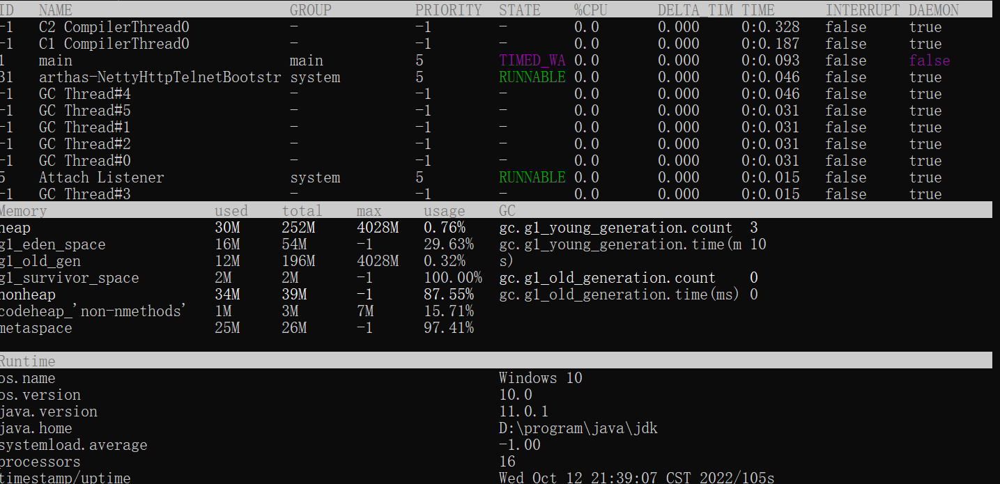
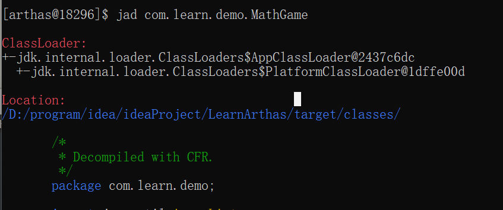
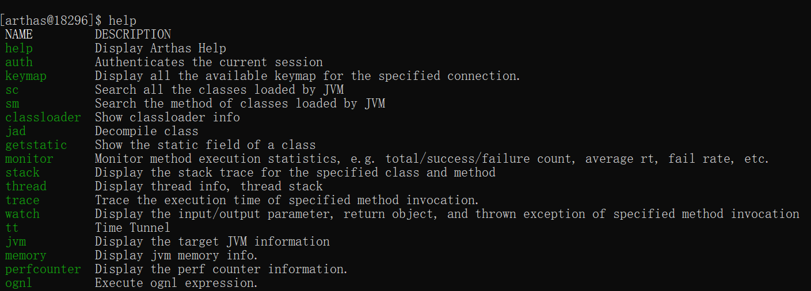

### 概述

> arthas是阿里巴巴开源的java诊断工具，他的使用场景包括但不限于以下几点

1. 这个类从哪个jar包加载？为什么报各种类相关的exception？
2. 我改的代码为什么没有执行到？难道我没commit？
3. 遇到问题无法在线上debug，只能通过加日志再重新发布？
4. 线上遇到某个用户的数据处理有问题，线下无法重现
5. 是否有一个全局视角来查看系统的运行状况？
6. 有什么办法可以监控到JVM的实时运行状态？
7. 怎么快速定位应用的热点，生成火焰图

> 运行环境

arthas支持jdk6+，支持linux/mac/windows，采用命令行交互模式，同时提供tab自动补全

### 安装

curl -O https://alibaba.github.io/arthas/arthas-boot.jar

java -jar arthas-boot.jar（运行这个命令前确保至少有一个java程序在运行）

windows下会在 C:\Users\holder\\.arthas目录安装，同时会创建C:\Users\holder\logs目录

### 运行

java -jar arthas-boot.jar

如果该端口已经被占用，可以通过**java -jar arthas-boot.jar --telnet-port 9997 --http-port -1**修改端口号

同时也可以通过浏览器连接arthashttp://127.0.0.1:3658。

可以通过修改ip，连接其他机器的arthas。默认情况下arthas只监听127.0.0.1 如果想要远程连接，使用 --target-ip参数指定listen的ip

### 常用命令

#### dashboard

> dashboard

仪表盘展示当前进程信息，按q或者ctrl+c可以中断执行

第一部分是显示JVM中运行的所有线程，所在线程组，优先级，线程的状态，CPU的占用率，是否是后台进程等

第二部分显示的是JVM内存的使用情况

第三部分是操作系统的一些信息和java版本号

#### thread

> thread

 获取到arthas-demo进程的main class

thread不带参数可以看到所有线程，thread 线程id可以看到当前线程的详细信息

#### jad

> jad com.learn.demo.MathGame

反编译main class

1. ClassLoader
2. Location
3. 反
4. 编译的源码

#### watch

> watch com.learn.demo.MathGame primeFactors returnObj

监视某个函数的返回值

#### 退出

* quit、exit退出当前连接，attach到目标进程上的arthas还会继续运行，端口会保持开放，下次连接时可以直接连接上
* stop 完全退出，关闭会话

### 基础命令

#### help

查看所有命令及描述

#### cat

查看文件

#### grep

匹配查找，但是只能用于管道命令

| 参数列表        | 作用                                 |
| --------------- | ------------------------------------ |
| -n              | 显示行号                             |
| -i              | 忽略大小写查找                       |
| -m 行数         | 最大显示函数，要与查询字符串一起使用 |
| -e "正则表达式" | 使用正则表达式查找                   |

#### pwd

显示当前工作目录

#### cls

清屏