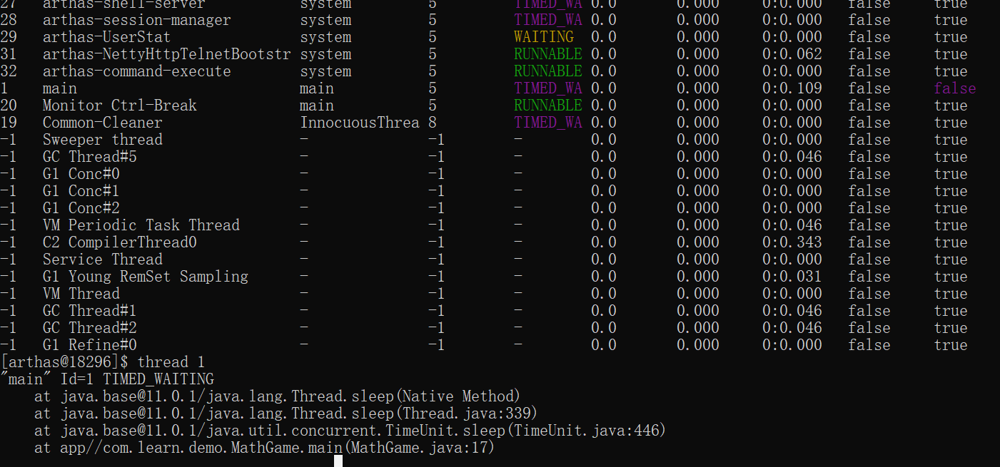

> arthas是阿里巴巴开源的java诊断工具，他的使用场景包括但不限于以下几点

1. 这个类从哪个jar包加载？为什么报各种类相关的exception？
2. 我改的代码为什么没有执行到？难道我没commit？
3. 遇到问题无法在线上debug，只能通过加日志再重新发布？
4. 线上遇到某个用户的数据处理有问题，线下无法重现
5. 是否有一个全局视角来查看系统的运行状况？
6. 有什么办法可以监控到JVM的实时运行状态？
7. 怎么快速定位应用的热点，生成火焰图

> 运行环境

arthas支持jdk6+，支持linux/mac/windows，采用命令行交互模式，同时提供tab自动补全

### 安装

curl -O https://alibaba.github.io/arthas/arthas-boot.jar

java -jar arthas-boot.jar（运行这个命令前确保至少有一个java程序在运行）

windows下会在 C:\Users\holder\\.arthas目录安装，同时会创建C:\Users\holder\logs目录

### 运行

java -jar arthas-boot.jar

如果该端口已经被占用，可以通过**java -jar arthas-boot.jar --telnet-port 9997 --http-port -1**修改端口号

同时也可以通过浏览器连接arthashttp://127.0.0.1:3658。

可以通过修改ip，连接其他机器的arthas。默认情况下arthas只监听127.0.0.1 如果想要远程连接，使用 --target-ip参数指定listen的ip

### 常用命令

#### dashboard

> dashboard

仪表盘展示当前进程信息，按q或者ctrl+c可以中断执行


第一部分是显示JVM中运行的所有线程，所在线程组，优先级，线程的状态，CPU的占用率，是否是后台进程等

第二部分显示的是JVM内存的使用情况

第三部分是操作系统的一些信息和java版本号

#### thread

> thread

 获取到arthas-demo进程的main class



thread不带参数可以看到所有线程，thread 线程id可以看到当前线程的详细信息

#### jad

> jad com.learn.demo.MathGame

反编译main class


1. ClassLoader
2. Location
3. 反
4. 编译的源码

#### watch

> watch com.learn.demo.MathGame primeFactors returnObj

监视某个函数的返回值

#### 退出

* quit、exit退出当前连接，attach到目标进程上的arthas还会继续运行，端口会保持开放，下次连接时可以直接连接上
* stop 完全退出，关闭会话

### 基础命令

#### help

查看所有命令及描述


#### cat

查看文件

#### grep

匹配查找，但是只能用于管道命令

| 参数列表        | 作用                                 |
| --------------- | ------------------------------------ |
| -n              | 显示行号                             |
| -i              | 忽略大小写查找                       |
| -m 行数         | 最大显示函数，要与查询字符串一起使用 |
| -e "正则表达式" | 使用正则表达式查找                   |

#### pwd

显示当前工作目录

#### cls

清屏

#### session

查看当前会话信息，显示java程序的pid和当前会话id

#### reset

重置增强类，将被Arthas增强过的类全部还原，Arthas服务端关闭时会重置所有增强过的类

```reset
还原指定类
reset List
还原所有以List结尾的类
reset *List
还原所有类
reset
```

#### version

输出当前java进程所加载的arthas版本号

#### history 

打印命令历史

#### quit

退出当前客户端，其他客户端不受影响

#### stop

关闭arthas服务端，素有arthas客户端全部退出

#### keymap

显示arthas中的快捷键

| 快捷键                 | 命令说明                         |
| ---------------------- | -------------------------------- |
| ctrl + a               | 跳到行首                         |
| ctrl + e               | 跳到行尾                         |
| ctrl + f               | 向前移动一个单词                 |
| ctrl + b               | 向后移动一个单词                 |
| 键盘左方向键           | 光标向前移动一个字符             |
| 键盘右方向键           | 光标向后移动一个字符             |
| 键盘下方向键           | 下翻显示下一条命令               |
| 键盘上方向键           | 上翻显示上一条命令               |
| ctrl + h               | 向前删除一个字符                 |
| ctrl + ？（shift + /） | 向后删除一个字符                 |
| ctrl + u               | 撤销上一个命令，相当于清空当前行 |
| ctrl +d                | 删除当前光标所在字符             |
| ctrl + k               | 删除当前光标到行尾的所有字符     |
| ctrl + i               | 自动补全，相当于tab              |
| ctrl + j               | 结束当前行，相当于回车           |
| ctrl + m               | 结束当前行，相当于回车           |

**后台异步命令相关快捷键**

| 命令     | 说明                                                  |
| -------- | ----------------------------------------------------- |
| ctrl + c | 终止当前命令                                          |
| ctrl + z | 挂起当前命令，后续可以bg/fg重新支持此命令，或者kill掉 |
| ctrl + a | 回到行首                                              |
| ctrl + e | 回到行尾                                              |

### JVM相关命令

#### dashboard

显示当前系统的实时数据面板，按q或者ctrl+c退出


#### thread

查看当前JVM的线程堆栈信息

* thread -n 3

  打印出最忙的前n个线程并打印堆栈

* thread -b

  如果出现了死锁问题，或者某个线程持有锁阻塞了后续进程，则可以用trhead -b查找被阻塞的线程信息

  

* thread -i 1000 

  指定采样时间间隔，每过*1000*毫秒采样

* thread --statet WAITING

  查看处于*等待*状态的线程 

#### jvm

查看jvm信息

#### sysprop

查看和修改jvm系统的属性

* sysprop 

  查看所有属性

* sysprop java.version

  查看单个属性

* sysprop user.country CN

  修改属性值

#### sysenv

查看当前JVM的环境属性

* sysenv 

  查看所有属性

* sysenv user

  查看单个环境变量

#### vmoption

查看，更新VM诊断相关的参数

* vmoption

  查看所有参数

* vmoption key

  查看单个参数

* vmoption key value

  修改某个参数

#### getstatic

查看运行时类的静态属性

getstatic 类名 属性名

#### ognl

执行ognl表达式

| 参数名称 | 参数说明                                                    |
| -------- | ----------------------------------------------------------- |
| express  | 执行的表达式                                                |
| [c:]     | 执行表达式Class Loader的hashcode，默认值是SystemClassLoader |
| [x]      | 结果对象的展开层次，默认值1                                 |

```ognl
ognl '@java.lang.System@out.println("hello")'
ognl '@com.learn.demo.MathGame@random'
ognl '#value1=@System@getProperty("java.home"), #value2= @System@getProperty("java.runtime.name"), {v}'alue1, #value2}'
```

### Class/Classloader相关命令

#### sc

search class，查看JVM已加载的类信息，这个命令能搜索出所有已经加载到JVM中的Class信息

sc默认开启子类匹配功能，也就是说当前类的子类也会被搜出来，想要精确匹配，需要打开options disable-sub-class true开关

| 参数名称       | 参数说明                                                     |
| -------------- | ------------------------------------------------------------ |
| class-pattern  | 类名表达式匹配，支持全限定名，如com.taobao.test.AAA，也支持com/taobao/test/AAA这样的格式 |
| method-pattern | 方法名表达式匹配                                             |
| [d]            | 输出当前类的详细信息，包括这个类所加载的原始文件来源，类的声明，加载的ClassLoader等详细信息。如果一个类被多个ClassLoader加载，则会出现多次 |
| [E]            | 开启正则表达式匹配，默认为通配符匹配                         |
| [f]            | 输出当前类的成员变量信息（需要配合参数-d一起使用）           |

#### sm

search method，查看已加载的类的方法信息。这个命令能搜索除所有已加载了Class信息的方法信息

sm命令只能看到由当前类所声明的方法，父类的无法看到

| 参数名称       | 参数说明                             |
| -------------- | ------------------------------------ |
| class-pattern  | 类名表达式匹配                       |
| method-pattern | 方法名表达式匹配                     |
| [d]            | 展示每个方法的详细信息               |
| [E]            | 开启正则表达式匹配，默认为通配符匹配 |

#### jad

反编译指定已加载类源码

jad命令将JVM中实际运行从class的byte code反编译成java代码，便于理解业务逻辑

在arthas console上，反编译出来的源码是带语法高亮的，阅读方便。反编译出来的java代码可能存在语法错误

| 参数名称      | 参数说明                             |
| ------------- | ------------------------------------ |
| class-pattern | 类名表达式匹配                       |
| [E]           | 开启正则表达式匹配，默认为通配符匹配 |

反编译时只显示源代码，默认会带有ClassLoader信息，通过-source-only选项，可以只打印源代码。方便和mc/redefine命令结合使用

jad -source-only ****

#### mc

Memory Compiler 内存编译器，编辑.java文件生成.class文件

mc  d:/Hello.java -d d:/ 

-d可以指定编译到目录

#### redefine

加载外部的.class文件，redefine到JVM里

```
redefin后的原来的类不能回复，redefine有可能失败
reset命令对redefine的类无效，如果想重置，需要redefine原始的字节码
redefine命令和jad/watch/trace/monior/tt等命令会冲突，执行完redefine之后，如果再执行上面提到的命令，会把redefine的字节码重置
```

**redefine的限制**

```
不允许新增加field/method
正在跑的函数，没有退出不能生效
```

#### dump

将已加载类的字节码文件保存到特定目录：logs/arthas/classdump/

#### classloader

获取类加载器的信息

1. classloader命令将JVM中所有的classloader的信息统计出来，并可以展示继承树，urls等
2. 可以让指定classloader去getResources，答应出所有查找到的resource的url。对于ResourceNotFoundException异常比较有用 

| 参数名称          | 参数说明                                |
| ----------------- | --------------------------------------- |
| \[l]   *(小写 L)* | 按类加载实例进行统计                    |
| [t]               | 打印所有ClassLoader的继承树             |
| [a]               | 列出所有ClassLoader加载的类，请谨慎使用 |
| [c:]              | ClassLoader的hashcode                   |
| [c:r:]            | 用ClassLoader去查找resource             |
| [c:load:]         | 用ClassLoader去加载指定的类             |

* classloader

  

* classloader -l

  

### 监视相关命令

watch、stack、trace都支持#cost耗时条件过滤

#### monitor

监控指定类中方法的执行情况


* timestamp 时间戳
* class 监视的类名
* method 监视的方法名
* total 方法执行了几次
* success 方法执行成功了几次
* fail 方法执行失败了几次
* avg-rt（ms） 方法执行平均耗时
* fail-rate 失败率

#### watch

观察到指定方法的调用情况

| 参数名称          | 参数说明                                        |
| ----------------- | ----------------------------------------------- |
| class-pattern     | 类名表达式匹配                                  |
| method-pattern    | 方法名表达式匹配                                |
| express           | 观察表达式                                      |
| condition-express | 条件表达式                                      |
| [b]               | 在方法调用之前观察 before                       |
| [e]               | 在方法异常之后观察 exception                    |
| [s]               | 在方法返回之后观察 success                      |
| [f]               | 在方法结束之后（正常返回和异常返回）观察 finish |
| [E]               | 开启正则表达式匹配，默认为通配符匹配 regex      |
| [x]               | 指定输出结果的属性遍历深度，默认为1  expend     |

特别说明

* watch命令定义了4个观察事件点，即-b方法调用前，-e方法异常后，-s方法返回后，-f方法结束后
* 四个观察事件点-b、-e、-s默认关闭，-f默认打开，当指定观察点被打开后，在相应事件点会对观察表达式进行求值并输出
* 这里要注意**方法入参**和**方法出参**的区别，有可能在中间被修改导致前后不一致，除了-b事件点params代表方法入参外，其余事件都代表方法出参
* 当使用-b时，由于观察事件点时在方法调用前，此时返回值和异常均不存在


```
watch com.learn.demo.MathGame primeFactors "{params, target,returnObj}" "returnObj != null && returnObj.size() > 2" -x 3  //输出returnObj不为null且长度大于2的情况
```

#### trace

方法内部调用路径，并输出方法路径上的每个节点上耗时

默认情况下，trace不会包含jdk里的函数调用，如果需要，要显示设置 --skipJDKMethod false

#### stack

输出当前方法被调用的调用路径

tt

time tunnel，记录下指定方法每次调用的入参和返回信息，并能对这些不同时间下调用的信息进行观测

| 参数 | 说明                             |
| ---- | -------------------------------- |
| -t   | 记录某个方法在一个时间段内的调用 |
| -l   | 列出所有已经记录的列表           |
| -n   | 只记录执行次数                   |
| -s   | 用ognl表达式进行搜索             |
| -i   | 查看指定索引号的详细调用信息     |
| -p   | 重新调用指定的索引号时间碎片     |

### 其他命令

#### options

| 名称                | 默认值 | 描述                                                        |
| ------------------- | ------ | ----------------------------------------------------------- |
| unsafe              | fasle  | 是否支持对系统级别的类进行增强，打开该开关可能导致把JVM搞挂 |
| dump                | false  | 是否支持对被增强了的类dump到外部文件中                      |
| batch-retransform   | true   | 是否支持批量对匹配到的类执行retransform操作                 |
| json-format         | false  | 是否支持json化输出                                          |
| disbale-sub-class   | false  | 是否禁用子类匹配，默认在匹配目标类的时候会默认匹配到其子类  |
| debug-for-asm       | false  | 打印ASM相关的调试信息                                       |
| save-result         | false  | 是否打开执行结果存日志功能                                  |
| job-timeout         | 1d     | 异步后台任务的默认超时时间，超过这个时间，任务自动停止      |
| print-parent-fields | true   | 是否打印parent class里的field                               |

#### profiler

生成火焰图，本质上时通过不断的采样，然后把收集到的采样结果生成火焰图

火焰越高，调用越多