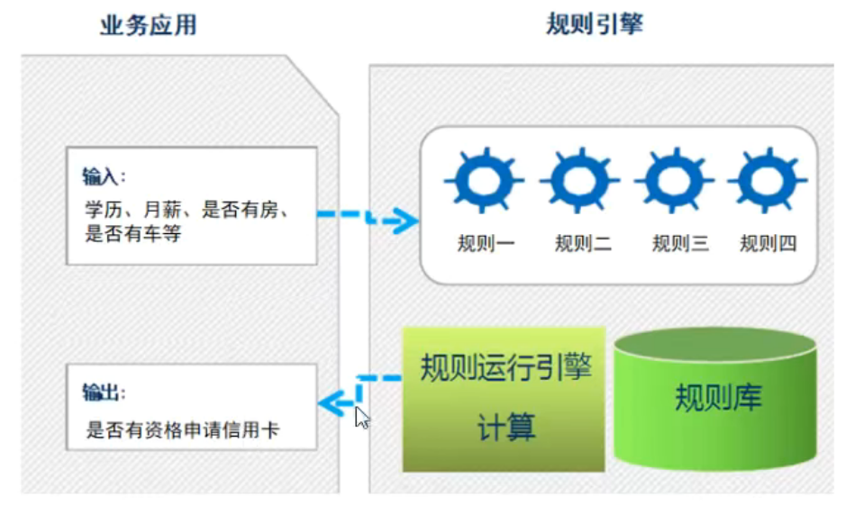
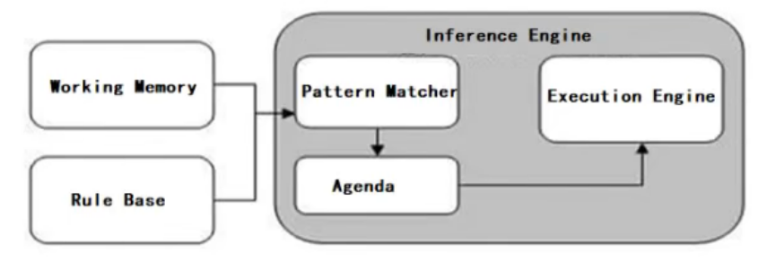
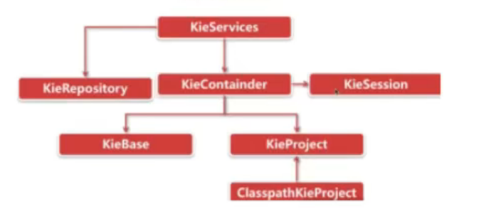

### 问题引出

申请信用卡举例，办理信用卡需要进行多维度信息的校验（学历，月收入，是否有房、车，已申请信用卡数量）。此类业务，最容易想到的就是用分支判断（if-else）来实现

```java
//检查用户信息合法性，返回true表示检查通过，false表示不通过
public boolean checkUser(User user) {
    //没房没车，学历大专以下，月薪少于5000，申请不通过
    if (user.getHouse == null &&user.getCar() == null && user.getEducation().equals("大专以下") && user.getSalary() < 5000) {
		return false;
    } 
    // 没房没车，学历大专或本科，月薪少于3000，申请不通过
    else if (user.getHouse == null &&user.getCar() == null && user.getEducation().equals("大专或本科") && user.getSalary() < 3000) {
		return false;
    } 
    //等等情况，不一一列举了
}
```

缺点：

* 硬编码实现业务规则难以维护
* 硬编码实现业务规则难以应对变化
* 业务规则发生变化需要修改代码，重启服务后才能生效

### 规则引擎概述

#### 什么是规则引擎

**规则引擎**全称为业务规则管理系统，英文名为BRMS（Business Rule Management System）。规则引擎的主要思想是将应用程序中的业务决策部分分离处理出来，并使用预定义的语义模块编写业务决策（业务规则），由用户或开发者再需要时进行配置、管理。这类产品有：drools、VisualRules、iLog等

规则引擎实现了将业务决策从应用程序代码中分离出来，接收数据输入，解释业务规则，并根据业务规则做出业务决策。规则引擎其实就是一个输入输出平台。



系统中引入规则引擎后，业务规则不再以程序代码的形式驻留再系统中，取而代之的是处理规则的规则引擎，业务规则存储在规则库中，完全独立于程序。业务人员可以像管理数据一样对业务规则进行管理，比如查询、添加、更新、统计、提交业务规则等。业务规则被加载到规则引擎中供应系统调用

#### 规则引擎的优势

* 业务规则与系统代码分离，实现业务规则的集中管理
* 在不重启服务的情况下，可随时对业务规则进行扩展和维护
* 可以动态修改业务规则，从而快速响应需求变更
* 规则引擎是相对独立的，只关心业务规则，使得业务分析人员也可以参与编辑、维护系统的业务规则
* 减少了硬编码业务规则的成本和风险
* 使用规则引擎提供的规则编辑工具，使复杂的业务规则变得简单

#### Drools介绍

drools是基于java语言开发的开源规则引擎，可以将复杂多变的业务规则从硬编码中解放出来，以规则脚本的形式存放在文件或特定的存储介质中（例如存放在数据库中），使得业务规则的变更不需要修改项目代码、重启服务器就可以使线上环境立即生效

#### 规则引擎构成

* **Working Memory**（工作内存）

  工作内存，drools规则引擎会从Working Memory中获取数据并和规则文件中定义的规则进行模式匹配，所以我们开发的应用程序只需要将我们的数据插入到Working Memory中即可

* **Rule Base**（规则库）

  规则库，我们在规则文件中定义的规则都会被加载到规则库中

* **Inference Engine**（推理引擎）

  * **Pattern Matcher**（匹配器）

    匹配器，将rule base中的所有规则与working memory中的fact对象进行模式匹配，匹配成功的规则将被激活并放入Agenda中

  * **Agenda**（议程）

    议程，用于存放通过匹配器进行模式匹配后被激活的规则

  * **Execution Engine**（执行引擎）

    执行引擎，执行Agenda中被激活的规则



其他概念

**Fact**：事实，是指在drools规则应用当中，将一个普通的JavaBean插入到Working Memory后的对象就是Fact对象。Fact对象是我们的应用和规则引擎进行数据交互的桥梁或通道

#### 规则引擎执行过程

1. 将初始数据（fact）输入至工作内存（working memory）
2. 使用Pattern Matcher将规则库中的规则（rule）和数据（fact）比较
3. 如果执行规则存在冲突（conflict），即同时激活了多个规则，将冲突的规则放入冲突集合
4. 解决冲突，将激活的规则按顺序放入Agenda
5. 执行Agenda中的规则。
6. 重复步骤2-5，直到执行完毕Agenda中的所有规则

#### KIE介绍



大部分类名都是Kie开头。Kie全称为Knowledge Is Everything（知识就是一切），是Jboss一系列项目的总称。

### 入门案例

#### 业务场景说明

消费者在图书商城购买图书，下单后需要在支付页面显示订单优惠后的价格，具体优惠如下

| 规则编号 | 规则名称 | 描述                                 |
| -------- | -------- | ------------------------------------ |
| 1        | 规则一   | 所购图书总价在100元以下的没有优惠    |
| 2        | 规则二   | 所购图书总价在100元到200元的优惠20元 |
| 3        | 规则三   | 所购图书总价在200元到300元的优惠50元 |
| 4        | 规则四   | 所购图书总价在300元以上的优惠100元   |

#### 实现

1. 导入maven坐标

   ```xml
   <dependency>
       <groupId>org.drools</groupId>
       <artifactId>drools-compiler</artifactId>
       <version>7.66.0.Final</version>
   </dependency>
   <dependency>
       <groupId>org.drools</groupId>
       <artifactId>drools-core</artifactId>
       <version>7.66.0.Final</version>
   </dependency>
   <!--mvel不导入，获取不到dialect，会抛出空指针异常-->
   <dependency>
       <groupId>org.drools</groupId>
       <artifactId>drools-mvel</artifactId>
       <version>7.66.0.Final</version>
   </dependency>
   <dependency>
       <groupId>org.kie</groupId>
       <artifactId>kie-api-parent</artifactId>
       <version>7.66.0.Final</version>
       <type>pom</type>
   </dependency>
   ```

2. 在resources目录下创建META-INF/kmodule.xml文件

   ```xml
   <?xml version="1.0" encoding="UTF-8"?>
   <kmodule xmlns="http://www.drools.org/xsd/kmodule">
       <!--
       name：指定kbase名称，可以任意，但是需要唯一
       packages：指定规则文件目录，需要根据实际情况填写，否则无法加载到规则文件，与文件实际的文件夹路径不同，只扫描drl文件的package是否相同
       default：指定当前kbase是否默认
       -->
       <kbase name="myKbase" packages="rules" default="true">
           <!--
           name：指定ksession名称，可以任意，但是需要唯一
           default：指定当前session是否为默认
           -->
           <ksession name="ksession-rule" default="true"/>
       </kbase>
   </kmodule>
   ```

3. 在resources目录下创建rules/*.drl文件

   ```java
   //包名必须与kmodule文件中指定的packages相同，否则无法不会加载此文件！！！
   package rules;
   import com.learn.drools.entity.Order;
   
   //所购图书总价在100元以下没有优惠
   rule "book_discount_1"
       when
   //        $order:Order(originalPrice < 100.0)//模式匹配，到规则引擎中（工作内存）查找Order对象
           $order:Order(originalPrice < 100)
       then
           $order.setRealPrice($order.getOriginalPrice());
           System.out.println("成功匹配到规则一");
   end
   
   //所购图书总价在100元到200元的优惠20元
   rule "book_discount_2"
       when
           //模式匹配，到规则引擎中（工作内存）查找Order对象
           $order:Order(originalPrice >= 100 && originalPrice < 200)
       then
           $order.setRealPrice($order.getOriginalPrice() - 20);
           System.out.println("成功匹配到规则二");
   end
   
   //所购图书总价在200元到300元的优惠50元
   rule "book_discount_3"
       when
           //模式匹配，到规则引擎中（工作内存）查找Order对象
           $order:Order(originalPrice >= 200 && originalPrice < 300)
       then
           $order.setRealPrice($order.getOriginalPrice() - 50);
           System.out.println("成功匹配到规则三");
   end
   
   //所购图书总价在300元以上的优惠100元
   rule "book_discount_4"
       when
           //模式匹配，到规则引擎中（工作内存）查找Order对象
           $order:Order(originalPrice >= 300)
       then
           $order.setRealPrice($order.getOriginalPrice() - 100);
           System.out.println("成功匹配到规则四");
   end
   ```

4. 创建java文件进行测试

   ```java
    KieServices kieServices = KieServices.Factory.get();
   //获取容器对象
   //KieContainer kieContainer = kieServices.getKieClasspathContainer();
   KieContainer kieContainer = kieServices.newKieClasspathContainer();
   //获取会话对象
   KieSession kieSession = kieContainer.newKieSession();
   //fact对象
   Order order = new Order();
   order.setOriginalPrice(500D);
   
   //将order对象插入到工作内存中
   kieSession.insert(order);
   
   //激活规则，由drools框架自动进行规则匹配，如果规则匹配成功，则执行当前规则
   int i = kieSession.fireAllRules();
   
   //匹配到了几条规则
   System.out.println(i);
   //关闭会话
   kieSession.dispose();
   System.out.println(order);
   ```

### Drools基础语法

#### 规则文件构成

在使用Drools时非常重要的一个工作就是编写规则文件，通常规则文件的后缀为drl

drl时Drools Rule Language的缩写。在规则文件中编写具体的规则内容

| 关键字   | 描述                                                         |
| -------- | ------------------------------------------------------------ |
| package  | 包名，只限于逻辑上的管理，同一个包名下的查询或者函数可以直接调用 |
| import   | 用于导入类或静态方法                                         |
| global   | 全局变量                                                     |
| function | 自定义函数                                                   |
| query    | 查询                                                         |
| rule end | 规则体                                                       |

Drools支持的规则文件，除了drl形式，还有Excel文件类型的。

#### 规则体语法结构

规则体是规则文件内容中的重要组成部分，是进行业务规则判断、处理业务结果的部分

```java
//注释和java一致
/*
  第二种注释方法
*/
rule "ruleName"
    attributes
    when 
    	LHS
    then 
    	RHS
end
```

**rule**：关键字，表示规则开始，参数为规则的唯一名称

**attributes**：规则属性，是rule与when之间的参数，为可选项

**when**：关键字，后面跟规则的条件部分

**LHS**(Left Hand Side)：是规则的条件部分的通用名称。他由零个或多个条件元素组成。如果LHS为空，则他们将被视为始终为true的条件元素

**then**：关键字，后面跟规则的结果部分

**RHS**(Right Hand Side)：是规则的后果或行动部分的通用名称

**end**：关键字，表示一个规则的结束

#### 模式匹配

Drools中的匹配器可以将Rule Base中的所有规则与Working Memory中的Fact对象进行模式匹配，那么我们就需要在规则体的LHS部分定义规则并进行模式匹配。LHS部分由一个或者多个条件组成，条件又称为pattern

Pattern的语法结构为：绑定变量名:类型约束(域约束)

例如：$order:Order(originalPrice < 100)

其中绑定变量名可以省略，通常绑定变量名的命名一般建议以$开始。如果定义了绑定变量名，就可以在规则体的RHS部分使用此绑定变量名来操作相应的Fact对象。Field约束部分是需要返回true或者false的0个或多个表达式

```java
//所购图书总价在100元到200元的优惠20元
rule "book_discount_2"
    when
        //Order为类型约束，originalPrice为属性约束
        $order:Order(originalPrice >= 100 && originalPrice < 200)
    then
        $order.setRealPrice($order.getOriginalPrice() - 20);
        System.out.println("成功匹配到规则二");
end
```

* 工作内存中必须存在Order这种类型的Fact对象--类型约束
* Fact对象的originalPrice属性值必须小于200--属性约束
* Fact对象的originalPrice属性值必须大于等于100--属性约束

以上条件必须同时曼珠当前规则才有可能激活

绑定变量既可以用在对象上，也可以用在对象的属性上。

LHS部分还可以定义多个pattern，多个pattern之间可以使用and或者or进行连接，也可以不写，默认连接为and

#### 比较操作符

基本比较符：\>、<、\>=、 <=、==、!=

| 其他比较符   | 描述                                                         |
| ------------ | ------------------------------------------------------------ |
| contains     | 检查一个Fact对象的某个属性值是否包含一个指定的对象值         |
| not contains | 检查一个Fact对象的某个属性值是否不包含一个指定的对象值       |
| memberOf     | 判断一个Fact对象的某个属性是否在一个或多个集合中             |
| not memberOf | 判断一个Fact对象的某个属性是否不在一个或多个集合中           |
| matches      | 判断一个Fact对象的属性是否与提供的标准的java正则表达式进行匹配 |
| not matches  | 判断一个Fact对象的属性是否不语提供的标准的java正则表达式进行匹配 |

语法

* contains | not contains语法结构

  Object(Field[Collection/Array] contains value)

  Object(Field[Collection/Array] not contains value)

* memberOf | not memberOf

  Object(field memberOf value[Collection/Array])

  Object(field not memberOf value[Collection/Array])

* matches | not matches

  Object(field matches "正则表达式")

  Object(field not  matches "正则表达式")

#### 执行指定规则

```java
kieSession.fireAllRules(new RuleNameEqualsAgendaFilter("not_matches_test"));
//RuleNameEqualsAgendaFilter也可以换成其他的过滤器，比如规则名称以xx开始的才能触发，以xx结尾的才能触发
```

#### 关键字

Drrols的关键字分别为：硬关键字(Hard keywords)和软关键字(Soft keywords)

硬关键字是我们在规则文件中定义包名或者规则名时明确不能使用的，否则程序会报错。软关键字虽然可以使用，但是不建议使用

硬关键字：true false null

软关键字：lock-on-active、data-effective、data-expires、no-loop、auto-focus、activation-group、agenda-group、ruleflow-group、entry-point、duration、package、import、dialect、salience、enabled、attributes、rule、extend、when、then、template、query、declare、function、global、eval、not、in、or、and、exists、forall、accumulate、collect、from、action、reverse、result、end、over、init

#### Drools内置方法

规则文件的RHS部分的主要作用是通过插入、删除或修改工作内存中的Fact数据，来达到控制规则引擎执行的目的。Drools提供了一些方法可以用来操作工作内存中的数据，操作完成后规则引擎会重新进行相关规则的匹配，原来没有匹配成功的规则在我们修改数据完成后有可能就会匹配成功

* **update**

  update方法的作用是更新工作内存中的数据，并让相关的规则重新匹配

* **insert**

  insert方法的作用是向工作内存中插入数据，并让相关的规则重新匹配

* **retract**

  retract方法的作用是删除工作内存中的数据，并让相关的规则重新匹配

### 规则属性

| 属性名           | 说明                                                 |
| ---------------- | ---------------------------------------------------- |
| salience         | 指定规则执行优先级                                   |
| dialect          | 指定规则使用的语言类型，取值为java和mvel，默认是java |
| enabled          | 指定规则是否启用，默认启用                           |
| date-effective   | 指定规则生效时间                                     |
| date-expires     | 指定规则失效时间                                     |
| activation-group | 激活分组，具有相同分组名称的规则只能有一个规则触发   |
| timer            | 定时器，指定规则触发的时间                           |
| auto-focus       | 自动获取焦点，一般结合agenda-group一起使用           |
| no-loop          | 防止死循环                                           |

#### salience

salience属性用于指定规则的执行优先级，取值类型为Integer。数值越大越优先执行。每个规则都有一个默认的执行顺序，如果不设置salience属性，规则体的执行顺序为由上到下

#### **no-loop**

no-loop属性用于防止死循环，当规则通过update之类的函数修改了fact对象时，可能使当前规则再次被激活从而导致死循环。取值类型为boolean，默认为false

#### **activation-group**

activation-group属性是指激活分组，取值为String类型。具有相同分组名称的规则只能由一个规则被触发

#### **agenda-group**

agenda-group属性为议程分组，属于另一种可控的规则执行方式。用户可以通过设置agenda-group来控制规则的执行，只有获取焦点的组中的规则才会被触发

```java
kieSession.getAgenda().getAgendaGroup("group1").setFocus();//指定组获得焦点
```

#### **auto-focus**

自动获取焦点，取值类型为boolean，默认值为false。一般结合agenda-group属性使用，当一个议程分组未获取焦点时，可以设置auto-focus属性来控制。议程分组中的规则，只要有一个标记为auto-focus true，这个组就会自动获取焦点。

#### **timer**

timer属性可以通过定时器的方式指定规则执行时间，使用方式有两种

1. timer(int:\<initial delay> \<repeat interval>?)

   此种方法遵循java.util.Timer对象的使用方式，第一个参数表示几秒后执行，第二个参数表示每隔几秒执行一次，第二个参数为可选

   ```java
   //启动规则引擎进行匹配，直到调用halt方法才结束规则引擎
   new Thread(kieSession::fireUntilHalt).start();
   kieSession.halt();
   ```

   ```java
   rule "timer_test"
       timer(3s 2s)
       when
       then
           System.out.println("test timer");
   end
   ```

2. timer(cron:\<cron expression>)

   此种方法使用标准的unix cron表达式的使用方式来定义规则执行时间

   ```java
   timer(cron:0/2 * * * * ?)
   ```

#### **date-effective**

date-effective属性用于指定规则的生效时间，即只有当前系统时间大于等于设置的时间或者日期规则才有可能触发。默认日期格式为dd-MM-yyy。用户也可以自定义日期格式

```java
rule "test_date_effective"
    date-effective "2022-03-09 10:10:00"
    when
    then
        System.out.println("test_date_effective time " + new SimpleDateFormat("yyyy-MM-dd HH:mm:ss").format(new Date()));
end
```

#### **date-expires**

date-expires属性用于指定规则的失效时间，即只有当前系统时间小于设置的时间或者日期规则才有可能触发。默认日期格式为dd-MM-yyyy。用户也可以自定义日期格式

### 高级语法

#### **global**

global关键字用于在规则文件中定义全局变量，它可以让应用程序的对象在规则文件中能够被访问。可以用来为规则我呢见提供数据或服务。

语法结构为：global 对象类型 对象名称

在使用global定义的全局变量时有两点需要注意：

1. 如果对象类型为包装类型时，在一个规则中改变了global值，那么只针对当前规则有效，对其他规则中的global不会有影响。可以理解为他是当前规则代码中的global副本，规则内部修改不会影响全局的使用
2. 如果对象类型为集合类型或JavaBean时，在一个规则中改变了global的值，对java代码和所有规则都有效

#### **query**

query查询提供了一种查询working memory中符合约束条件的fact对象的简单方法。它仅包含规则文件中的LHS部分，不用指定"when"和"then"部分并且以end结束

```java
query 查询的名称（可选参数）
    LHS
end
```

```java
QueryResults query_1 = kieSession.getQueryResults("ruleName", "xxxx"...);
```

#### **function**

function关键字用于在规则文件中定义函数，就相当于java类中的方法一样。可以在规则体中调用定义的函数。使用函数的好处是可以将业务逻辑集中放置在一个地方，根据需要可以对函数进行修改。

```java
function 返回值类型 函数名（可选参数）{
    //逻辑代码
}
```

#### **LHS加强**

* 复合值限制in/not in

  复合值限制是指超过一种匹配的限制条件，类似于SQL语句中的in关键字。Drools规则体中的LHS部门可以使用in或者not in进行复合值的匹配

  ```java
  Object(field in (比较值1, 比较值2...))
  $s:Student(name in ("1", "2", "3"))
  $s:Student(name not in ("1", "2", "3"))
  ```

* 条件元素eval

  eval用于规则体的LHS部分，并返回一个Boolean类型的值

  ```java
  eval(表达式)
  eval(true)
  eval(false)
  eval(1 == 1)
  ```

* 条件元素not

  not用于判断Working Memory中是否存在某个Fact对象，如果不存在则返回true，否则返回false

  ```java
  not Object(可选属性约束);
  not Studemt();
  ```

* 条件元素exists

  exists的作用与not相反，用于判断Working Memory中是否存在某个Fact对象，如果存在则返回true，不存在则返回false

  ```java
  exists Object(可选属性约束)
  exists Student()
  ```

  和不加exists的区别：当向Working Memory中加入多个满足条件的Fact对象时，使用了exists的规则执行一次，不使用exists的规则会执行多次

* 规则继承

  规则之间可以使用extends关键字进行规则条件部分的继承，类似于java类之间的继承

#### **RHS加强**

在RHS部分Drools为我们提供了一个内置对象，名称就是drools

* halt

  halt方法的作用时立即终止后面所有规则的执行

* getWorkingMemory

  getWorkingMemory方法的作用是返回工作内存对象

* getRule

  getRule方法的作用是返回规则对象

#### **规则文件编码规范**

* 所有的规则文件(.drl)应统一放在一个规定的文件夹中
* 书写的每个规则应尽量加上注释。注释要清晰明了，言简意赅
* 同一类型的对象尽量放在一个规则文件中
* 规则结果部分(RHS)尽量不要有条件语句
* 每个队则最好都加上salience属性，明确执行顺序
* Drools默认dialect为java，尽量避免使用dialect “mvel”

### WorkBench

#### 简介

WorkBench是KIE组件中的元素，也称为KIE-WEB，是Drools-WB与JBPM-WB的结合体。他是一个可视化的规则编辑器。WorkBench其实就是一个war包，安装到tomcat中就可以运行。使用WorkBench可以在浏览器中创建数据对象、创建规则文件、创建测试场景并将规则部署到maven仓库供其他应用使用

#### 安装

https://blog.csdn.net/qq_36305027/article/details/106597643

