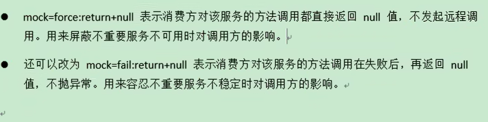
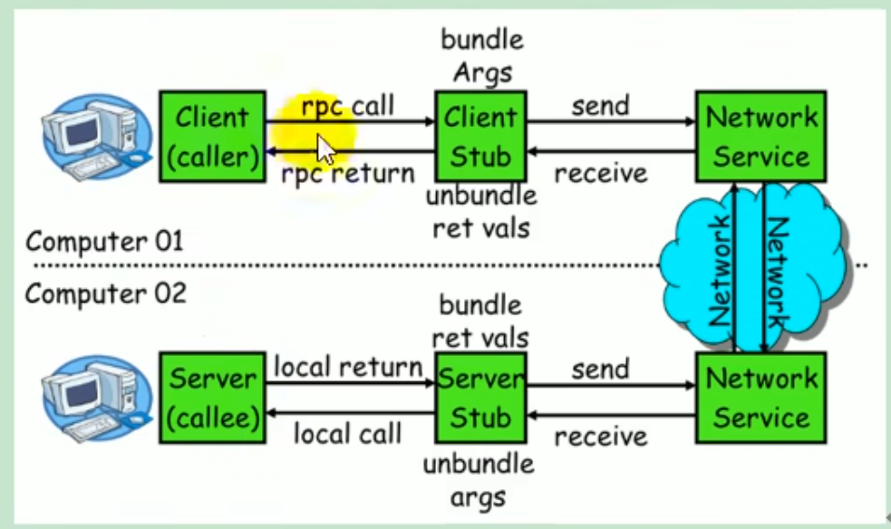
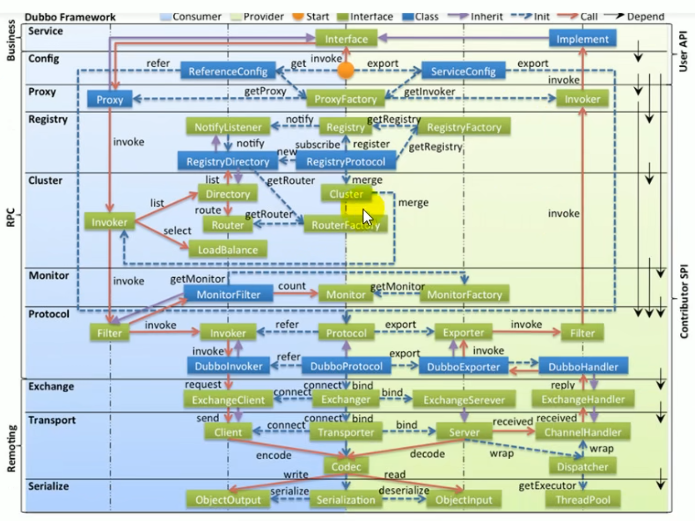
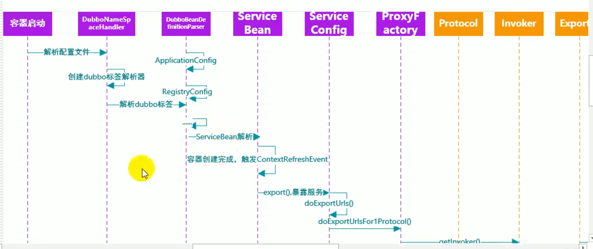
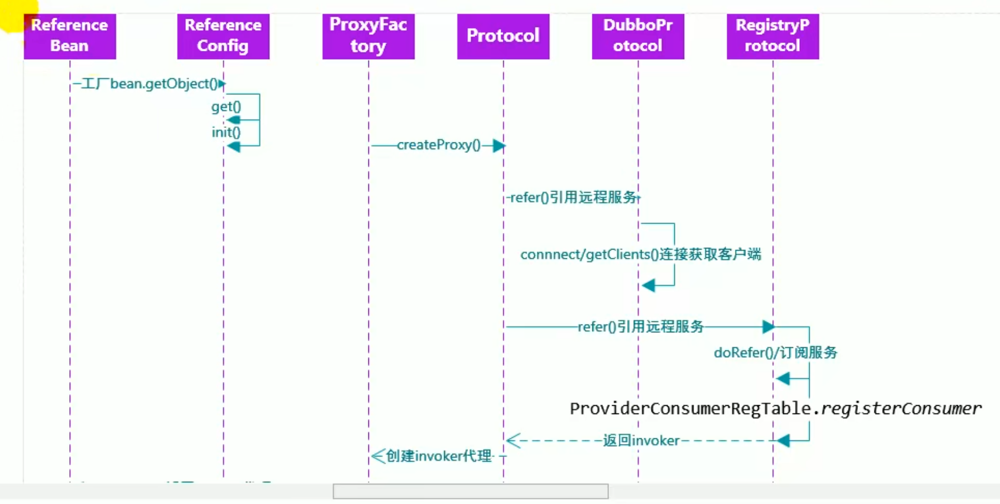

### 分布式系统

分布式系统是若干独立计算机的合集，这些计算机对用户来说就像单个相关系统

### RPC

RPC(Remote Procedure Call)是指远程过程调用，是一种进程间通信方式，他是一种技术的思想，而不是规范。他允许程序调用另一个地址空间(通常时共享网络的另一台机器上)的过程或函数，而不用程序员显式编码这个远程调用的细节。即程序员无论是调用本地的还是远程的函数，本质上编写的调用代码基本相同。

### provider.xml

```xml
<beans>
    <!-- 指定当前服务名称 -->
    <dubbo:application name = "" ></dubbo:application>
    <!-- 指定注册中心位置 -->
    <dubbo:register protocol = "zookeeper" address =  ""></dubbo:register>
    <!-- 指定通信规则 -->
    <dubbo:protocol name = "dubbo" port = "20880"></dubbo:protocol> 
    <!-- 暴露服务, ref指向服务真正的实现对象 -->
    <dubbo:service interface = "" ref = ""></dubbo:service>
    <bean id = "test" class = ""></bean>
</beans>
```

```xml
<beans>
    <!-- 指定当前服务名称 -->
    <dubbo:application name = "" ></dubbo:application>
    <!-- 指定注册中心位置 -->
    <dubbo:register protocol = "zookeeper" address =  ""></dubbo:register>
    <!-- 指定通信规则 -->
    <dubbo:protocol name = "dubbo" port = "20880"></dubbo:protocol> 
    <!-- 声明需要调用的远程服务的接口，生成远程服务代理 -->
    <dubbo:reference interface = "" id = ""></dubbo:reference>
    
</beans>
```

### 覆盖策略：

dubbo的配置可以通过jvm参数传入，也可以配置在dubbo.xml或者dubbo.properties中

优先级顺序是：jvm>xml>properties

### 配置覆盖关系

以timeout为例

* 方法级优先，接口级次之，全局配置再次之
* 如果级别一样，则消费方优先，提供方次之

### springboot与dubbo整合的三种方式

1. 导入dubbo-starter，在application.properties配置属性，使用@Service【暴露服务】使用@Reference【引用服务】
2. 保留dubbo.xml配置文件，导入dubbo-starter，使用@ImportResource导入dubbo配置文件即可
3. 使用注解API的方式，将每一个组件手动创建到容器中

### zookeeper宕机

zookeeper注册中心宕机，还可以消费dubbo暴露的服务

* 监控中心宕掉不影响使用，只是丢失部分采样数据
* 数据库宕掉后，注册中心仍能通过缓存提供服务列表查询，当不能注册新服务
* 注册中心对等集群，任意一台宕掉后，自动切换到另一台
* **注册中心全部宕掉后，服务提供者和服务消费者仍能通过本地缓存通讯**
* 服务提供者无状态，任意一台宕掉后，不影响使用
* 服务提供者全部宕掉后，服务消费者应用将无法使用，并无限次重连等待服务提供者恢复

### dubbo直连

在使用reference注解引用服务时，可以通过url参数指定ip和端口

### 负载均衡

1. 随机，按权重设置随机概率
2. 轮循，按公约后的权重设置轮循比率
3. 最少活跃调用数，相同活跃数的随机，活跃数指调用前后计数差，使慢的提供者收到更少请求，因为越慢的提供者的调用前后计数差别会越大
4. 一致性hash，相同参数的请求总是发到同一个提供者

### 服务降级



### RPC原理



一次同步的RPC调用流程

1. 服务消费方（client）调用以本地方法调用方式调用服务
2. client stub接收到调用后负责将方法、参数组装成能够进行网络传输的消息体
3. client stub找到服务地址后，将消息发送到服务端
4. server stub收到消息后进行解码
5. server stub根据解码结果调用本地服务
6. 本地服务执行并将结果返回给server stub
7. server stub将返回结果打包成消息并发送至消费方
8. client stub接收到消息，并进行解码
9. 服务消费方得到最终结果

### 集群容错模式

* 失败自动切换，当出现失败，重试其他服务器，通常用于读操作，但重试会带来更长的延迟。可通过retries="2"来设置重试次数（不含第一次）
* 快速失败，只发起一次调用，失败立即报错。通常用于非幂等性的写操作，比如新增记录
* 失败安全，出现异常，直接忽略，通常用于写入审计日志等操作
* 失败自动恢复，后台记录失败请求，定时重发。通常用于消息通知操作
* 并行调用多个服务器，只要一个成功即返回。通过用于实时性要求较高的读擦欧总，但需要浪费更多服务资源。可通过forks="2"来设置最大并行数
* 广播调用所有提供者，逐个调用，任意一台报错则报错。通常用于通知所有提供者更新缓存或日志等本地资源信息

### dubbo框架原理



#### 服务暴露流程

```java
DubboBeanDefinitionParser implements BeanDefinitionParser {
   BeanDefinition parse()
}
```



#### 服务引用流程



#### 服务调用流程