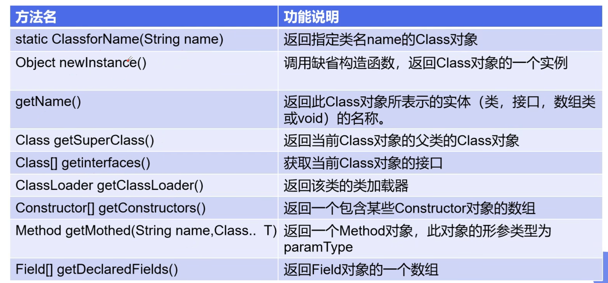

### 什么是注解

Annotation是从JDK5.0开始引入的新技术

作用：不是程序本身，可以对程序做出解释。可以被其他程序（如编译器）读取

作用范围：包，类，方法，属性

### 元注解

负责注解其他注解，java定义了四个标准的meta-annotation类型

* @Target

  用于描述注解的使用范围

* @Retention

  需要在什么级别保存该注释信息，用于描述注解的生命周期

  source < class < runtime

* @Document

  该注解将被包含在javadoc里面

* @Inherited

  子类可以继承父类中的该注解

### 反射

Reflection是java被视为动态语言的关键，反射机制允许程序在执行期取得任何类的内部信息，并能直接操作任何对象的内部属性及方法

优点

* 可以实现动态创建对象和编译，体现出很大的灵活性

缺点

* 对性能有影响。使用反射基本上是一种解释操作，这种操作总是慢于直接执行相同的操作

作用

* 使用反射新建类而不是通过new
* 获取类的属性和方法，可以调用一些private的方法和属性进行操作
* 获取属性的泛型类型信息，获取方法参数和返回值的泛型信息
* 获取类或者属性或方法的注解信息
* 延申：单例模式一般会把构造函数设置为private，外部类无法调用。通过反射可以禁用访问安全检查，构造单实例类的对象

#### 常用方法



setAcessible

**启动和禁用访问安全检查的开关**，如果代码中必须使用反射，而且该段代码需要频繁被调用，需要设置为true提高执行效率

#### 获取class类的方法

1. 已知具体的类，通过类的class属性获取

   ````java
   Class c = Person.class;
   ````

2. 已知类的实例，调用该实例的getClass()方法获取Class对象

   ```java
   Class c = person.getClass();
   ```

3. 已知类的全类名，且该类在类路径下，可通过Class类的静态方法forName()获取

   ```java
   Class c = Class.forName("com.xxx.Person");
   ```

4. 内置基本数据类型可以直接用类名.Type

   ```java
   Class<Integer> type = Integer.TYPE;
   ```

5. 利用ClassLoader加载++

### 代码

```java
package com.reflect;

import java.lang.annotation.*;
import java.lang.reflect.*;
import java.util.ArrayList;
import java.util.HashMap;
import java.util.List;
import java.util.Map;

public class Test01 {
    public static void main(String[] args) throws Exception {
        test06();
    }

    // 反射获取注解信息
    private static void test06() throws Exception {
        Class<?> c1 = Class.forName("com.reflect.User");
        Annotation[] annotations = c1.getAnnotations();
        for (Annotation annotation : annotations) {
            System.out.println(annotation);
            System.out.println(((TableName) annotation).value());
        }
        Field name = c1.getDeclaredField("name");
        ColumnName annotation = name.getAnnotation(ColumnName.class);
        System.out.println(annotation);
        System.out.println(annotation.name());
        System.out.println(annotation.type());
        System.out.println(annotation.length());
    }

    //反射操作泛型信息
    private static void test05() throws Exception {
        Class<?> c1 = Class.forName("com.reflect.User");
        Method testParamGeneric = c1.getDeclaredMethod("testParamGeneric", Map.class, ArrayList.class);
        Method testReturnGeneric = c1.getDeclaredMethod("testReturnGeneric");
        Type[] parameterTypes = testParamGeneric.getParameterTypes();
        Type[] genericParameterTypes = testParamGeneric.getGenericParameterTypes();
        for (Type parameterType : parameterTypes) {
            System.out.println(parameterType);
        }
        System.out.println("----------------------------------------");
        for (Type parameterType : genericParameterTypes) {
            System.out.println(parameterType);
            if (parameterType instanceof ParameterizedType) {
                Type[] actualTypeArguments = ((ParameterizedType) parameterType).getActualTypeArguments();
                for (Type actualTypeArgument : actualTypeArguments) {
                    System.out.println(actualTypeArgument);
                }
            }
        }
        System.out.println("----------------------------------------");
        Type genericReturnType = testReturnGeneric.getGenericReturnType();
        System.out.println(genericReturnType);
        Type[] actualTypeArguments = ((ParameterizedType) genericReturnType).getActualTypeArguments();
        for (Type actualTypeArgument : actualTypeArguments) {
            System.out.println(actualTypeArgument);
            if (actualTypeArgument instanceof ParameterizedType) {
                Type[] actualTypeArguments2 = ((ParameterizedType) actualTypeArgument).getActualTypeArguments();
                for (Type type : actualTypeArguments2) {
                    System.out.println(type);
                }
            }
        }
        System.out.println("----------------------------------------");
        Field genericField = c1.getDeclaredField("genericField");
        Type genericType = genericField.getGenericType();
        System.out.println(genericType);
    }

    //反射破解普通单例模式
    private static void test04() throws Exception {
        Class<?> c1 = Class.forName("com.reflect.User");
        Constructor<?> constructor = c1.getDeclaredConstructor(int.class);
        constructor.setAccessible(true);
        Object o = constructor.newInstance(1);
        System.out.println(o);
    }

    //反射调用类的方法
    private static void test03() throws Exception {
        Class<?> c1 = Class.forName("com.reflect.User");
        Constructor<?> constructor = c1.getConstructor(null);
        Field age = c1.getDeclaredField("age");
        age.setAccessible(true);
        System.out.println(constructor);
        User user = (User)constructor.newInstance();
        System.out.println(user);
        age.set(user, 2);
        System.out.println(user);
        Method setAge = c1.getMethod("setAge", int.class);
        setAge.invoke(user, 1);
        System.out.println(user);
        Method test = c1.getDeclaredMethod("test");
        test.setAccessible(true);
        test.invoke(user);
        Method getAge = c1.getMethod("getAge", null);
        Type genericReturnType = getAge.getGenericReturnType();
        Class<?> returnType = getAge.getReturnType();
        Object invoke1 = getAge.invoke(user);
        if (returnType.getName().equals(int.class.getName())) {
            int invoke = (int) invoke1;
            System.out.println(invoke);
        }
    }

    // 反射常用函数
    private static void test02() throws ClassNotFoundException {
        Class<?> c1 = Class.forName("com.reflect.User");

        for (Field declaredField : c1.getDeclaredFields()) {
            System.out.println(declaredField);
        }
        System.out.println("-----------------------------------");
        for (Field field : c1.getFields()) {
            System.out.println(field);
        }
        System.out.println("-----------------------------------");
        for (Method method : c1.getMethods()) {
            System.out.println(method);
        }
        System.out.println("-----------------------------------");
        for (Method declaredMethod : c1.getDeclaredMethods()) {
            System.out.println(declaredMethod);
        }
        System.out.println("-----------------------------------");
        for (Constructor<?> constructor : c1.getConstructors()) {
            System.out.println(constructor);
        }
        System.out.println("-----------------------------------");
    }

    // 使用反射加载类
    private static void test01() throws ClassNotFoundException {
        Class<?> c1 = Class.forName("com.reflect.User");
        Class<? extends Class> aClass = User.class.getClass();
        Class<Integer> type = Integer.TYPE;
    }
}
class Test02 {
    static int a = 1;
    static {
        int b = 10;
        a = b;
    }
    static {
//        b = 100;
    }
}
@TableName("db_user")
class User {
    @ColumnName(name = "name", type = "varchar", length = 255)
    private String name;
    @ColumnName(name = "id", type = "varchar", length = 255)
    private int id;
    @ColumnName(name = "age", type = "int", length = 4)
    private int age;
    private List<String> genericField;

    public User() {
    }

    private User(int id) {
        this.id = id;
    }
    public User(String name, int id, int age) {
        this.name = name;
        this.id = id;
        this.age = age;
    }

    public String getName() {
        return name;
    }

    public void setName(String name) {
        this.name = name;
    }

    public int getId() {
        return id;
    }

    public void setId(int id) {
        this.id = id;
    }

    public int getAge() {
        return age;
    }

    public void setAge(int age) {
        this.age = age;
        System.out.println(this.age);
    }

    @Override
    public String toString() {
        return "User{" +
                "name='" + name + '\'' +
                ", id=" + id +
                ", age=" + age +
                '}';
    }

    private void test(){
        System.out.println("private method test");
    }

    public void testParamGeneric(Map<String, User> map, ArrayList<User> list) {

    }
    public Map<ArrayList<Integer>, User> testReturnGeneric() {
        return new HashMap<>();
    }

    public List<String> getGenericField() {
        return genericField;
    }

    public void setGenericField(List<String> genericField) {
        this.genericField = genericField;
    }
}

@Target(ElementType.TYPE)
@Retention(RetentionPolicy.RUNTIME)
@interface TableName {
    String value();
}

@Target(ElementType.FIELD)
@Retention(RetentionPolicy.RUNTIME)
@interface ColumnName {
    String name();
    String type();
    long length();
}
```

