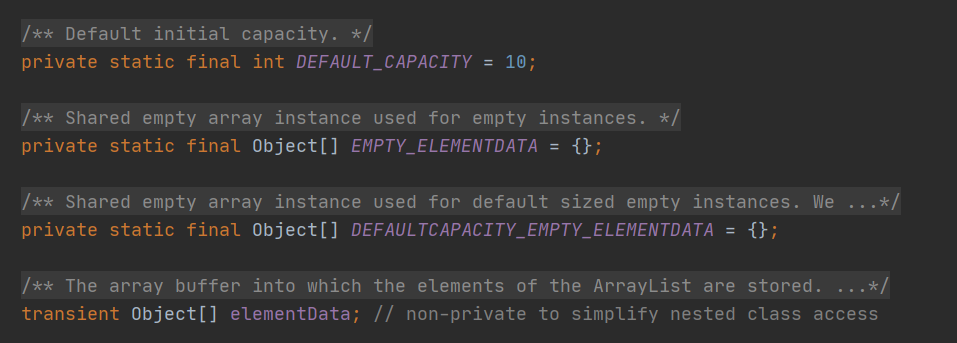
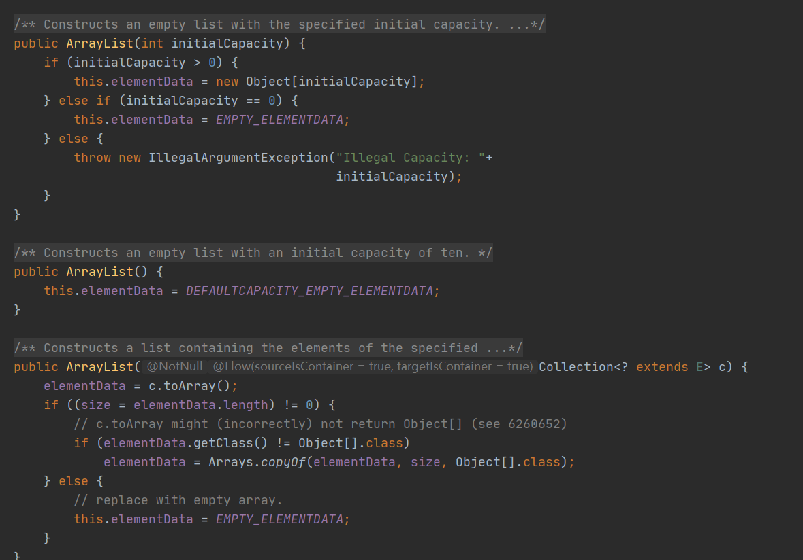

# 集合

## ArrayList和LinkedList区别

相同点：都实现了List接口

> ArrayList





**ArrayList内部是由数组实现的，无参构造会分配一个空数组**

> LinkList

linkedlist的get方法，会先判断要取的值的下标是否大于数组的一半的size，如果小于就从前往后找，否则从后往前找


**LinkedList内部是由链表实现的**，**而且链表是双向链表**


> 增删改查时间复杂度


> **大致区别**

* ArrayList是实现了基于动态数组的数据结构
* LinkedList基于链表的数据结构
* 对于随机访问get和set,ArrayList 绝对由于LinkedList 因为LinkedList要移动指针
* 对于任何新增操作add和remove，LinkedList比较占优势，因为ArrayList要移动数据
* ArrayList的空间浪费主要体现在list列表的结尾预留一定的容量空间，LinkedList的空间花费则体现在每一个元素都需要消耗相当的空间

> **ArrayList的扩容**


* **如果使用无参构造方法，每当数组容量到达极限的时候，就会自动扩容成原来的1.5倍，如果数组容量为0，则先扩容成10**
* **当我们需要插入1000条数据到数组时，如果使用的是无参的构造方法，那么。就会导致频繁的扩容，而数组的扩容，是将旧数组的数据复制到新数组去，旧数组就会被废弃掉，这样会浪费大量的内存，我们应该尽量使用带初始化参数的构造方法**

## HashMap

JDK集合容器主要包含了实现了List,Map,Set三个接口的诸多子类，List和Set是对Collection接口，Map是单独的接口


> **三者的主要区别**

List是有序的，指的是插入顺序有序，可以存放重复的值和null

Set是无序的，其中只能存放一个null值

Map存放的是Entry键值对，键必须是唯一的，所以可以存放一个键为null的值，但是不能存放多个值为null的entry

> **Hash的内部结构**

主要运用的数据结构三个：数组，链表，以及JDK中为了加快它查询速度加入的红黑树结构


HashMap类有一个非常重要的字段，


而HashMap的数组就是一个Node的数组，Node是HashMap的一个内部实现类，实现了Map.Entry接口，本质就是一个映射(键值对)

HashMap使用的是链地址法，简单来说，就是数组加链表的结合，每个数组元素上都有一个链表结构，当数据被Hash后，得到数组下标，把数据放到

对应的下标链表上  ，然后再通过Hash算法的后两步运算（高位运算和取模运算，下文有介绍）来定位该键值对的存储位置，有时两个key会定位到相同的位置，表示发生了Hash碰撞。当然Hash算法计算结果越分散均匀，Hash碰撞的概率就越小，map的存取效率就会越高。

**当一个数组的一个节点挂载超过8时，会将这个链表转化成红黑树**           

> **属性**


```java
// 默认初始容量 2^4
static final int DEFAULT_INITIAL_CAPACITY = 1 << 4;
// 最大容量 2^30
static final int MAXIMUM_CAPACITY = 1 << 30;
// 默认装载因子为0.75
static final float DEFAULT_LOAD_FACTOR = 0.75F;
// 树阈值，如果链表长度大于8，链表转为红黑树
static final int TREEIFY_THRESHOLD = 8;
// 由树转化为链表的阈值
static final int UNTREEIFY_THRESHOLD = 6;
// 最小树形化容量阈值：即 当哈希表中的容量 > 该值时，才允许树形化链表 （即 将链表 转换成红黑树）
// 如果哈希表的容量 < 该值，直接扩容，不转为红黑树
// 这个值不能小于 4 * TREEIFY_THRESHOLD 
static final int MIN_TREEIFY_CAPACITY = 64;
// hashmap中的数组结构
transient HashMap.Node<K, V>[] table;
transient Set<Entry<K, V>> entrySet;
// hashmap当前的node数量
transient int size;
// hashmap修改次数
transient int modCount;
// 当hashmap中的元素数量超过这个值则扩容
int threshold;
// 扩容因子大小
final float loadFactor;
```

> 构造函数


在创建HashMap集合对象，在jdk8以前。构造方法创建一个长度为16的entry[] table 用来存储键值对数据，

**在jdk8以后不是在HashMap的构造方法底层创建数组，是在第一次调用put方法时创建的数组**

Node[] table 用来存储键值对数据

> **哈希表采用何种算法计算hash值，还有哪些算法可以计算出hash值**


底层采用的key的HashCode方法结合数组长度进行无符号右移(>>>) 按位异与，按位与计算索引

其他计算方式相较效率低，而位运算效率要高

> **Put方法**


put方法调用putVal方法来实现数据的插入，

putval方法执行流程

* 判断数组是否为空，如果为空，会初始化一个大小为16的数组空间
* 根据哈希值和数组长度计算索引位置
* 判断索引位置上的键值是否和要插入的对象的键值相等，相等则直接插入
* 如果不相等，会判断是否是树的节点对象，如果是，则插入树中
* 如果不是树的对象，则遍历链表，把对象插入，，再根据链表的长度，判断是否需要把链表转换成红黑树


> **HashMap的扩容**


**扩容过程**

* 判断原数组容量和阈值，如果为0，则对数组进行初始化，设置数组初始容量为16，设置数组阈值=负载因子*容量

* 如果原数组的容量超过了HashMap所能承受的最大容量2的30次方，那么会把阈值设为整形数所能表达的最大值

* 如果正常扩容，那么对原数组容量左移1(扩大一倍),并重新计算阈值

  


> **get方法**


> 为什么HashMap扩容时，扩容为原来两倍

因为hashMap计算索引是使用（n-1）&hash,只有当容量为2的次幂时，容量的二进制会全表示为1，位运算时可以充分散列，最大程度的避免hash冲突，所以，扩容成两倍是保证容量始终是2的次幂，而扩容成两倍还有一个好处，当Hash扩容时，就势必要重新计算索引位置，对于索引上挂载的链表的重新索引，可以直接通过hash&oldCap得出索引位置如下图


只需要比较新增的一位bit就可以计算出索引的位置，既省去了重新计算hash值的时间，而且同时，由于新增的1bit是0还是1可以认为是随机的，因此resize的过程，均匀的把之前的冲突的节点分散到新的bucket了

> **扩容的地方是红黑树**
> **上面看到的扩容的地方是链表，如果是红黑树呢?**

//这个函数的功能是对红黑树进行　rehash 操作

```java
final void split(HashMap<K,V> map, Node<K,V>[] tab, int index, int bit) {
        TreeNode<K,V> b = this;
        // Relink into lo and hi lists, preserving order
        TreeNode<K,V> loHead = null, loTail = null;
        TreeNode<K,V> hiHead = null, hiTail = null;
        int lc = 0, hc = 0;
　　　　　//由于　TreeNode 节点之间存在双端链表的关系，可以利用链表关系进行 rehash
        for (TreeNode<K,V> e = b, next; e != null; e = next) {
            next = (TreeNode<K,V>)e.next;
            e.next = null;
            if ((e.hash & bit) == 0) {
                if ((e.prev = loTail) == null)
                    loHead = e;
                else
                    loTail.next = e;
                loTail = e;
                ++lc;
            }
            else {
                if ((e.prev = hiTail) == null)
                    hiHead = e;
                else
                    hiTail.next = e;
                hiTail = e;
                ++hc;
            }
        }
         
```

```java
    //rehash 操作之后注意对根据链表长度进行　untreeify　或　treeify　操作
    if (loHead != null) {
        if (lc <= UNTREEIFY_THRESHOLD)
            tab[index] = loHead.untreeify(map);
        else {
            tab[index] = loHead;
            if (hiHead != null) // (else is already treeified)
                loHead.treeify(tab);
        }
    }
    if (hiHead != null) {
        if (hc <= UNTREEIFY_THRESHOLD)
            tab[index + bit] = hiHead.untreeify(map);
        else {
            tab[index + bit] = hiHead;
            if (loHead != null)
                hiHead.treeify(tab);
        }
    }//end if
}//end split
```

可以看到由TreeNode 节点之间存在双端链表的关系，可以利用链表关系进行处理红黑树，也就是说红黑树里还存着next的信息，只不过平时不用，到扩容的时候就用上了，作为链表来处理，分为高位链表和低位链表。

> 1.7HashMap的线程不安全情况

\#1.hash算法为简单的用key mod链表的大小。

\#2.最开始hash表size=2，key=3,7,5，则都在table[1]中。

\#3.然后进行resize，使size变成4。

未resize前的数据结构如下：


如果在单线程环境下，最后的结果如下：


这里的转移过程，不再进行详述，只要理解transfer函数在做什么，其转移过程以及如何对链表进行反转应该不难。

然后在多线程环境下，假设有两个线程A和B都在进行put操作。线程A在执行到transfer函数中第11行代码处挂起，因为该函数在这里分析的地位非常重要，因此再次贴出来。


 

此时线程A中运行结果如下：


线程A挂起后，此时线程B正常执行，并完成resize操作，结果如下：


**这里需要特别注意的点：由于线程B已经执行完毕，根据Java内存模型，现在newTable和table中的Entry都是主存中最新值：7.next=3，3.next=null。**

此时切换到线程A上，在线程A挂起时内存中值如下：e=3，next=7，newTable[3]=null，代码执行过程如下：

```html
newTable[3]=e ----> newTable[3]=3
e=next ----> e=7
```

此时结果如下：


继续循环：

```html
e=7
next=e.next ----> next=3【从主存中取值】
e.next=newTable[3] ----> e.next=3【从主存中取值】
newTable[3]=e ----> newTable[3]=7
e=next ----> e=3
```

结果如下：


再次进行循环： 

```html
e=3
next=e.next ----> next=null
e.next=newTable[3] ----> e.next=7 即：3.next=7
newTable[3]=e ----> newTable[3]=3
e=next ----> e=null
```

注意此次循环：e.next=7，而在上次循环中7.next=3，出现环形链表，并且此时e=null循环结束。

结果如下：

****

在后续操作中只要涉及轮询hashmap的数据结构，就会在这里发生死循环，造成悲剧。例如，get（11），就会定位到数组三，然后迭代链表找key是11的值，这时就会陷入死循环。

> 1.8的线程不安全

这是jdk1.8中HashMap中put操作的主函数， 注意第6行代码，如果没有hash碰撞则会直接插入元素。如果线程A和线程B同时进行put操作，刚好这两条不同的数据hash值一样，并且该位置数据为null，所以这线程A、B都会进入第6行代码中。假设一种情况，线程A进入后还未进行数据插入时挂起，而线程B正常执行，从而正常插入数据，然后线程A获取CPU时间片，此时线程A不用再进行hash判断了，问题出现：线程A会把线程B插入的数据给**覆盖**，发生线程不安全。


**#1.在jdk1.7中，在多线程环境下，扩容时因为采用头插法，会造成环形链或数据丢失。**

**\#2.在jdk1.8中，在多线程环境下，会发生数据覆盖的情况。**

## Java容器都有哪些

**Java容器主要分为两大类 ，一类是Map类，一类是Collections类，Collection有一个父类接口Iterator，它提供基本的遍历，删除元素操作，**

Iterator还有一个子类接口Link Iterator它提供双向遍历操作


**Collection是一个独立元素的序列，它主要有三个子接口 List ,Set ,Queue**

## Collection和Collections有什么区别


* **Collection 是一个集合接口。它提供了对集合对象进行基本操作的通用接口方法。**
* **Collections是一个工具类，方法用于操作·Collection,且该类不能实例化**


## List Set Map之间的区别是什么

* List和Set都是Collection的子接口，而Map是单独的一个接口
* List是有序的集合，可以插入多个相同的值，Set不能插入重复的值，Map是键值对集合

## HashTable

与新的集合实现不同，**Hashtable是同步的。如果不需要线程安全实现，建议使用HashMap代替Hashtable。**

如果需要线程安全的高并发实现，那么建议使用ConcurrentHashMap代替Hashtable。因为ConcurrentHashMap锁细粒度更小


> **扩容 = old*2+1**


## HashTable和HashMap的区别

* HashMap初始化容量为16而hashTable初始化容量为11
* HashMap扩容是*2而HashTable是 *2+1
* HashMap是线程不同步的，而Hash Table是线程同步的，意味着Hashmap线程不安全，而HashTable线程安全
* HashMap键值可以为NULL,键可以存在多个null,而HashTable键值都不能为null
* HashMap是重新计算过Hash值，而HashTable直接使用
* HashTable继承自Dirctionary，HashMap继承自AbstractMap，二者均实现了Map接口；
* 这两个在遍历方式的实现不同。HashTable和HashMap两者都实现了Iterator。但是，由于历史原因，HashTable还使用了Enumeration。

## TreeMap

TreeMap是基于红黑树（一种自平衡的二叉树）实现的一个保证有序性的Map,TreeMap实现了NavigableMap接口，而该接口又继承了SortedMap接口，

该映射根据其键的自然顺序进行排序，或者根据创建映射时提供的Comparator进行排序，取决于使用的构造方法

* TreeMap是根据key进行排序的，它的排序和定位是依赖比较器或覆盖Compareable接口，因此不需要key覆写hashCode方法和equalus方法，就可以排除掉重复的key，而HashMap的key需要通过复写hashCode方法和equals方法确保没有重复的key
* TreeMap的查询，插入，删除效率均没有HashMap高，一般需要对key进行排序时，才会使用TreeMap
* TreeMap的key不能为null，而HashMap的key可以为null
* TreeMap不是同步的，


## TreeMap和HashMap的区别

* 底层数据结构不同，HashMap的数据结构是数组，链表和红黑树，而TreeMap的数据结构是红黑树
* HashMap适用于在Map删除插入定位元素，TreeMap使用按照自然顺序或自定义顺序遍历键
* HashMap基于表实现的，使用HashMap要求添加的键明确定义了HashCode和equals（可以重写该方法）,为了优化空间使用，可以调整初始容量和负载因子，HashTable基于红黑树实现的，没有调优选项，因为红黑树总是平衡的

## 如何实现数组和List的相互转换


```java
    String[] arrays = new String[]{"a", "b", "c"};
    List<String> listStrings = Arrays.asList(arrays);
```


```java
       String[] sss = listStrings.toArray(new String[listStrings.size()]);
```

## Array 和 ArrayList 有何区别？什么时候更适合用Array

* 数组长度是固定的，ArrayList长度是可变的
* 数组类型可以是基本数据类型和对象，ArrayList只能是对象
* ArrayList提供了更多方法来操作数组
* 对于基本类型数据，集合使用自动装箱来减少编码工作量。但是，当处理固定大小的基本数据类型的时候，这种方式相对比较慢。

> 适用场景

如果想要**保存一些在整个程序运行期间都会存在而且不变的数据**，我们可以将他们放到一个**全局数组**里，

但是如果我们单纯的只是想**以数组的形式保存数据，而不对数据进行追加等操作**，而只是**方便我们查找的**话，我们就选择ArrayList

而且还要一个地方我们需要知道的是，如果我们需要对元素频繁的对元素删除和移动，或者是处理超大量的数据，**那么ArrayList就不是一个好的选择**

使用数组进行这样的操作会很麻烦，我们可以考虑使用LinkedList

## Vector


## ArrayList 和 Vector 的区别是什么？

* Vector是线程安全的，ArrayList是线程不安全的，如果程序只有一个线程，建议用ArrayList ，它不考虑线程安全，效率会更高
* Vector扩容默认长度是原容量的两倍，还可以设置扩容长度，ArrayList扩容是原数组的1.5倍，两个数组的默认初始容量是10

## 在 Queue 中 poll()和 remove()有什么区别？


## 哪些集合类是线程安全的？

常见四种常用的

* **Vector**：就比ArrayList多了个同步化机制（线程安全）。
* **Hashtable**：就被HashMap多了个线程安全。
* **ConcurrentHashMap**：是一种高效但是线程安全的集合。
* **Stack**：栈，也是线程安全的，继承于Vector，已过时，不建议使用。

## 迭代器 Iterator 是什么？怎么使用？，有什么特点？和 ListIterator 有什么区别？

* 迭代器（也是一种设计模式），通常被称为轻量级对象
  * 它是一个对象，它的工作遍历并选择序列中的对象，而客户端的程序员并不必知道或关星序列底层的结构
* 使用方法
  * 使用方法Iterator()要求容器返回一个Iterator,Iterator将返回序列的第一个元素
  * 使用next()获取序列中的下一个元素
  * 使用hashNext（）检查序列中是否还有元素
  * 使用remove()将迭代器新近返回的元素删除
* 特点：能够将遍历序列化的操作与序列底层结构分离
* Iterator是Java迭代器最简单的实现，为List设计的ListIterator具有更多的功能，它可以从两个方向遍历List，也可以从List中插入和删除元素。

## 怎么确保一个集合不会被修改

> **Collections.unmodifiableCollection()**


> **Arrays.asList()**


## 遍历一个List有哪几种不同的方式

1、for循环遍历：基于计数器，在集合的外部维护一个计数器，然后依次读取每一个位置的元素，当读到最后一个元素时停止。

2、迭代器遍历：iterator是面向对象的一个设计模式，目前是屏蔽不同数据集和的特点，统一遍历集合的接口。java在Collections中支持了iterator模式。

3、foreach循环遍历：foreach内部也是采用了iterator的方式实现，使用时不需要显示声明iterator或计数器。优点是代码简洁，不易出错；缺点是只能做简单的遍历，不能在遍历过程操作数据集合，如删除、替换等。

## 哪些集合提供对元素的随机访问

java集合类中元素的访问分为随机访问和顺序访问

* 随机访问一般是通过index下标访问，行为类似数组的访问
* 顺序访问类似链表的访问，通常为迭代器遍历

提供随机访问的集合:ArrayList HashTable HashMap TreeMap等

## HashSet


## LinkedHashMap


* LinkedHashMap继承自HashMap,所以它的底层仍然是基于拉链式散列结构，该结构由数组和链表+红黑树，在此基础上LinkedHashMap增加了一条双向链表保持遍历顺序和插入顺序一致的问题

* LinkedHashMap使用的键值对节点是Entity,它继承了hashMap并新增了两个引用，分别是before和after，这两个引用的用途不难理解，用于维护双向链表

  