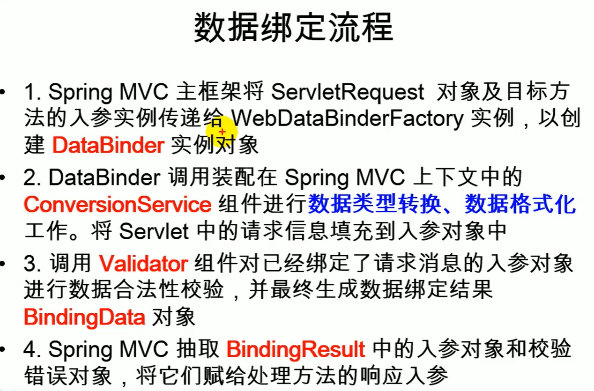
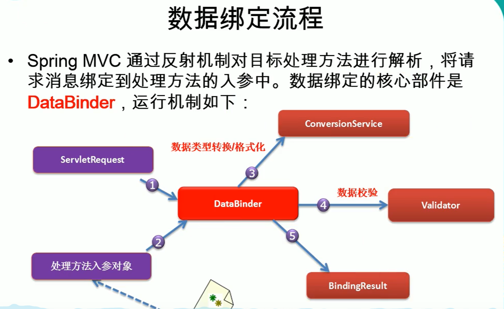
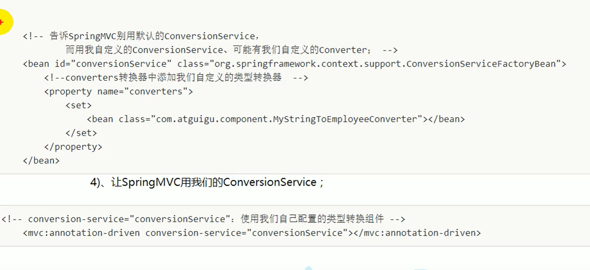
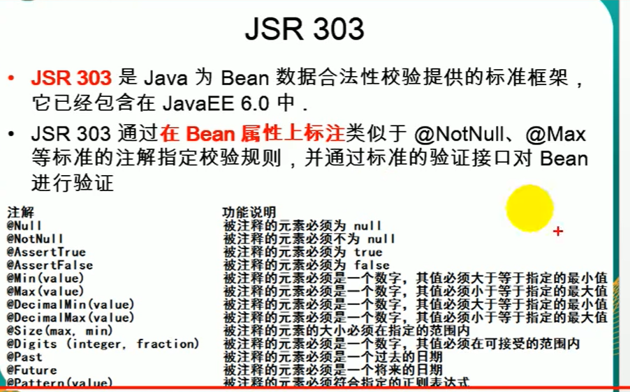
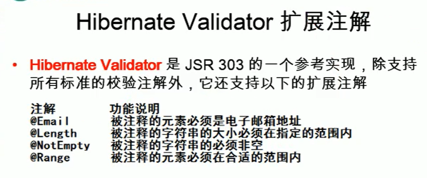

SpringMVC思想是有一个前端控制器能拦截所有请求，并智能派发

这个前端控制器是一个servlet，应该在web.xml中配置这个servlet来拦截所有请求

一个方法处理一个请求

---

创建SpringMVC步骤

1. 导包

```
aop
beans
context
core
expression
web
webmvc
```

2. 写配置

    1. web.xml

        配置SpringMVC的前端控制器，指定SpringMVC配置文件位置

        ```xml
        <servlet>
            <servlet-name>SpringDispatcherServlet</servlet-name>
            <servlet-class>org.springframework.web.servlet.DispatcherServlet</servlet-class>
            <init-param>
              <param-name>contextConfigLocation</param-name>
              <param-value>classpath:applicationContext.xml</param-value>
            </init-param>
            <!--servlet启动加载，原来是第一次访问创建对象
            load-on-startup：服务器启动的时候创建对象，值越小，优先级越高，越先创建对象-->
            <load-on-startup>1</load-on-startup>
          </servlet>
          <servlet-mapping>
            <servlet-name>SpringDispatcherServlet</servlet-name>
            <!--
        	/*和/都是拦截所有请求，/会拦截所有请求，但是不会拦截*.jsp,能保证jsp正常访问
            /*的范围更大，还会拦截*.jsp这些请求，一旦拦截jsp界面就不能显示了
        	处理*.jsp是tomcat做的事  所有项目中的web.xml都继承于tomcat的web.xml
        	DefaultServlet是tomcat中处理静态资源的
        	除了jsp和servlet，剩下的都是静态资源
        	index.html：静态资源，tomcat就会在服务器下找到这个资源并返回
        	我们前端控制器的/禁用了tomcat服务器中的defaultServlet
        	1. 服务器的web.xml中，有一个defaultservlet是url-pattern=/
        	2. 我们的配置中前端控制器url-pattern=/	
        		静态资源会来到DispatcherServlet（前端控制器）看哪个方法的RequestMapping是index.html
        	3. 我们没有覆盖服务器中的jspservlet的配置
        	4. /* 直接拦截所有请求；我们写/；也是为了迎合后来Rest风格的URL地址
        	-->
            <url-pattern>/</url-pattern>
        </servlet-mapping>
        ```

    2. applicationContext.xml

        ```xml
        <!--
            视图解析器自动拼串
            <property name="prefix" value="/pages/"/>
            <property name="suffix" value=".jsp"/>
            （前缀）/pages/+return的字符串+.jsp
            -->
            <bean class="org.springframework.web.servlet.view.InternalResourceViewResolver">
                <property name="prefix" value="/pages/"/>
                <property name="suffix" value=".jsp"/>
            </bean>
        ```

3. 测试

---

**helloworld细节**

1. 运行流程：

    1. 客户端点击链接会发送http://localhost:8080/srpingmvc/hello请求
    2. 来到tomcat服务器
    3. SpringMVC的前端控制器收到所有请求
    4. 看请求地址和@RequestMapping标注的哪个匹配，来找使用哪个类的哪个方法处理
    5. 前端控制器找到了目标处理器类和目标方法，直接利用反射执行目标方法
    6. 方法执行完成后会有一个返回值，SpringMVC认为这个返回值就是要去的页面地址
    7. 拿到方法返回值以后；用视图解析器进行拼串得到完整的页面地址
    8. 拿到页面地址，前端控制器帮我们转发到页面

2. RequestMapping("/hello")

    告诉SpringMVC，这个方法用来处理什么请求

    这个/是可以省略的，即使省略了，也是默认从当前项目下开始

    习惯加上比较好 /hello

    注意：如果requestmapping加了/ 那么访问他的链接等不需要加上：\<a href="hello">..\</a>，要么就两个地方都不加/，不然会报错404

    如果链接需要全路径，则需要\<a href="/项目名/hello">..\</a>


---

**@RequestMapping**

属性：

1. value

2. method

    ```
    限定请求方式：GET、POST
    HRPP中的所有请求方式GET, HEAD, POST,PUT,PATCH,DELETE, OPTIONS,TRACE;
    method=RequestMethod.POST: 只接受这种类型的请求，默认是什么都可以
    ```

3. params

    ```
    规定请求参数
    params和headers支持持简单的表达式
    	1. params：表示请求必须包含名为param1的请求参数
    		eg：params={"username"}：发送请求的时候必须带上一个名为username的参数，没带会404
    	2. !params：表示请求不能包含名为param1的请求参数
    		eg：params!={"username"}：发送请求的时候不能带上一个名为username的参数，带了会404
    	3. params!=123：表示请求不能包含名为param1，值为123的请求参数
    		eg：params={"username!=123"}：发送请求的时候不能带上一个名为username,值为123的参数，带了会400(注意：可以不带username，但是带了username，值必须不能为123)
    	4. {"param1=value1","param2"}: 请求必须包含名为param1和param2的参数，且param1的值为value
    		eg：params={"username!=123", "pwd", "!age"} 请求的username不能为123，而且必须有pwd，不能有age
    ```

4. headers

    ```
    指定能够访问的浏览器
    User-Agent : 浏览器信息
    让火狐能访问，让谷歌不能访问
     @RequestMapping(value = "test04", headers = {"User-Agent=" +
                "Mozilla/5.0 (Windows NT 10.0; Win64; x64; rv:78.0) Gecko/20100101 Firefox/78.0"})
                
    谷歌：
    User-Agent: Mozilla/5.0 (Linux; Android 6.0; Nexus 5 Build/MRA58N) AppleWebKit/537.36 (KHTML, like Gecko) Chrome/83.0.4103.106 Mobile Safari/537.36
    火狐：
    User-Agent
    	Mozilla/5.0 (Windows NT 10.0; Win64; x64; rv:78.0) Gecko/20100101 Firefox/78.0
    
    ```

5. consumes：只接受内容类型时哪种的请求，规定请求头中的Content-Type

6. produces：告诉浏览器返回的内容类型是什么，给响应头中加上 Content-Type:text/charset=utf-8;

模糊匹配

URL地址可以写模糊的通配符

​	？：能替代任意一个字符

​	\* ： 能替代任意多个字符和一层路径

​	**/：能替代多层路径

模糊和精确匹配情况下，精确优先

路径上可以有占位符，但是只能占一层路径

---

转发和重定向

```java
@Controller
public class HelloContorller {
    @RequestMapping("hello")
    public String test01(){
        System.out.println("hello");
        return "success";
    }
    /**
    * 使用forward进行转发，不会进行自动拼串
    * /hello.jsp当前项目下的hello
    * 一定要加上/，不加就是相对路径，容易出问题
    * */
    @RequestMapping("hello2")
    public String test02(){
        System.out.println("hello2");
        return "forward:/hello.jsp";
    }
    @RequestMapping("hello3")
    public String test03(){
        System.out.println("hello3");
        return "forward:/hello2";
    }
    /**
    * 重定向到hello.jsp界面
    * 有前缀的转发和重定向操作，配置的视图解析器就不会进行拼串
    * 转发：forward：转发的路径
    * 重定向：redirect：重定向的路径
    *       /hello.jsp:代表就是从当前项目开始；SpringMVC会为路径自动拼接上项目名
    *
    *       原生的servlet要加上项目名才能成功
    *       response.sendRedirect("output/hello.jsp")
    * */
    @RequestMapping("hello4")
    public String test04(){
        System.out.println("hello4");
        return "redirect:/hello.jsp";
    }
}
```

**REST**

* REST: 即Tepreesenttional State Transfer。（资源）表现层状态转化。是目前最流行的一种互联网软件架构。他结构清晰，符合标准，易于理解，扩展方便，所以正得到越来越多网站的采用。
* 资源（Resource）：网络上的一个实体，或者说是网络上的一个具体信息。他可以是一段文本、一张图片、一首歌曲、一种服务，总之，就是一个具体的存在。可以用一个URI（统一资源定位符）指向他，每种资源对应一个特定的URI。要获取这个资源，访问他的URI就可以，因此URI即为每一个资源的独一无二的识别符
* 表现层（Representation）：把资源具体呈现出来的形式，叫做他的表现层。比如，文本可以用txt格式表现，也可以用HTML格式、XML格式、JSON格式表现，甚至可以采用二进制格式。
* 状态转化（State Transfer）：每发出一个请求，就代表了客户端和服务器的一次交互过程，HTTP协议，是一个无状态协议，即所有的状态都保存在服务器端。因此，如果客户端想要擦操作服务武器，必须通过某种手段，让服务器端发生“状态转化”。而这种转化是建立在表现层之上的，所以就是“表现层状态转化“。具体说：HTTP协议里面，四个表示操作方式的动词：GET, POST, PUT, DELETE。他们分别对应四种基本操作：get用来获取资源，post用来新建资源，put用来更新资源，delete用来删除资源

---

rest：系统希望以非常简洁的URL地址来发请求

​			怎样表示对一个资源的增删改查用请求的方式来区分

/getBook?id=1：查询图书

/deleteBook?id=1：删除图书

/addbook         ： 添加图书


rest推荐：

/book/1   : GET 查询1号图书

/book/1   : DELETE 删除1号图书

/book       : POST    添加图书

系统的URL地址就这么来设计即可：

简洁的URL提交请求，以请求方式区分对资源操作

----

**从页面发起PUT、DELETE形式的请求，SpringMVC提供了对Rest风格的支持**

1. SpringMVC中有一个Filter，他可以把普通的请求转化为规定形式的请求，首先需要配置这个filter

    ```xml
    <filter>
        <filter-name>HiddenHttpMethodFilter</filter-name>
        <filter-class>org.springframework.web.filter.HiddenHttpMethodFilter</filter-class>
      </filter>
      <filter-mapping>
        <filter-name>HiddenHttpMethodFilter</filter-name>
        <url-pattern>/*</url-pattern>
      </filter-mapping>
    ```

2. 建立一个post类型的表单， 表单中携带一个\_method参数，这个\_method的值就是DELETE、PUT

    ```
    高版本tomcat，rest支持有点问题，会对jsp的转发有限制，需要
    <%@ page contentType="text/html;charset=UTF-8" language="java" isErrorPage="true"%>
    ```

---

SpringMVC如何获取请求带来的各种信息

* 默认方式请求参数

    直接给方法形参上写一个和请求参数相同的变量。这个变量就来接受请求参数的值

    ```
    public String test02(String username, int age)
    hello?username=hl 获取的值为hl
    hello 获取的值为null
    ```

@RequestParam

```
获取请求参数的，参数默认是必须带的
@RequestParam("user")String name
相当于name = request.getParameter("user");

value，required ，defaultValue 注解有三个参数可以选择

@ReqeustVariable("id")
获取的是路径中的值而不是参数值
```

@RequestHeader

```
@RequestHeader(value = "User-Agent") String user_agent
相当于user_agent = request.getHeader("User-Agent")
如果请求头中没有这个值就会报错

value，required ，defaultValue 注解有三个参数可以选择
```

@CookieValue

```
@CookieValue(value = "JSESSIONID")String jid
相当于：
Cookie[] cookies = request.getCookie();
for(Cookie c : cookies){
	if(c.getName.equals("JSESSIONID"))
		sout(c.getValue());
}

如果请求头中没有这个值就会报错

value，required ，defaultValue 注解有三个参数可以选择
```

---

如果我们的请求参数是一个POJO（自定义参数）

SpringMVC会自动的为这个POJO进行赋值

1. 将POJO中的每一个属性，从request参数中尝试获取出来，并封装即可（如果没找到对应参数，则默认封装null）
2. 还可以级联封装

---

**提交的数据可能有乱码**

请求乱码：

​	GET请求：改server.xml，在8080端口处URIEncoding=“UTF-8”

​	POST请求：

​		在第一次获取请求参数之前设置

```
request.setCharacterrEncoding("UTF-8");
```

​		自己写一个filter：SpringMVC有这个filter

----





-----

**自定义类型转换**

spring支持的转化器

```
spring定义了3种类型的转换器接口，实现任意一个转换器接口都可以作为自定义转换器注册到ConversionServiceFactory中
-- Converter<S,T> 将S类型对象转为T类型对象
-- ConcerterFactory：将相同系列多个“同质”Converter封装在一起。如果希望将一种类型的对象转换为另一个种类类型及其子类的对象（例如将String转换为Number及Number子类）可使用该转换器工厂类
-- GenericConverter：会根据源类对象及目标类对象所在的宿主类中的上下文信息进行类型转换
```

1. 步骤

    ```
    ConversionServicee：是一个接口
    他里面有Converter（转换器）进行工作
    1. 实现Converter接口，写一个自定义的类型转换器
    2. Converter是ConversionService中的组件
    	1. 你的MyConverter得放进Converter中
    	2. 将WebDataBinder中的ConversionService设置成我们这个加了自定义类型转换器的ConversionService
    ```

    

---

​	**\<mvc:annotation-driven>\</mvc:annotation-driven>**

* \<mvc:annotation-driven/>会自动注册

    RequestMappingHandlerMapping

    RequestMappingHandlerAdapter

    ExveptionHandlerExceptionResolver三个 bean

* 还将提供以下支持：

    支持使用ConversionService实现对表单参数进行类型转换

    支持使用@NumberFormat annotation、 @DateTimeFormat注解完成数据类型的格式化

    支持使用@Valid注解对Javabean实例进行JSR 303验证

    支持使用@RequestBody和ResponseBody注解

----

**数据格式化**

* 对属性对象的输入/输出进行格式化，从其本质上将依然属于“类型转换的范畴”

* spring在格式化模块中定义了一个实现

    ConversionService接口的FormattingConversionService实现类，该实现类扩展了GenericConversionService，因此它既具有类型转换的功能，又具有格式化的功能

* FormattionConversionService拥有一个FormattionConversionServiceFactoryBean工厂类，后者用于在spring上下文中构造前者

* FormattingConversionServicecFactoryBean内部已经注册了

    NumberFormatAnnotationFormatterFactory：支持数据类型的属性使用@NumberFormat注解

    jodaDateTimeAnnotationFormatterFactory：支持对日期类型的属性使用@DateTimeFormat注解

* 装配了FormattingConversionServiceFactoryBean后，就可以在SpringMVC入参绑定及模型数据输出时使用注解驱动了

    \<mvc:annotation-driven/>默认创建的ConversionService实例即为FormattingConversionServiceFactoryBean

---

**日期格式化**

@DateTimeFormat注解可对java.util.Date、java.tuil.Calendar、java.long.Long时间类型进行标注

- pattern属性：类型为字符串，指定解析字段数据的模式，如“yyyy-MM-dd hh:mm:ss”
- iso属性，IOS.NONE(不使用)(默认）、ISO.DATE（yyyy-MM--dd）、ISO.DATE_TIME（yyyy-MM-dd hh:mm:ss:SSSZ）、ISO.TIME(hh:mm:ss.SSSZ)

---

**数字格式化**

@NumberFormat可对类似数字类型的属性进行标注，它拥有两个互斥的属性

* style：类型为NumberFormat.Style。用于指定样式类型，包括三种：Style.NUMBER（正常数字类型）、Sytle.CURRENCY（货币类型）、Style.PERCENT（百分数类型）
* pattern：类型为string，自定义样式，如pattern=“#,###”

---

**数据校验**

只做前端校验是不安全的，重要的数据要做后端校验





如何快速的进行后端校验

1. 导入校验框架的jar包

```xml
<dependency>
    <groupId>org.hibernate</groupId>
    <artifactId>hibernate-validator</artifactId>
    <version>6.0.5.Final</version>
</dependency>
<!--

 这个jar包加入后就会报错
 <dependency>
      <groupId>org.hibernate</groupId>
      <artifactId>hibernate-validator-annotation-processor</artifactId>
      <version>6.0.5.Final</version>
      <type>pom</type>
    </dependency>-->
<dependency>
    <groupId>com.fasterxml</groupId>
    <artifactId>classmate</artifactId>
    <version>1.5.1</version>
</dependency>
<dependency>
    <groupId>javax.validation</groupId>
    <artifactId>validation-api</artifactId>
    <version>2.0.1.Final</version>
</dependency>
<dependency>
    <groupId>org.jboss.logging</groupId>
    <artifactId>jboss-logging</artifactId>
    <version>3.4.1.Final</version>
</dependency>
```

2. 加入校验注解
3. 在SpringMVC封装对象的时候，告诉SpringMVC这个Javabean需要校验
4. 可以在注解中加上message属性，这个就是报错信息
5. 如何知道校验结果（给需要校验的Javabean后面紧跟一个BindingResult，这个BindingResult就是封装了前一个bean的校验结果）
6. 前端用<form:errors path=""/>显示错误信息