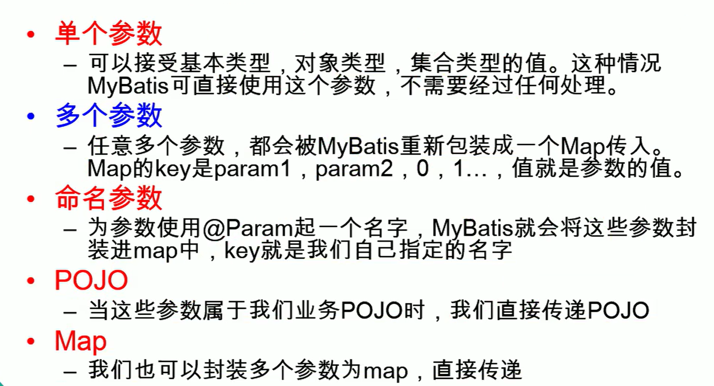
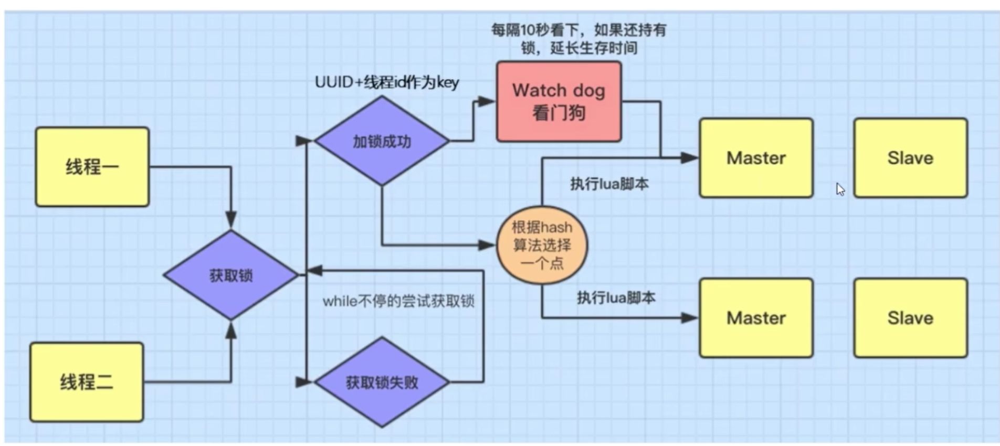
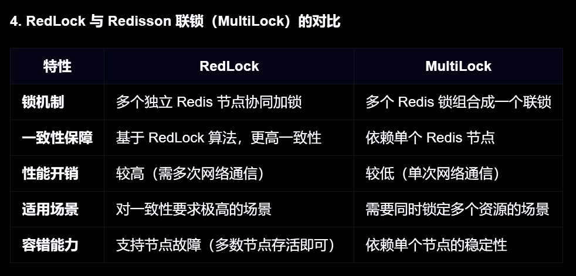
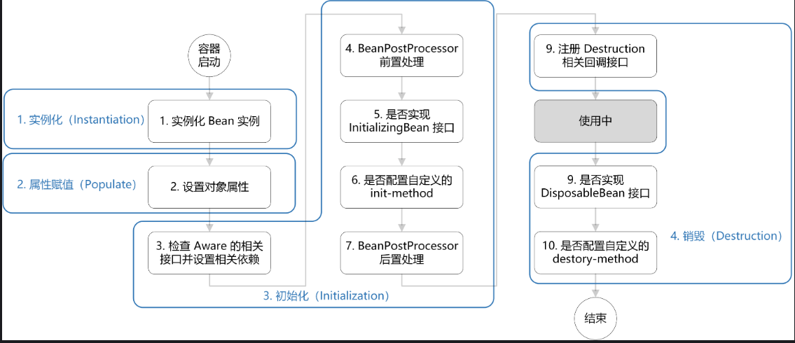
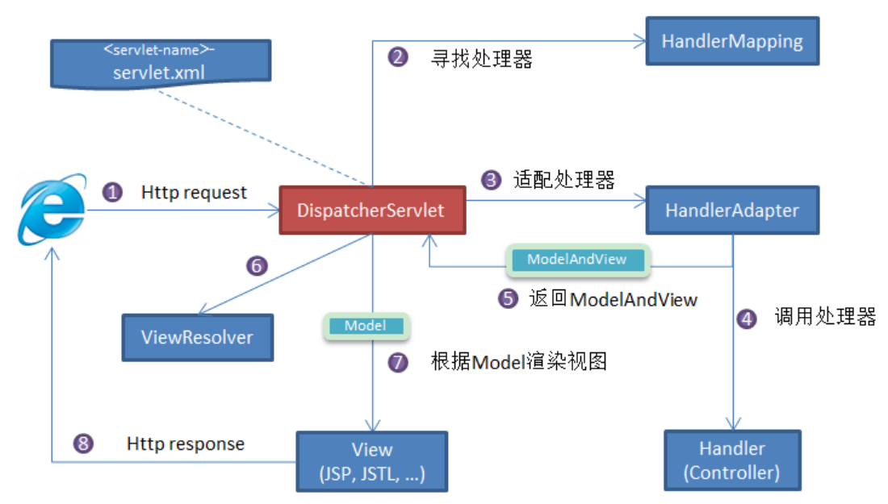
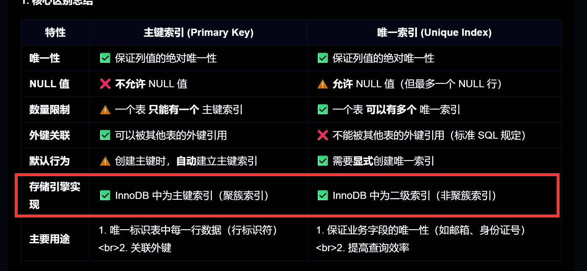
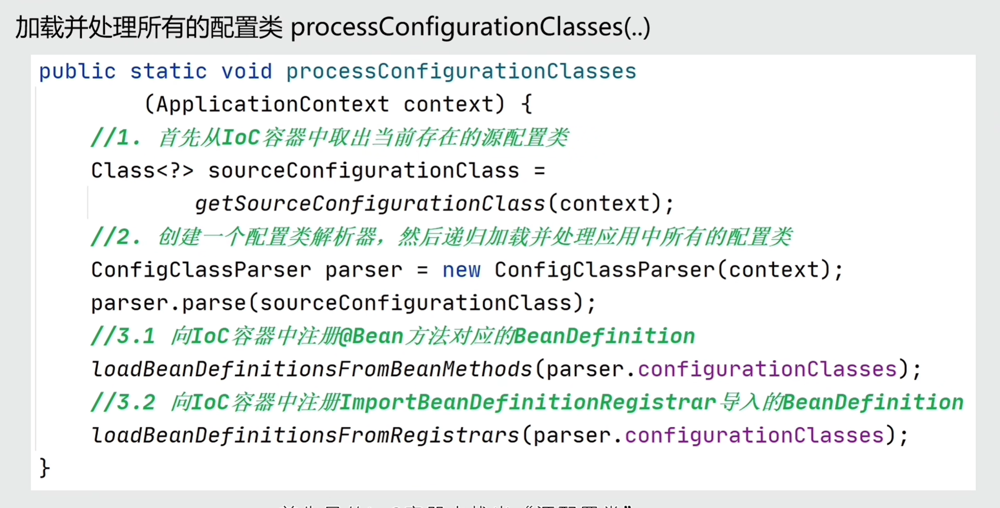
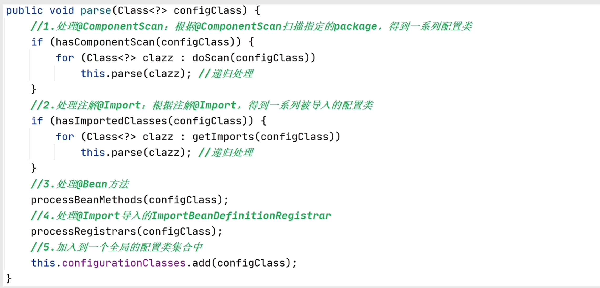
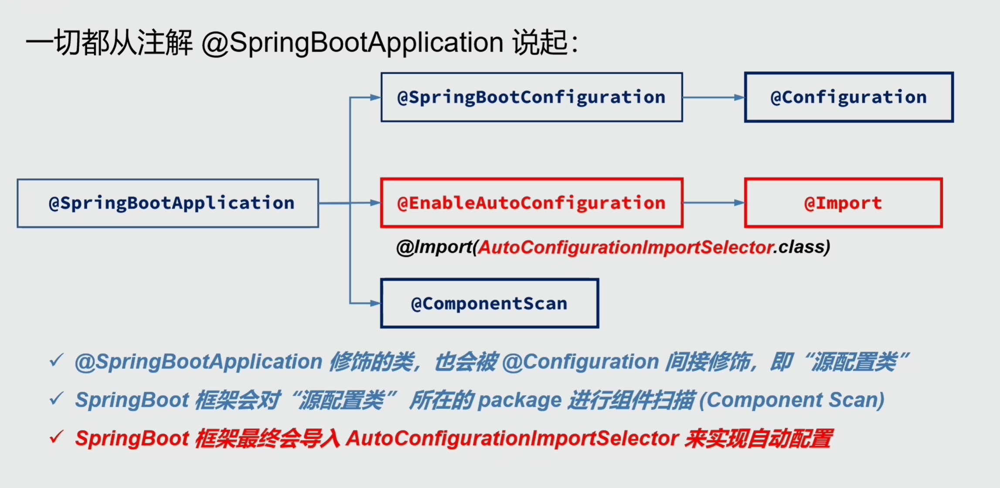
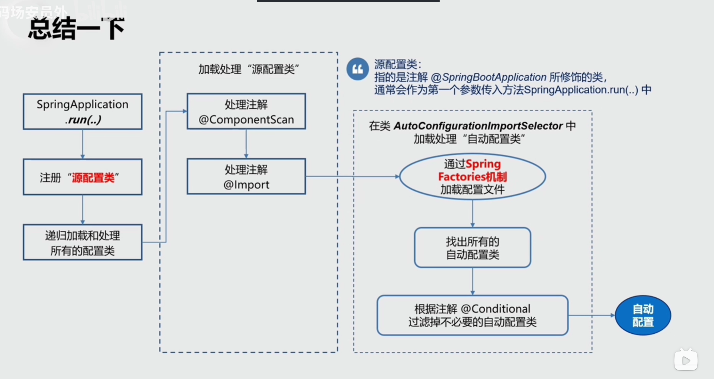

### java

**jdk动态代理和cglib的区别**

Java动态代理是利用反射机制生成一个实现代理接口的匿名类，在调用具体方法前调用InvokeHandler来处理。

而cglib动态代理是利用asm开源包，对代理对象类的class文件加载进来，通过修改其字节码生成子类来处理。

1. 如果目标对象实现了接口，默认情况下会采用JDK的动态代理实现AOP
2. 如果目标对象实现了接口，可以强制使用CGLIB实现AOP
3. 如果目标对象没有实现了接口，必须采用CGLIB库，spring会自动在JDK动态代理和CGLIB之间转换.

#### 线程

**java线程的实现方法，几种状态，状态之间的转换关系**

1. 继承Thread类，重写run方法
2. 实现Runnable接口，重写run方法，并用其初始化Thread
3. 实现Callable接口，重写call方法，并用其初始化FutureTask
4. 使用线程池创建

线程状态：

```java
NEW,//新生
RUNNABLE,//运行
BLOCKED,//阻塞
WAITING,//等待（一直等）
TIMED_WAITING,//有时间限制的等待（超时等待）
TERMINATED;//终止
```


#### **lambd**

**lambda入门**

```java
// 1. 不需要参数,返回值为 5
() -> 5

// 2. 接收一个参数(数字类型),返回其2倍的值
x -> 2 * x

// 3. 接受2个参数(数字),并返回他们的差值
(x, y) -> x – y

// 4. 接收2个int型整数,返回他们的和
(int x, int y) -> x + y

// 5. 接受一个 string 对象,并在控制台打印,不返回任何值(看起来像是返回void)
(String s) -> System.out.print(s)
```

替代匿名内部类

使用lambda表达式

```java
public class TestLambda {
	public static void main(String[] args) {
		new Thread(() -> System.out.println("hello")).start();
	}
}
```

不使用lambda表达式

```java
new Thread() {
	@Override
	public void run() {
	System.out.println("hello");
	}
}.start();
```

---

对集合进行迭代

```java
List<String> strings = Arrays.asList("one", "two", "three");
//不使用lambda表达式
for (String string : strings) {
	System.out.println(string);
}
//使用lambda表达式,两种方法
strings.forEach(x-> System.out.println(x));
strings.forEach(System.out::println);
```

---

用lambda表达式实现map

```java
List<String> strings = Arrays.asList("one", "two", "three");
//map函数可以说是函数编程里最重要的一个方法了。map的作用是将一个对象变换为另外一个
strings.stream().map(x -> x + "10").forEach(x -> System.out.println(x));
```

---

用lambda表达式实现reduce

```java
List<String> strings = Arrays.asList("one", "two", "three");
//reduce函数是将所有值合并为一个
String s = strings.stream().map(x -> x.replace('o', '0')).reduce((sum, x) -> sum + x).get();
System.out.println(s);
```

如果用for循环来做

```java
List<Double> cost = Arrays.asList(10.0, 20.0,30.0);
double sum = 0;
for(double each:cost) {
	each += each * 0.05;
	sum += each;
}
System.out.println(sum);
```

---

filter操作

```java
List<Double> cost = Arrays.asList(10.0, 20.0,30.0,40.0);
List<Double> filteredCost = cost.stream().filter(x -> x > 						25.0).collect(Collectors.toList());
filteredCost.forEach(x -> System.out.println(x));
```

---

与函数式接口Predicate配合

```java
public static void filterTest(List<String> languages, Predicate<String> condition) {
	languages.stream().filter(x -> condition.test(x)).forEach(x -> 				System.out.println(x + " "));
}
public static void main(String[] args) {
	List<String> languages = Arrays.asList("Java","Python","scala","Shell","R");
	System.out.println("Language starts with J: ");
	filterTest(languages,x -> x.startsWith("J"));
	System.out.println("\nLanguage ends with a: ");
	filterTest(languages,x -> x.endsWith("a"));
	System.out.println("\nAll languages: ");
	filterTest(languages,x -> true);
	System.out.println("\nNo languages: ");
	filterTest(languages,x -> false);
	System.out.println("\nLanguage length bigger three: ");
	filterTest(languages,x -> x.length() > 4);
}
```

#### **集合**

List、Set、Map都是接口，前两个继承至Collection接口，Map为独立接口

List子类有ArrayList、LinkedList、Vector

Set子类有HashSet、LinkedHashSet、TreeSet

Map子类有Hashmap、TreeMap、LinkedHashMap、HashTable

Collection接口下还有个Queue接口，子类有优先级队列，双端队列和阻塞队列等。

**同步的集合**

ArrayList、Linkedlist、HashMap、HashSet都是不同步的，Vector、ConcurrentHashMap是同步的。Collections里面提供了使集合同步的方法Collections.synchronizedXXX()，可以返回当前集合的同步对象。

其实返回的集合是Collections里面自己实现的集合类

```java
 static class SynchronizedCollection<E> implements Collection<E>, Serializable {
        final Collection<E> c;  // Backing Collection
        final Object mutex;     // Object on which to synchronize
     //...
 }
//SynchronizedXXX静态内部类大部分都继承至SynchronizedCollection，调用c的方法会放在同步代码块之中，用mutex做互斥量
public void add(int index, E element) {
    synchronized (mutex) {list.add(index, element);}
}
```

**ArrayList**

底层数据结构是数组，查询快，增删慢，线程不安全

```java
transient Object[] elementData; 
//默认容量是10
private static final int DEFAULT_CAPACITY = 10;
//使用有参构造器实例化的时候，会直接创建一个object数组
if (initialCapacity > 0) 
    this.elementData = new Object[initialCapacity];
//使用空参构造器实例化时，直接初始化为一个空数组
private static final Object[] DEFAULTCAPACITY_EMPTY_ELEMENTDATA = {};
public ArrayList() {
    this.e，lementData = DEFAULTCAPACITY_EMPTY_ELEMENTDATA;
}
//最大容量是整形的最大值-8，因为还要保存一些其他的信息
private static final int MAX_ARRAY_SIZE = Integer.MAX_VALUE - 8;
//扩容时，默认扩容为当前数组长度的1.5倍
int newCapacity = oldCapacity + (oldCapacity >> 1);
//查找数组中是否包含某个值，或者获取某个值的下标时，最后执行的都是下面这个函数，从前往后查找
int indexOfRange(Object o, int start, int end) {
	//...
    for (int i = start; i < end; i++) {
        //默认是使用object的equals比较对象是否相等
        if (o.equals(es[i])) {
            return i;
        }
    }
}
//数组的克隆
ArrayList<?> v = (ArrayList<?>) super.clone();
v.elementData = Arrays.copyOf(elementData, size);
v.modCount = 0;
return v;
//使用get方法时，会先判断要获取的下标是否越界
public E get(int index) {
    Objects.checkIndex(index, size);
    return elementData(index);
}
//使用set方法时，也会先判断是否越界。用的是size（数组元素的个数）而不是数组的长度（length）来判断是否越界
public E set(int index, E element) {
    Objects.checkIndex(index, size);
    //...	
}
//添加元素，最终调用的是
private void add(E e, Object[] elementData, int s) {
    //如果s超过数组长度，则进行扩容
    if (s == elementData.length)
        elementData = grow();
}
//在指定位置插入元素
System.arraycopy(elementData, index,
                 elementData, index + 1,
                 s - index);
elementData[index] = element;
//删除元素
private void fastRemove(Object[] es, int i) {
    //...
    if ((newSize = size - 1) > i)
    	System.arraycopy(es, i + 1, es, i, newSize - i);
    es[size = newSize] = null;
}
//判断两个集合是否相等，调用的是对方的迭代器遍历（传入的对象必须实现了List接口）
for (; from < to; from++) {
    if (!oit.hasNext() || !Objects.equals(es[from], oit.next())) {
        return false;
    }
}
//判断两个ArrayList是否相等
for (int i = 0; i < s; i++) {
    if (!Objects.equals(es[i], otherEs[i])) {
        equal = false;
        break;
    }
}
//计算hashCode，用的int值，所以最后算出来的结果不会很大
int hashCode = 1;
for (int i = from; i < to; i++) {
    Object e = es[i];
    hashCode = 31 * hashCode + (e == null ? 0 : e.hashCode());
}
//清空整个数组，是将整个数组中的元素置为null，size置为0，但是数组的length不变
for (int to = size, i = size = 0; i < to; i++)
    es[i] = null;
//添加整个集合，会先判断数组中剩余的空间大小是否能放下要添加集合的大小，不能放下则扩容
public boolean addAll(Collection<? extends E> c) {
    Object[] a = c.toArray();
    int numNew = a.length;
    if (numNew > (elementData = this.elementData).length - (s = size))
        elementData = grow(s + numNew);
    System.arraycopy(a, 0, elementData, s, numNew);
}
//移除某个集合中的所有元素
// 找到第一个包含的元素，然后判断是否被需要删除的集合包含，不包含就挨个往前挪
boolean batchRemove(Collection<?> c, boolean complement,
                    final int from, final int end) {
    final Object[] es = elementData;
    int w = r++;
    try {
        for (Object e; r < end; r++)
            if (c.contains(e = es[r]) == complement)
                es[w++] = e;
    } catch (Throwable ex) {
    } finally {
        shiftTailOverGap(es, w, end);
    }
}
```

**LinkedList**

底层数据结构是双向链表，查询慢，增删快，线程不安全

```java
//底层数据结构
private static class Node<E> {
    E item;
    Node<E> next;
    Node<E> prev;
    Node(Node<E> prev, E element, Node<E> next) {
        this.item = element;
        this.next = next;
        this.prev = prev;
    }
}
//维护了头结点和尾节点
transient Node<E> first;
transient Node<E> last;
//清空当前链表
public void clear() {
    for (Node<E> x = first; x != null; ) {
        Node<E> next = x.next;
        x.item = null;
        x.next = null;
        x.prev = null;
        x = next;
    }
    first = last = null;
}
//get和set方法都会先调用这个方法判断是否越界
private void checkElementIndex(int index) {
    if (!isElementIndex(index))
        throw new IndexOutOfBoundsException(outOfBoundsMsg(index));
}
private boolean isElementIndex(int index) {
    return index >= 0 && index < size;
}
//添加方法调用的是
private boolean isPositionIndex(int index) {
    return index >= 0 && index <= size;
}
//查找某个位置的元素时，会根据元素位置在前半段或者后半段，选择从头开始遍历还是从尾结点开始
Node<E> node(int index) {
    if (index < (size >> 1)) {
        Node<E> x = first;
    } else {
        Node<E> x = last;
    }
}
/**
以下方法继承至Deque（双端队列）
当定义变量为List<Integer> list = new LinkedList<>();时不能使用以下方法

检索但不删除链表的头部的方法
peek、peekFirst 如果头结点为空则返回null
element 如果头结点为空则抛出异常（getFirst）

检索但不删除链表的尾部的方法
peekLast 如果尾结点为空则返回null

检索并删除此列表的头结点
poll、pollFirst 如果头结点为空则返回null（unlinkFirst）
remove、pop 如果头结点为空则抛出异常（removeFirst）

检索并删除此列表的尾结点
pollLast 如果尾结点为空则返回null（unlinkLast）

添加尾结点
offer、offerLast（linkLast）

添加头节点
offerFirst、push（linkFirst）
*/
//clone方法
public Object clone() {
    //先克隆其他元素，然后将头尾节点置为null
    LinkedList<E> clone = superClone();
    clone.first = clone.last = null;
    clone.size = 0;
    clone.modCount = 0;
    //遍历旧链表，新链表通过尾插法添加元素
    for (Node<E> x = first; x != null; x = x.next)
        clone.add(x.item);
}
```

**Vector**

层数据结构是数组，查询快，增删慢，线程安全

```java
//底层是一个数组
protected Object[] elementData;
//每次扩容的容量大小，如果这个值小于等于0，则将数组容量扩大一倍
protected int capacityIncrement;
//有参构造器
public Vector(int initialCapacity, int capacityIncrement) {
    this.elementData = new Object[initialCapacity];
    this.capacityIncrement = capacityIncrement;
}
//数组大小默认是10，容量增量默认是0
public Vector(int initialCapacity) {
    this(initialCapacity, 0);
}
public Vector() {
    this(10);
}
//对所有需要同步的方法，都加了synchronized修饰
public synchronized void copyInto(Object[] anArray) {}

//最大容量是Integer.MAX_VALUE - 8，和ArrayList一样
private static final int MAX_ARRAY_SIZE = Integer.MAX_VALUE - 8;
```

#### 文件

BIO

同步阻塞I/O模式，数据的读取写入必须阻塞在一个线程内等待其完成。

NIO

非阻塞式I/O模式，线程在读取或者写入数据时可以进行别的操作

* buffer （缓冲区），bio是面向流（stream）nio面向缓冲区（buffer）
* channel（通道）通道是双向的，可读可写
* selcetors（选择器）单个线程处理多个通道

AIO

异步非阻塞型 IO，是根据事件和回调机制实现的

#### 反射

### WEB

**cookie和session的区别**

会话（session）跟踪是web程序中常用的技术，用来**跟踪用户的整个会话**。常用的会话跟踪技术是Session和Cookies。**Cookies通过在客户端记录信息确认用户身份，Session通过在服务器端记录信息确认用户身份。**

在Web程序中，会话跟踪是很重要的技术。理论上，一个用户的所有请求都应该属于同一个会话，而另一个用户的所有请求操作则应该属于另一个会话，二者不能混淆。例如，用户A在超市买任何东西都应该放在A的购物车内，而不应该放在B或C的购物车内。

Web程序使用的HTTP协议传输数据，**而我们知道HTTP协议是无状态的。一旦数据交换完毕，客户端与服务端的连接就会关闭，再次交换数据需要建立新的连接。这意味着服务器无法从连接上跟踪会话。**即用户A购买了一件商品放入购物车内，当再次购买商品时服务器已经无法判断该购买行为是属于用户A的会话还是用户B的会话了。要跟踪该会话，必须引入一种机制。

而Cookies和Session就是这种机制。可以弥补HTTP无状态协议的不足，在Session出现之前，所有网站都用Cookies来跟踪会话

**Cookies**

1.什么是Cookies

由于HTTP是一种无状态协议，服务器单从网络连接上无法知道客户身份，怎么办呢？**那么就给每个客户发一个通行证吧！每人一个，无论谁访问都必须携带自己通行证。这样服务器就能从通行证上确认客户身份了。这就是Cookie的工作原理。**

2.Cookies工作原理

Cookie实际上是一小段的文本信息。客户端请求服务器，如果服务器需要记录该用户状态，就使用response向客户端浏览器颁发一个Cookie。客户端浏览器会把Cookie保存起来。当浏览器再请求该网站时，浏览器把请求的网址连同该Cookie一同提交给服务器。服务器检查该Cookie，以此来辨认用户状态。服务器还可以根据需要修改Cookie的内容。

3.Java中的Cookies

Java把Cookies封装成了javax.servlet.http.Cookies类。每个Cookies都是该Cookies类的对象。服务器通过操作该Cookies类的对象操作Cookies。**通过request.getCookie()获取客户端提交的所有Cookies**（以Cookie[]数组形式返回），**通过response.addCookie(Cookiecookie)向客户端设置Cookie。**

Cookie对象使用key-value属性对的形式保存用户状态，一个Cookie对象保存一个属性对，一个request或者response同时使用多个Cookie。因为Cookie类位于包javax.servlet.http.*下面，所以JSP中不需要import该类。

4.设置Cookies的所有属性

除了name与value之外，Cookie还具有其他几个常用的属性。每个属性对应一个getter方法与一个setter方法。Cookie类的所有属性如表1.1所示。

| 属 性 名       | 描  述                                                       |
| -------------- | ------------------------------------------------------------ |
| String name    | 该Cookie的名称。Cookie一旦创建，名称便不可更改               |
| Object value   | 该Cookie的值。如果值为Unicode字符，需要为字符编码。如果值为二进制数据，则需要使用BASE64编码 |
| **int maxAge** | **该Cookie失效的时间，单位秒。如果为正数，则该Cookie在maxAge秒之后失效。如果为负数，该Cookie为临时Cookie，关闭浏览器即失效，浏览器也不会以任何形式保存该Cookie。如果为0，表示删除该Cookie。默认为–1** |
| boolean secure | 该Cookie是否仅被使用安全协议传输。安全协议。安全协议有HTTPS，SSL等，在网络上传输数据之前先将数据加密。默认为false |
| String path    | 该Cookie的使用路径。如果设置为“/sessionWeb/”，则只有contextPath为“/sessionWeb”的程序可以访问该Cookie。如果设置为“/”，则本域名下contextPath都可以访问该Cookie。注意最后一个字符必须为“/” |
| String domain  | 可以访问该Cookie的域名。如果设置为“.google.com”，则所有以“google.com”结尾的域名都可以访问该Cookie。注意第一个字符必须为“.” |
| String comment | 该Cookie的用处说明。浏览器显示Cookie信息的时候显示该说明     |
| int version    | 该Cookie使用的版本号。0表示遵循Netscape的Cookie规范，1表示遵循W3C的RFC 2109规范 |

5.Cookies的有效期

Cookies的maxAge代表Cookies的有效期，单位为**秒**，Cookie中通过getMaxAge()方法与setMaxAge(int maxAge)方法来读写maxAge属性。

如果maxAge属性为正数，则表示该Cookie会在maxAge秒之后自动失效。浏览器会将maxAge为正数的Cookie持久化，即写到对应的Cookie文件中。无论客户关闭了浏览器还是电脑，只要还在maxAge秒之前，登录网站时该Cookie仍然有效。下面代码中的Cookie信息将永远有效。

```java
Cookie cookie = new Cookie("username","helloweenvsfei");  // 新建Cookie**

cookie.setMaxAge(Integer.MAX_VALUE);      // 设置生命周期为MAX_VALUE

response.addCookie(cookie);           // 输出到客户端
```

　　如果maxAge为负数，则表示该Cookie仅在本浏览器窗口以及本窗口打开的子窗口内有效，关闭窗口后该Cookie即失效。maxAge为负数的Cookie，为临时性Cookie，不会被持久化，不会被写到Cookie文件中。Cookie信息保存在浏览器内存中，因此关闭浏览器该Cookie就消失了。Cookie默认的maxAge值为–1。

　　如果maxAge为0，则表示删除该Cookie。**Cookie机制没有提供删除Cookie的方法，因此通过设置该Cookie即时失效实现删除Cookie的效果。失效的Cookie会被浏览器从Cookie文件或者内存中删除**

```java
Cookie cookie = new Cookie("username","helloweenvsfei");  // 新建Cookie
cookie.setMaxAge(0);              // 设置生命周期为0，不能为负数
response.addCookie(cookie);           // 必须执行这一句
```

6.Cookies的修改、删除

Cookies不提供修改和删除的对应方法，只提供一个addCookie(Cookie cookie)方法

如果要修改Cookies，只需要新建一个同名的Cookies，添加到response中覆盖掉原先的Cookies

如果要删除Cookies，只需要新建一个同名的Cookies，然后将maxAge设置为0，并添加到response中覆盖掉原来的Cookies

**注意：修改、删除Cookie时，新建的Cookie除value、maxAge之外的所有属性，例如name、path、domain等，都要与原Cookie完全一样。否则，浏览器将视为两个不同的Cookie不予覆盖，导致修改、删除失败。**

**Session**

除了Cookies，Web程序还可以使用Session来记录客户端状态。**Session是服务器端使用的一种记录客户端状态的机制**，使用比Cookies简单，但是**会增大服务端的压力**

1.什么是Session

Session是一种记录客户状态的机制，和Cookies不同的是，Cookies是保存在客户端上，而Session是保存在服务端上的。客户端访问服务器的时候，服务器把客户端的信息以某种方式保存在服务器上，这就是Session。客户端再次访问服务器时只要从Session中找到该客户就行了。

如果说**Cookie机制是通过检查客户身上的“通行证”来确定客户身份的话，那么Session机制就是通过检查服务器上的“客户明细表”来确认客户身份。Session相当于程序在服务器上建立的一份客户档案，客户来访的时候只需要查询客户档案表就可以了。**

2.Session工作原理

Session在Java中对应的类是javax.servlet.http.HttpSession类。每个来访者对应一个session对象，所有该客户的Session都保存在这个Session对象里。**Session对象是客户端在第一次请求服务器时服务器创建的**Session也是一种key-value的属性对，通过getAttribute(Stringkey)和setAttribute(String key，Objectvalue)方法读写客户状态信息。Servlet里通过request.getSession()方法获取该客户的Session

例如：

```java
HttpSession session = request.getSession();       // 获取Session对象

session.setAttribute("loginTime", new Date());     // 设置Session中的属性

out.println("登录时间为：" +(Date)session.getAttribute("loginTime"));      // 获取Session属性
```

request还可以使用getSession(boolean create)来获取Session。区别是如果该客户的Session不存在，request.getSession()方法会返回null，而getSession(true)会先创建Session再将Session返回。

3.Session的生命周期

Session保存在服务端。**为了获得更高的存取速度，服务器一般把Session保存在内存中。每个用户拥有一个独立的Session，如果Session内容过于复杂，当大量用户访问时有可能会导致内存溢出，因此Session应该尽量保持精简。**

**Session在用户第一次访问时自动创建。**只有在访问Jsp和Servlet时才会创建，如果是访问image，html等静态文件，是不会创建Session的。如果尚未生成Session，也可以使用request.getSession(true)强制生成Session。

**Session生成后，只要用户继续访问，服务器就会更新Session的最后访问时间，并维护该Session。**用户每访问服务器一次，无论是否读写Session，服务器都认为该用户的Session“活跃（active）”了一次。

4.Session的有效期

由于会有越来越多的用户访问服务器，因此Session也会越来越多。**为防止内存溢出，服务器会把长时间内没有活跃的Session从内存删除。这个时间就是Session的超时时间。如果超过了超时时间没访问过服务器，Session就自动失效了。**

Session的超时时间为maxInactiveInterval属性，可以通过对应的getMaxInactiveInterval()获取，通过setMaxInactiveInterval(longinterval)修改。

Session的超时时间也可以在web.xml中修改。另外，通过调用Session的invalidate()方法可以使Session失效。

5.Session的常用方法

Session中包括各种方法，使用起来要比Cookie方便得多。Session的常用方法如表1.2所示。

表1.2 HttpSession的常用方法

| 方 法 名                                          | 描  述                                                       |
| ------------------------------------------------- | ------------------------------------------------------------ |
| void setAttribute(String attribute, Object value) | 设置Session属性。value参数可以为任何Java Object。通常为Java Bean。value信息不宜过大 |
| String getAttribute(String attribute)             | 返回Session属性                                              |
| Enumeration getAttributeNames()                   | 返回Session中存在的属性名                                    |
| void removeAttribute(String attribute)            | 移除Session属性                                              |
| String getId()                                    | 返回Session的ID。该ID由服务器自动创建，不会重复              |
| long getCreationTime()                            | 返回Session的创建日期。返回类型为long，常被转化为Date类型，例如：Date createTime = new Date(session.get CreationTime()) |
| long getLastAccessedTime()                        | 返回Session的最后活跃时间。返回类型为long                    |
| int getMaxInactiveInterval()                      | 返回Session的超时时间。单位为秒。超过该时间没有访问，服务器认为该Session失效 |
| void setMaxInactiveInterval(int second)           | 设置Session的超时时间。单位为秒                              |
| void putValue(String attribute, Object value)     | 不推荐的方法。已经被setAttribute(String attribute, Object Value)替代 |
| Object getValue(String attribute)                 | 不被推荐的方法。已经被getAttribute(String attr)替代          |
| boolean isNew()                                   | 返回该Session是否是新创建的                                  |
| void invalidate()                                 | 使该Session失效                                              |

Tomcat中Session的默认超时时间为20分钟。通过setMaxInactiveInterval(int seconds)修改超时时间。可以修改web.xml改变Session的默认超时时间。例如修改为60分钟：

```xml
<session-config>
   <session-timeout>60</session-timeout>      <!-- 单位：分钟 -->
</session-config>
```

注意：\<session-timeout>参数的单位为分钟，而setMaxInactiveInterval(int s)单位为秒。

**Cookies和Session的区别**

1. Cookies的数据保存在客户端上，Session的数据保存在服务器上
2. Cookies不是很安全，攻击人可以分析存在本地的Cookies文件并进行Cookies欺骗
3. 设置cookie时间可以使cookie过期。但是使用session-destory（），我们将会销毁会话。
4. Session的数据保存在服务器上，会对服务器造成压力。如果想减轻服务器压力，应当使用Cookies
5. 单个cookie保存的数据不能超过4K，很多浏览器都限制一个站点最多保存20个cookie。(Session对象没有对存储的数据量的限制，其中可以保存更为复杂的数据类型)
6. Session的生命周期是从浏览器启动到浏览器关闭，即浏览页面一关，Session就消失了。
    Cookies是预先设置存活时间，或永久的保存到本地文件中

### MySQL

```sql
#常用命令
#1.查看当前所有的数据库
show databases;
#2.打开指定的库
use 库名;
#3.查看当前库的所有表
show tables;
#4.查看其它库的所有表
show tables from 库名;
#5.创建表
create table 表名(
	列名 列类型,
	列名 列类型,
	...
);
#6.查看表结构
desc 表名;
```

```sql
#数据库的创建
create database [if not exists] name;
#数据库的删除
drop database [if exists] name;
#数据库的修改
alter database name character set gbk
```

```sql
#表的创建
create table 表名(
	列名 列的类型 【（长度）约束】，
	...
	列名 列的类型 【（长度）约束】
)
#表的修改
#1. 修改列名
alter table 表名 change column 列名 新列名 类型
#2. 修改列的类型或约束
alter table 表名 modify column 列名 类型
#3. 添加新列
alter table 表名 add column 列名 类型 
#4. 删除列
alter table 表名 drop column 列名
#5. 修改表名
alter table 表名 rename to 新表名

#表的删除
drop table 表名
#表的复制
#1. 仅仅复制表的结构
create table 新表名 like 表名

#2.复制表的结构+数据
create table 新表名
select * from 表名

#3. 只复制部分数据
create table 新表名
select 字段
from 表名
where 筛选条件

#4. 仅仅复制某些字段
create table 新表名
select 字段
from 表名
where 0
```

```sql
#添加列级约束：直接进在字段名和类型后面追加约束类型即可，只支持：默认、非空、主键、唯一
#添加表级约束：在各个字段的最下面 constraint 约束名 约束类型（字段）
#六大约束
NOT NULL  #非空，用于保证该字段的值不能为空
DEFAULT #默认，用于保证该字段有默认值
primary key #主键，用于保证该字段的值具有唯一性，并且非空
UNIQUE #唯一：用于保证该字段的值具有唯一性，可以为空
check #检查约束（mysql不支持）
foreign key #外键，用于限制两个表的关系，用于保证该字段的值必须来自于主表的关联列的值，在从表中添加外键约束，用于引用主表中某列的值
```

**主键和唯一的异同**

|      | 保证唯一性 | 是否允许为空 | 一个表可以有几个 | 是否允许组合 |
| :--: | :--------: | :----------: | :--------------: | :----------: |
| 主键 |     √      |      ×       |    至多有一个    | √，但不推荐  |
| 唯一 |     √      |      √       |    可以有多个    | √，但不推荐  |

```sql
#添加非空约束
alter table 表名 modify column 列名 varchar(20) not null

#添加默认约束
alter table 表名 modify column 列名 int default 5

#添加主键
#列级约束
alter table 表名 modify column 列名 类型 primary key
#表级约束
alter table 表名 add primary key(列名)

#添加唯一
#列级约束
alter table 表名 modify column 列名 类型 unique
#表级约束
alter table 表名 add unique(列名)

#添加外键
alter table 表名 add constraint 外键名 foreign key(列名) references 表名(列名)

#删除非空约束
alter table 表名 modify column 列名 类型  null;

#删除默认约束
alter table 表名 modify column 列名 类型

#删除主键
alter table 表名 drop primary key
```

```
标识列，又称自增长列
必须和key搭配
一个表至多只有一个标识列
可以通过set_auto_increment==3设置步长
```

```sql
#级联删除
alter table 表名 add constraint 外键名 foreign key(列名) references major(列名) on delete cascade

#级联置空
alter table 表名 add constraint 外键名 foreign key(列名) references major(列名) on set null
```

```sql
#插入语句
insert into 表名（列名，...） values（值1， ...）
insert into 表名 set 列名=值， 列名=值， 列名=值...
#方式一可以插入多行；
insert into 表名（列名，...） values（值1， ...）， values（值1， ...），values（值1， ...）
#方式一支持子查询
insert into 表名（列名，...） select ...

#修改语句
update 表名 set 列=新值， 列=新值... where 筛选条件
#多表更新
#SQL92语法
update 表1 别名，表2 别名 set 列=值 where 连接条件 and 筛选条件
#SQL99语法
update 表1 别名 inner|left|right join 表2 别名 on 连接条件 set 列=值 where 筛选条件

#删除语句
delete from 表名 where 筛选条件
truncate table 表名
#多表删除
#SQL92语法
delete 别名 from 表1 别名, 表2 别名 where 连接条件 and 筛选条件
#SQL99语法
delete 别名 from 表1 别名 inner|left|right join 表2 别名 on 连接条件 where 筛选条件
/*
truncate和delete的区别
1. delete可以加where条件，truncate不能加
2. truncate删除，效率高一点
3. 假如要删除表中的自增长类
	用delete删除后，再插入数据，自增长列从断点开始
	用truncate删除后，再插入数据，自增长列的值从1开始
4. truncate删除没有返回值，delete删除有返回值
5. truncate删除不能回滚，delete可以回滚
*/
```

```sql
#简单查询语句
select 查询表名 from 表名 where 筛选条件 #where中不允许使用别名

#安全等于<=>
select * from employees where comminssion_pct <=> null;
select * from employees where salary <=> 12000;
#is null 仅仅可以判断null值，可读性较高
#<=> 既可以判断null值，又可以判断普通的数值，可读性较低

select 查询列表 from 表 [where 条件] order by 排序列表 [asc|desc]
/*
asc 是升序
desc 是降序
如果不写，默认是升序
order by字句中可以支持单个字段、多个字段、表达式、函数、别名
order by子句一般是放在查询语句的最后面，limit子句除外
*/
#按表达式排序
select *, salary*12*(1+IFNULL(commission_pct, 0)) 年薪 from employees order by salary*12*(1+IFNULL(commission_pct, 0)) DESC;

#按别名排序
select *, salary*12*(1+IFNULL(commission_pct, 0)) 年薪 from employees order by 年薪 DESC;

#按函数排序
select Length(last_name) 字节长度, last_name, salary from employees order by LENGTH(last_name) desc;

#按多个字段排序，先排的写前面
select * from employees order by salary desc, employee_id desc;
```

```sql
#复杂查询

#联合查询
查询语句1
union
查询语句2
union
...
/*
1. 要求多条查询语句的查询列数是一致的
2. 要求多条查询语句的查询的每一列的类型和顺序最好一致
3. union关键字默认去重，如果使用union all可以留下重复项
*/
```

MySQL调优

1. 选取最适合的字段属性

    * 在创建表的时候，我们可以将表中字段的宽度设得尽可能小，在它上面执行的查询也就会越快

    * 应该尽量把字段设置为NOTNULL，这样在将来执行查询的时候，数据库不用去比较NULL值

    * 对于某些文本字段，例如“省份”或者“性别”，我们可以将它们定义为ENUM类型。因为在MySQL中，ENUM类型被当作数值型数据来处理，而数值型数据被处理起来的速度要比文本类型快得多
2. 使用连接查询来代替子查询
3. 使用联合来代替手动创建临时表
4. 事务
5. 锁定表
6. 使用外键
7. 使用索引
8. 优化的查询语句
9. 应尽量避免在 where 子句中对字段进行 null 值判断，否则将导致引擎放弃使用索引而进行全表扫描
10. 应尽量避免在 where 子句中使用 != 或 <> 操作符，否则将引擎放弃使用索引而进行全表扫描。
11. 如果在 where 子句中使用参数，也会导致全表扫描
12. 对于多张大数据量（这里几百条就算大了）的表JOIN，要先分页再JOIN，否则逻辑读会很高，性能很差
13. 任何地方都不要使用 select * from t ，用具体的字段列表代替“*”，不要返回用不到的任何字段。

**索引**


**范式**

1NF 每个属性都不可再分

2NF 消除了非主属性对码的部分函数依赖

3NF 消除了非主属性对码的传递依赖

BCNF 在3NF的基础上消除主属性对于码的部分依赖与传递函数依赖

### ES

**为什么用es**

es是一个实时分布式搜索和分析引擎，基于 Lucene 的全文检索引擎，它会对数据进行分词后保存索引，擅长管理大量的索引数据，相对于 MySQL 来说不擅长经常更新数据及关联查询。

对已有的数据进行搜索的时候，Solr更快

当实时建立索引的时候solr会产生io阻塞，查询性能较差

随着数据量的增加，Solr的搜索效率会比较低，而es没有明显的变化

es采用倒排索引搜索数据

**什么是倒排索引**

采用lucene倒排索引作为底层，倒排索引结构是根据内容（词语）找文档

### Spring

spring的基本特性：ioc和aop

#### ioc

ioc：控制反转。将需要的组件交给容器去管理。在容器初始化的时候，会加载所有的非抽象的非懒加载的单实例bean，存放在map中。在需要的时候，直接从容器中获取就可以了。多实例的bean在每次获取的时候创建一个对象。获取的时候，会先按照类型去找，然后按照变量名作id去找

流程：

1. spring容器在启动的时候，会先保存所有注册进来的Bean的定义信息

    1. xml注册bean；<bean/>
    2. 注解注册bean；@Service、@Component、@Bean

2. spring容器会在合适的时机创建这些bean

    1. 用到这个bean的时候，利用getBean创建bean，创建好以后保存在容器中
    2. 统一创建剩下所有bean的时候，finishBeanFactoryInitialization

3. 后置处理器：BeanPostProcessor

    1. 每一个bean创建完成，都会使用各种后置处理器进行处理，来增强bean功能

        AutowiredAnnotationBeanPostProcessor；处理自动注入

        AnnotationAwareAspectJAutoProxyCreator；用来做AOP功能

4. 事件驱动模型

    ApplicationListener；事件监听

    ApplicationEventMulticaster；事件派发

#### aop

aop：面向切面编程。在程序运行期间，**将某段代码动态的切入到指定方法的指定位置**进行运行的这种编程方式。

1. 先创建所有的BeanPostProcessor，然后创建所有的单实例bean。先从缓存中获取当前bean，如果能获取到，说明bean是之前创建过的，直接使用，否则再创建（只要创建好的bean都会被缓存起来）

2. AnnotationAwareAspectJAutoProxyCreator会在任何bean创建之前先尝试返回bean的实例

    1. 每一个bean创建之前，调用postProcessBeforeInstantiation()
        1. 判断当前bean是否在advisedBeans中（保存了所有需要增强的bean）
        2. 判断当前bean是否是基础类型的Advice、Pointcut、Advisor、AopInfrastructureBean
        3. 是否需要跳过
    2. 创建对象
        1. 获取当前bean的所有增强器（通知方法）Object[] specificInterceptors
            1. 找到候选的所有增强器（找哪些通知方法是需要切入当前bean方法的）
            2. 获取到能在bean使用的增强器
            3. 给增强器排序eligibleAdvisors = sortAdvisors(eligibleAdvisors);
        2. 保存当前bean在advisedBean中
        3. 如果当前bean需要增强，创建当前bean的代理对象
            1.  获取所有增强器（通知方法）
            2. 保存到proxyFactory
            3. 创建代理对象，spring自动决定
        4. 给容器中返回当前组件使用cglib增强了的代理对象
        5. 以后容器中获取到的就是这个组件的代理对象，执行目标方法的时候，代理对象就会执行通知方法的流程

3. 目标方法的执行

    容器中保存了组件的代理对象（cglib增强后的对象），这个对象里面保存了详细信息（比如增强器，目标对象，xxx）

    1. CglibAopProxy.intercept()拦截目标方法的执行
    2. 根据ProxyFactory对象获取要执行的目标方法的拦截器链
        1. 遍历所有的增强器，将其转换为Interceptor
    3. 如果没有拦截器链，直接执行目标方法
    4. 如果有拦截器链，把需要执行的目标对象，目标方法，拦截器链等信息传入，创建一个CglibMethodInvocation对象
    5. 拦截器的触发过程
        1. 如果没有拦截器，就执行目标方法，或者拦截器的索引和拦截器数组-1大小一样（指定到了最后一个拦截器）执行目标方法
        2. 链式获取每一个拦截器，拦截器执行invoke方法，每一个拦截器等待下一个拦截器执行完成返回以后再来执行。拦截器链的机制，保证通知方法与目标方法的执行顺序

### Redis

**redis过期时间**

键的默认过期时间的永不过期

expire和pexpire可以将键的生存时间设置多少秒或者毫秒(p)

expireat和pexpireat可以将键的过期时间设置为指定的毫秒数时间戳

但是这四个命令内部都是调用同一个函数实现的

```c
expireGenericCommand(redisClient *c, long long basetime, int unit)
```

也可以通过ttl和pttl查看键的生存时间还有多久

```c
ttlGenericCommand(redisClient *c, int output_ms) //output_ms为1则返回毫秒，为0返回秒
```

**数据类型**

String，list，set，zset，hash

string可以存一些简单的字符串，比如房源信息的浏览量

hash可以存对象信息，比如把id作为key，filed-value则放入房源名称，描述等信息

list可以存储用户收藏的房屋信息，key是用户的id，value则是房屋id

set可以用来放共同关注

zset可以根据房屋搜索的相关度进行排序

**redis为什么快**

因为他是基于内存的一个数据库，内部的数据结构也是进行过优化的。他是单线程的，避免了高并发下线程切换和锁竞争的问题

### MyBatis



#### ${}和#{}的区别

${}：不是参数预编译，是直接和sql语句拼接的。可以在不需要预编译的地方使用，比如动态设置表名，orderby排序

#{}：是参与预编译的方式，参数位置都用?代替，参数是后面预编译设置进去的

### HR

**自我介绍**

面试官你好，我叫黄雷。毕业于江西农业大学软件工程专业。毕业后在用友网络科技股份有限公司担任Java开发工程师，这三年来我刻苦学习，努力工作，因表现优异，多次被评为优秀员工，职级也从p1升到了p3。在三年的工作中，我负责BIP考勤系统相关功能的设计与开发。所在小组主要负责加班、请假、考勤规则、假勤档案等基础功能的重构与优化，对打卡、日月报也有一定了解。同时还参与过公司自研的MDD框架的研发，主要负责基于反射机制的规则引擎的开发。这套框架能做到动态加载不同领域的自定义规则，实现了一套全领域可复用的低代码平台。我的自我介绍结束了。请面试官多多指教。

**你觉得你个性上最大的优点是什么？**

沉着冷静、条理清楚、立场坚定、顽强向上。 乐于助人和关心他人、适应能力和幽默感、乐观和友爱。

**说说你最大的缺点？**

比较容易担心某件事。比如有个a任务，明天要交给领导，交给领导之前我会核实好多次。上交之后，我可能还会时不时的想想那个任务是不是做完了，还有没有什么缺陷。导致我在做接下来的任务时，没法专注进去。但是我已经意识到了这件事，我会改进的。

**你对加班的看法？**

如果工作任务紧急，那么加班完成工作任务，这是个人职责。但是，如果我天天都加班，我会反思，是不是我自己的效率太低了。我会通过提高工作效率来避免不必要的加班。

**你对薪资的要求**

没有具体的薪资要求。因为我觉得公司会根据我的情况和市场标准的水平，给我合理的薪水。

**职业规划**

我准备在技术领域有所作为，对公司所用的技术，我将不断的深入研究

**朋友对你的评价**

我觉的我是一个比较随和的人，与不同的人都可以友好相处。在我与人相处时， 我总是能站在别人的角度考虑问题

**如果通过这次面试我们单位录用了你，但工作一段时间却发现你根本不适合这个职位， 你怎么办？**

不断学习，虚心向领导和同事学习业务知识和处事 经验，了解这个职业的精神内涵和职业要求，力争减少差距

**你并非毕业于名牌院校？**

是否毕业于名牌院校不重要，重要的是有能力完成公司交给我的工作。大学只是一个地点，再好的大学也不能代替你学习，还得看自己的努力。而且在互联网发达的今天，我们能获得的资源不比他们少。

**反问**

如果我能进入贵公司，公司对新员工有没有什么培训项目？

公司的日常工作时间是怎么安排的？

公司的晋升机制

### 面试专业问题

#### 代码部署到服务器发现cpu被打满了怎么排查

**使用 `top` 命令**
 登录服务器后执行 `top`，观察CPU使用率最高的进程（`%CPU`列）。

**查看进程内线程**
 使用 `top -H -p <PID>` 查看目标进程的所有线程（`H` 表示显示线程）。

**使用 `jstack` 分析Java进程**

记得把上面查到的线程转换为16进制。使用 `jstack <PID>` 获取线程堆栈信息，并查找目标线程。根据堆栈信息和线程状态，判断可能的原因。

```
根据堆栈信息和线程状态，判断可能的原因：
(1) 计算密集型任务
表现：线程状态为 RUNNABLE，堆栈显示在执行计算逻辑。
解决方案：检查代码中的死循环、递归或高频计算（如正则表达式、加密算法）。优化算法复杂度或拆分任务。
(2) 频繁GC
表现：线程名为 GC Task Thread 或 VM Thread。
解决方案：启用GC日志分析（-Xlog:gc* 参数）。调整堆内存大小（-Xmx/-Xms）。
(3) 锁竞争
表现：大量线程状态为 BLOCKED 或 WAITING，堆栈显示等待锁。
解决方案：使用 jstack 检查死锁提示（Found one Java-level deadlock）。优化锁粒度或改用无锁数据结构。
(4) 外部依赖异常
表现：线程卡在IO操作（如 java.net.SocketInputStream.read）。
解决方案：检查数据库、RPC调用或第三方接口的响应时间。添加超时机制或重试策略。
```

#### 代码部署到服务器发现内存被打满了怎么排查

使用 `free` 命令查看内存状态

使用 `vmstat` 命令查看内存和交换分区动态

 使用 `top` 或 `htop` 实时监控进程内存

```
top -o %MEM  # 按内存使用率排序
```

查找占用内存最多的进程

```
ps -eo pid,%mem,cmd --sort -%mem | head -n 10
```

检查进程的内存使用细节

```
pmap -x <PID>  # 查看进程的内存映射
```

- 分析内存问题原因

- (1) 应用层问题

- 1. **内存泄漏**
     - **现象**：堆内存（heap）持续增长，最终耗尽物理内存。
     - 排查方法：对于 Java 应用：使用 `jstat -gc <PID>` 查看堆内存变化，或通过 `jmap` 生成堆转储文件分析。
  2. **缓存失控**
     - **现象**：缓存数据未设置过期时间，导致内存被占满。
     - 排查方法
       - 检查 Redis 或 Memcached 的 `maxmemory` 配置。
       - 使用 `MEMORY STATS`（Redis）或 `stats`（Memcached）查看缓存占用。
  3. **高频 GC（垃圾回收）**
     - **现象**：频繁触发 GC，导致 CPU 和内存波动。
     - 排查方法
       - Java 应用：启用 GC 日志（`-Xlog:gc*`）分析 GC 频率。
       - 调整 JVM 参数（如 `-Xmx` 和 `-Xms`）优化堆大小

#### **CompletableFuture**

`CompletableFuture` 是 Java 8 引入的用于简化异步编程的工具类，基于 `Future` 接口扩展，支持链式调用、任务编排、异常处理等高级功能。它通过函数式编程风格，解决了传统 `Future` 的局限性（如无法手动完成任务、无法链式依赖等），广泛应用于高并发、异步任务处理的场景。

默认使用 `ForkJoinPool.commonPool()`，但建议显式指定线程池以避免资源竞争（尤其是 I/O 密集型任务）。

等待全部数据查询完成后再统一进行处理

#### sql优化

* 避免使用select *
* 分页查询
* 避免做多表join操作
* 尽量不要使用外键
* 正确使用索引
  * 主键自动创建主键索引
  * 频繁作为查询的字段
  * 查询中与与其他表关联的字段，外键建立索引
  * 查询中排序的字段，如果字段排序了，用索引将会提高效率
  * 高并发下趋向使用组合索引
  * 查询中统计或分组字段
  * 尽量选择唯一性索引
  * 适合索引的列是WHERE查询子句的列，或者是连接子句中指定的列
* 避免错误的使用索引
  * 表记录较少（MySQL自己可以处理，不需要索引，反而会影响效率）
    * 经常增删改的表（在增删改的时候，索引文件同时需要更改，影响效率）
    * 数据重复且平均分配的字段，例如国籍，性别等，不适合创建索引
    * 频繁更新的字段
    * WHERE里用不到的字段不适合创建索引，因为在使用WHERE时，用不到的字段会导致索引失效。

#### redis分布式锁

Redisson 是一个基于 Redis 的 Java 客户端。为了解决重入问题，redisson使用了hash来实现分布式锁。redisson使用lua脚本设置key和过期时间，并且这个操作是原子性的。

watchdog子线程，每过1/3的锁时间，就会自动为锁做一个续期。

setnx必须要加上过期时间，不然如果持有锁的进程挂了，会造成“死锁”



基于 Redis 官方推荐的 RedLock 算法，通过多个独立 Redis 节点确保锁的高可用性。

加锁流程：

1. 客户端向 N 个独立的 Redis 主节点 发送加锁请求。
2. 每个节点的锁需设置相同的 唯一标识（如 UUID）和 过期时间（TTL）。
3. 客户端记录加锁开始时间。
4. 如果客户端在 大多数节点（N/2+1）上成功加锁，并且总耗时小于锁的 TTL，则认为加锁成功。
5. 实际有效时间 = TTL - 总耗时。

解锁流程：客户端需向 所有 Redis 节点 发送解锁请求，即使某些节点未成功加锁。确保锁的最终释放，避免因网络故障导致锁残留



#### @Component和@Bean的区别

- `@Component` 注解作用于类，而`@Bean`注解作用于方法。
- `@Component`通常是通过类路径扫描来自动侦测以及自动装配到 Spring 容器中（我们可以使用 `@ComponentScan` 注解定义要扫描的路径从中找出标识了需要装配的类自动装配到 Spring 的 bean 容器中）。`@Bean` 注解通常是我们在标有该注解的方法中定义产生这个 bean,`@Bean`告诉了 Spring 这是某个类的实例，当我需要用它的时候还给我。
- `@Bean` 注解比 `@Component` 注解的自定义性更强，而且很多地方我们只能通过 `@Bean` 注解来注册 bean。比如当我们引用第三方库中的类需要装配到 `Spring`容器时，则只能通过 `@Bean`来实现。

####  新创建一个接口需要注意什么

1. 参数校验
2. 权限控制
3. sql优化，查询字段添加索引
4. 如果是高频访问的数据可以缓存到本地或者redis中
5. 数据量过大需要分页查询
6. 记录日志
7. 构建数据集

#### Spring 中 Bean 的作用域通常有下面几种：

- **singleton** : IoC 容器中只有唯一的 bean 实例。Spring 中的 bean 默认都是单例的，是对单例设计模式的应用。
- **prototype** : 每次获取都会创建一个新的 bean 实例。也就是说，连续 `getBean()` 两次，得到的是不同的 Bean 实例。
- **request** （仅 Web 应用可用）: 每一次 HTTP 请求都会产生一个新的 bean（请求 bean），该 bean 仅在当前 HTTP request 内有效。
- **session** （仅 Web 应用可用） : 每一次来自新 session 的 HTTP 请求都会产生一个新的 bean（会话 bean），该 bean 仅在当前 HTTP session 内有效。
- **application/global-session** （仅 Web 应用可用）：每个 Web 应用在启动时创建一个 Bean（应用 Bean），该 bean 仅在当前应用启动时间内有效。
- **websocket** （仅 Web 应用可用）：每一次 WebSocket 会话产生一个新的 bean

默认是单实例，需要多实例的话可以使用@Scope注解

```java
@Bean
@Scope(value = ConfigurableBeanFactory.SCOPE_PROTOTYPE)
public Person personPrototype() {
    return new Person();
}
```

#### ThreadLocal

```java
public class Thread implements Runnable {
    //......
    //与此线程有关的ThreadLocal值。由ThreadLocal类维护
    ThreadLocal.ThreadLocalMap threadLocals = null;

    //与此线程有关的InheritableThreadLocal值。由InheritableThreadLocal类维护
    ThreadLocal.ThreadLocalMap inheritableThreadLocals = null;
    //......
}
```

```java
public void set(T value) {
    //获取当前请求的线程
    Thread t = Thread.currentThread();
    //取出 Thread 类内部的 threadLocals 变量(哈希表结构)
    ThreadLocalMap map = getMap(t);
    if (map != null)
        // 将需要存储的值放入到这个哈希表中，键用的是当前threadLocal对象的哈希值
        map.set(this, value);
    else
        createMap(t, value);
}
ThreadLocalMap getMap(Thread t) {
    return t.threadLocals;
}
```

**最终的变量是放在了当前线程的 `ThreadLocalMap` 中，并不是存在 `ThreadLocal` 上，`ThreadLocal` 可以理解为只是`ThreadLocalMap`的封装，传递了变量值。**`ThrealLocal` 类中可以通过`Thread.currentThread()`获取到当前线程对象后，直接通过`getMap(Thread t)`可以访问到该线程的`ThreadLocalMap`对象

#### Bean的生命周期

1. **创建 Bean 的实例**：Bean 容器首先会找到配置文件中的 Bean 定义，然后使用 Java 反射 API 来创建 Bean 的实例。
2. **Bean 属性赋值/填充**：为 Bean 设置相关属性和依赖，例如`@Autowired` 等注解注入的对象、`@Value` 注入的值、`setter`方法或构造函数注入依赖和值、`@Resource`注入的各种资源。
3. **Bean 初始化**：
   * 如果实现了其他 `*.Aware`接口，就调用相应的方法。
   * 如果有和加载这个 Bean 的 Spring 容器相关的 `BeanPostProcessor` 对象，执行`postProcessBeforeInitialization()` 方法
   * 如果 Bean 实现了`InitializingBean`接口，执行`afterPropertiesSet()`方法。
   * 如果 Bean 在配置文件中的定义包含 `init-method` 属性，执行指定的方法。
   * 如果有和加载这个 Bean 的 Spring 容器相关的 `BeanPostProcessor` 对象，执行`postProcessAfterInitialization()` 方法。
4. **销毁 Bean**：销毁并不是说要立马把 Bean 给销毁掉，而是把 Bean 的销毁方法先记录下来，将来需要销毁 Bean 或者销毁容器的时候，就调用这些方法去释放 Bean 所持有的资源。
   * 如果 Bean 实现了 `DisposableBean` 接口，执行 `destroy()` 方法。
   * 如果 Bean 在配置文件中的定义包含 `destroy-method` 属性，执行指定的 Bean 销毁方法。或者，也可以直接通过`@PreDestroy` 注解标记 Bean 销毁之前执行的方法。

```java
protected Object doCreateBean(final String beanName, final RootBeanDefinition mbd, final @Nullable Object[] args)
    throws BeanCreationException {

    // 1. 创建 Bean 的实例
    BeanWrapper instanceWrapper = null;
    if (instanceWrapper == null) {
        instanceWrapper = createBeanInstance(beanName, mbd, args);
    }

    Object exposedObject = bean;
    try {
        // 2. Bean 属性赋值/填充
        populateBean(beanName, mbd, instanceWrapper);
        // 3. Bean 初始化
        exposedObject = initializeBean(beanName, exposedObject, mbd);
    }

    // 4. 销毁 Bean-注册回调接口
    try {
        registerDisposableBeanIfNecessary(beanName, bean, mbd);
    }

    return exposedObject;
}
```

整体上可以简单分为四步：实例化 —> 属性赋值 —> 初始化 —> 销毁。

初始化这一步涉及到的步骤比较多，包含 `Aware` 接口的依赖注入、`BeanPostProcessor` 在初始化前后的处理以及 `InitializingBean` 和 `init-method` 的初始化操作。

销毁这一步会注册相关销毁回调接口，最后通过`DisposableBean` 和 `destory-method` 进行销毁。



#### 多个切面的执行顺序如何控制？

通常使用`@Order` 注解直接定义切面顺序，或者实现`Ordered` 接口重写 `getOrder` 方法。

#### Spring MVC 的核心组件有哪些？

- **`DispatcherServlet`**：**核心的中央处理器**，负责接收请求、分发，并给予客户端响应。
- **`HandlerMapping`**：**处理器映射器**，根据 URL 去匹配查找能处理的 `Handler` ，并会将请求涉及到的拦截器和 `Handler` 一起封装。
- **`HandlerAdapter`**：**处理器适配器**，根据 `HandlerMapping` 找到的 `Handler` ，适配执行对应的 `Handler`；
- **`Handler`**：**请求处理器**，处理实际请求的处理器。
- **`ViewResolver`**：**视图解析器**，根据 `Handler` 返回的逻辑视图 / 视图，解析并渲染真正的视图，并传递给 `DispatcherServlet` 响应客户端



#### Spring 框架中用到了哪些设计模式？

- **工厂设计模式** : Spring 使用工厂模式通过 `BeanFactory`、`ApplicationContext` 创建 bean 对象。
- **代理设计模式** : Spring AOP 功能的实现。
- **单例设计模式** : Spring 中的 Bean 默认都是单例的。
- **模板方法模式** : Spring 中 `jdbcTemplate`、`hibernateTemplate` 等以 Template 结尾的对数据库操作的类，它们就使用到了模板模式。
- **包装器设计模式** : 我们的项目需要连接多个数据库，而且不同的客户在每次访问中根据需要会去访问不同的数据库。这种模式让我们可以根据客户的需求能够动态切换不同的数据源。
- **观察者模式:** Spring 事件驱动模型就是观察者模式很经典的一个应用。
- **适配器模式** : Spring AOP 的增强或通知(Advice)使用到了适配器模式、spring MVC 中也是用到了适配器模式适配`Controller`。

#### Spring 的循环依赖

**一级缓存（singletonObjects）**：存放最终形态的 Bean（已经实例化、属性填充、初始化），单例池，为“Spring 的单例属性”⽽⽣。一般情况我们获取 Bean 都是从这里获取的，但是并不是所有的 Bean 都在单例池里面，例如原型 Bean 就不在里面。

**二级缓存（earlySingletonObjects）**：存放过渡 Bean（半成品，尚未属性填充），也就是三级缓存中`ObjectFactory`产生的对象，与三级缓存配合使用的，可以防止 AOP 的情况下，每次调用`ObjectFactory#getObject()`都是会产生新的代理对象的。

**三级缓存（singletonFactories）**：存放`ObjectFactory`，`ObjectFactory`的`getObject()`方法（最终调用的是`getEarlyBeanReference()`方法）可以生成原始 Bean 对象或者代理对象（如果 Bean 被 AOP 切面代理）。三级缓存只会对单例 Bean 生效。

```java
//当 Spring 创建 A 之后，发现 A 依赖了 B ，又去创建 B，B 依赖了 A ，又去创建 A；在 B 创建 A 的时候，那么此时 A 就发生了循环依赖，由于 A 此时还没有初始化完成，因此在 一二级缓存 中肯定没有 A；那么此时就去三级缓存中调用 getObject() 方法去获取 A 的 前期暴露的对象 ，也就是调用上边加入的 getEarlyBeanReference() 方法，生成一个 A 的 前期暴露对象；然后就将这个 ObjectFactory 从三级缓存中移除，并且将前期暴露对象放入到二级缓存中，那么 B 就将这个前期暴露对象注入到依赖，来支持循环依赖。
class A {
    // 使用了 B
    private B b;
}
class B {
    // 使用了 A
    private A a;
}
```

在三级缓存这一块，主要记一下 Spring 是如何支持循环依赖的即可，也就是如果发生循环依赖的话，就去 **三级缓存 `singletonFactories`** 中拿到三级缓存中存储的 `ObjectFactory` 并调用它的 `getObject()` 方法来获取这个循环依赖对象的前期暴露对象（虽然还没初始化完成，但是可以拿到该对象在堆中的存储地址了），并且将这个前期暴露对象放到二级缓存中，这样在循环依赖时，就不会重复初始化了！

#### Spring 事务中哪几种事务传播行为

* **`TransactionDefinition.PROPAGATION_REQUIRED`**

  `@Transactional`注解默认使用就是这个事务传播行为。如果当前存在事务，则加入该事务；如果当前没有事务，则创建一个新的事务。

* **`TransactionDefinition.PROPAGATION_REQUIRES_NEW`**

  创建一个新的事务，如果当前存在事务，则把当前事务挂起。也就是说不管外部方法是否开启事务，`Propagation.REQUIRES_NEW`修饰的内部方法会新开启自己的事务，且开启的事务相互独立，互不干扰。

* **`TransactionDefinition.PROPAGATION_NESTED`**

  如果当前存在事务，则创建一个事务作为当前事务的嵌套事务来运行；如果当前没有事务，则该取值等价于`TransactionDefinition.PROPAGATION_REQUIRED`

* **`TransactionDefinition.PROPAGATION_MANDATORY`**

  如果当前存在事务，则加入该事务；如果当前没有事务，则抛出异常。（mandatory：强制性）

* **`TransactionDefinition.PROPAGATION_SUPPORTS`**

  如果当前存在事务，则加入该事务；如果当前没有事务，则以非事务的方式继续运行。

* **`TransactionDefinition.PROPAGATION_NOT_SUPPORTED`**

  以非事务方式运行，如果当前存在事务，则把当前事务挂起

* **`TransactionDefinition.PROPAGATION_NEVER`**

  以非事务方式运行，如果当前存在事务，则抛出异常

#### 主键索引和唯一索引的区别



- 主键索引

  - 聚簇索引（Clustered Index）：表数据按主键顺序存储，主键索引的叶子节点直接包含行数据。
  - 优势：通过主键查询时无需回表，效率极高。

- 唯一索引

  * 二级索引（Secondary Index）：叶子节点存储的是主键值，需通过主键索引回表查询数据。

  - 劣势：查询效率略低于主键索引

#### spring事务失效的几种场景

1. 没添加@EnableTransactionManagement注解到配置类
2. 方法访问权限错误，因为他是通过aop代理实现的，final和private方法不能代理
3. 同类内方法调用，Spring 事务基于 AOP 代理，非容器管理的对象无法被代理。
4. 线程中事务失效，事务是和当前线程绑定的，新线程无事务上下文。

#### springboot的pom文件中，各种starter的原理

**依赖聚合 + 自动配置 + 模块分离**，通过标准化的模块设计和约定，帮助开发者快速引入功能模块并实现开箱即用的配置。Starter 通过 Maven/Gradle 的依赖传递性，将复杂依赖关系封装成一个简单的依赖项。

`xxx-starter` 模块（启动器模块）

- 职责：作为依赖聚合入口，管理 xxx-autoconfigure模块和其他第三方依赖。
  - 在 `pom.xml` 中声明对 `xxx-autoconfigure` 和其他依赖的依赖。
  - 通过 Maven/Gradle 的依赖传递性，将所有必需的依赖传递给用户项目。
- 特点
  - 用户入口：开发者只需在 `pom.xml` 中添加 `xxx-starter` 依赖即可。
  - 简化配置：用户无需手动管理复杂的依赖关系和版本兼容性。

#### springboot自动配置原理

1. @SpringBootApplication

   - 这是 Spring Boot 应用的启动注解，本质上是三个注解的组合：
     - `@SpringBootConfiguration`：标识为配置类（等价于 `@Configuration`）。
     - `@ComponentScan`：扫描组件，自动注册 Bean。
     - `@EnableAutoConfiguration`：开启自动配置的核心注解。

2. @EnableAutoConfiguration

   - 通过 `@Import(AutoConfigurationImportSelector.class)` 导入自动配置选择器。
   - AutoConfigurationImportSelector的作用是：
     - 读取 `META-INF/spring/org.springframework.boot.autoconfigure.AutoConfiguration.imports` 文件（Spring Boot 2.7+）或旧版的 `spring.factories` 文件中的自动配置类列表。
     - 根据条件注解过滤并加载符合条件的配置类到 Spring 容器中。

3. 排除自动配置

   ```java
   // 通过 @SpringBootApplication 的 exclude 属性
   @SpringBootApplication(exclude = {MyAutoConfiguration.class})
   ```

   ```properties
   # 在 application.properties 中配置
   spring.autoconfigure.exclude=com.example.MyAutoConfiguration
   ```

```java
@Configuration
@ConditionalOnClass(DataSource.class) // 类路径存在 DataSource 时生效
@EnableConfigurationProperties(DataSourceProperties.class) // 绑定配置属性
@AutoConfigureAfter(DataSourceAutoConfiguration.class) // 依赖其他配置
public class DataSourceAutoConfiguration {
    @Bean
    @ConditionalOnMissingBean // 用户未自定义 DataSource 时创建
    public DataSource dataSource(DataSourceProperties properties) {
        return properties.initializeDataSourceBuilder().build();
    }
}
```

```java
// springboot启动流程
public static void run(Class<?> primaryClass) {
    // 创建一个ApplicationContext实例，就是常说的ioc容器
    ApplicationContext context = createApplicationContext();
    // 将主类注册到ioc容器中
    loadSourceClass(context, primaryClass);
    // 递归加载并处理所有配置类
    processConfigurationClasses(context);
    // 实例化所有单例bean
    instantiateSingletonBeans(contenxt);
    // 如果是web应用，启动web服务器
    startWebService(context);
}
```








#### arthas热部署原理